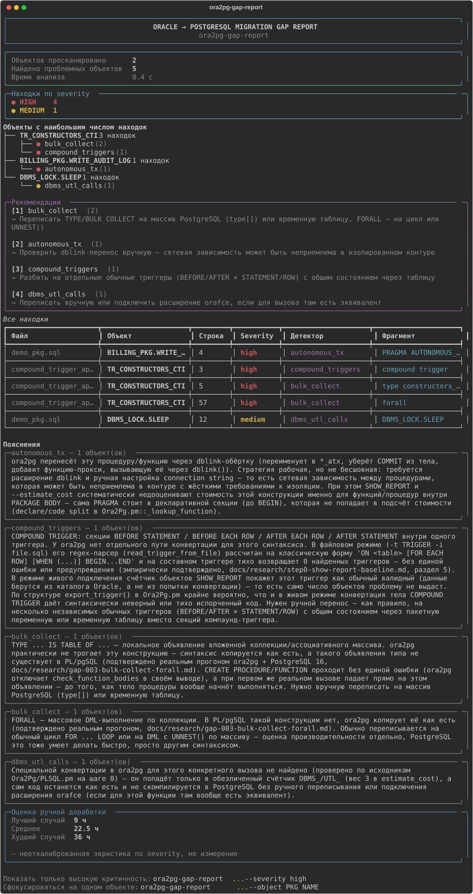

# ora2pg-gap-report

[](https://github.com/Lunch418/ora2pg-gap-report/actions/workflows/tests.yml)
[](https://pypi.org/project/ora2pg-gap-report/)

Инструмент для оценки миграции Oracle → PostgreSQL Pro (Standard/Certified) **до** её начала.

```sh
pip install ora2pg-gap-report
ora2pg-gap-report path/to/oracle_schema_dump/
```

```
Oracle DDL (PACKAGE BODY / TRIGGER / TABLE / INDEX / ...)
                    │
                    ▼
            ora2pg-gap-report
                    │
                    ▼
   28 подтверждённых типов пробелов миграции ora2pg
   ┌──────────────────────────────────────────────────────┐
   │ HIGH    GAP-006  database_link    — @dblink нет в PG  │
   │ HIGH    GAP-023  oracle_text      — CONTAINS()/...    │
   │ MEDIUM  GAP-025  invisible_index  — теряет скрытие    │
   └──────────────────────────────────────────────────────┘
```



## Проблема

При миграции с Oracle на Postgres Pro в сегменте Standard/Certified (то есть без
лицензии на Postgres Pro Enterprise и без проприетарной утилиты `ora2pgpro`)
единственный доступный автоматический конвертер — открытый
[`ora2pg`](https://github.com/darold/ora2pg). По независимым оценкам он закрывает
в среднем ~80% задачи перевода PL/SQL → PL/pgSQL. Оставшиеся ~20% (пакеты,
автономные транзакции, `CONNECT BY`, вызовы `DBMS_*`/`UTL_*`, составные триггеры)
сейчас разбираются вручную и, как правило, обнаруживаются постфактум — когда
что-то уже сломалось в проде.

## Что делает этот инструмент

Сканирует схему Oracle **до** миграции и говорит: какие конкретно объекты
`ora2pg` пропустит без предупреждения, недооценит по трудоёмкости или
сконвертирует потенциально некорректно — и почему. Не замена `ora2pg`, а
надстройка над ним: список того, что он реально не переносит, проверен
эмпирически на открытом PL/SQL-коде (`docs/research/step0-show-report-baseline.md`),
а не взят на веру.

## Детекторы

| Детектор | Что ловит |
|---|---|
| `autonomous_tx` | `PRAGMA AUTONOMOUS_TRANSACTION` внутри `PACKAGE BODY` — ora2pg конвертирует через dblink, но занижает/теряет стоимость в `SHOW_REPORT`/`--estimate_cost` |
| `compound_triggers` | `COMPOUND TRIGGER` — файловый парсер ora2pg тихо возвращает 0 триггеров, без единой ошибки |
| `dbms_utl_calls` | Классификатор конкретных вызовов `DBMS_*`/`UTL_*` — что из них ora2pg реально конвертирует, а что остаётся как есть |
| `connect_by` | Линтинг сгенерированного ora2pg `WITH RECURSIVE` на баг с `LEVEL`. Включается флагом `--check-connect-by` и, в отличие от остальных, требует установленный `ora2pg` |
| `merge_delete_clause` | `MERGE ... WHEN MATCHED THEN UPDATE SET ... DELETE WHERE ...` — составная Oracle-конструкция без аналога в MERGE PostgreSQL. Обычный MERGE без DELETE WHERE не ловится — не проблема |
| `bulk_collect` | Локальные `TYPE ... IS TABLE OF`, `BULK COLLECT INTO`, `FORALL` — практически не конвертируются ora2pg. Самый частый в реальном коде из всех детекторов проекта |
| `database_link` | `table@dblink_name` — прямая ссылка на удалённую БД через database link. Копируется как есть, эквивалента нет без ручной настройки postgres_fdw/dblink |
| `model_clause` | `MODEL PARTITION BY ... DIMENSION BY ... MEASURES ... RULES` — spreadsheet-вычисления в SQL. Не имеет прямого эквивалента в PostgreSQL вообще |
| `pivot_clause` | `PIVOT`/`UNPIVOT` — поворот строк в столбцы прямо в SQL. Копируется как есть, встроенного эквивалента в PostgreSQL нет |
| `object_type` | `CREATE TYPE ... AS OBJECT`/`TYPE BODY` — объектные типы Oracle. `--estimate_cost` не имеет для них механизма оценки вообще, не просто занижает |
| `with_function` | `WITH FUNCTION`/`WITH PROCEDURE` — встроенная функция внутри WITH. Парсер ora2pg разваливает структуру исходника, а не просто не конвертирует |
| `flashback_query` | `AS OF TIMESTAMP`/`AS OF SCN` — flashback-запрос. Копируется как есть, эквивалента в PostgreSQL нет вообще |
| `global_temp_table` | `CREATE GLOBAL TEMPORARY TABLE` — секция `ON COMMIT` теряется целиком, а умолчания Oracle и PostgreSQL противоположны (тихая смена поведения, не ошибка) |
| `table_partitioning` | `PARTITION BY RANGE/LIST/HASH` — секционирование таблицы отбрасывается целиком, без единого предупреждения |
| `connect_by_nocycle` | `CONNECT BY NOCYCLE`/`ORDER SIBLINGS BY` — в отличие от базового `CONNECT BY`, разваливает структуру всего окружающего PL/SQL-блока |
| `context_object` | `CREATE CONTEXT` — application context (часто основа VPD) не конвертируется вообще, след только в DEBUG-логе |
| `insert_all` | `INSERT ALL`/`INSERT FIRST` — многотабличная вставка. Копируется как есть, PL/pgSQL падает на этапе компиляции тела |
| `json_table` | `JSON_TABLE(...)` — не существует в PostgreSQL 16 и старше (в 17 есть, но с другим синтаксисом COLUMNS) |
| `external_table` | `CREATE TABLE ... ORGANIZATION EXTERNAL` — секция отбрасывается целиком, таблица становится обычной пустой |
| `sql_macro` | `SQL_MACRO` — конвертируется в обычную функцию, падает при вызове тем способом, для которого была написана |
| `invisible_column` | Столбец `INVISIBLE` теряет своё скрытие — тихо появляется в SELECT * после конвертации |
| `collection_type` | `CREATE TYPE ... TABLE OF`/`VARRAY OF` — коллекционный тип пропадает без следа, зависимые таблицы падают уже при загрузке DDL |
| `cross_apply` | `CROSS APPLY`/`OUTER APPLY` — синтаксиса APPLY нет в PostgreSQL вообще, ближайший эквивалент — JOIN LATERAL |
| `oracle_text` | Oracle Text — домен-индекс (`INDEXTYPE IS CTXSYS.*`) отбрасывается, `CONTAINS`/`CATSEARCH`/`MATCHES` не переносятся |
| `recursive_with` | Нативная рекурсивная `WITH ... AS (...)` (не через CONNECT BY) без ключевого слова `RECURSIVE`, которое требует PostgreSQL |
| `invisible_index` | Индекс `INVISIBLE` теряет своё скрытие от оптимизатора — PostgreSQL не имеет аналога |
| `read_only_table` | `CREATE TABLE ... READ ONLY` теряет гарантию неизменяемости — INSERT проходит там, где Oracle гарантированно блокирует его |
| `materialized_view_log` | `CREATE MATERIALIZED VIEW LOG` не конвертируется вообще, след только в DEBUG-логе |
| `identity_column` | `GENERATED ... AS IDENTITY (...)` с опциями — баг двойных скобок в самой подстановке ora2pg, не пропуск конвертации |

Плюс `ora2pg_wrapper.py` — запуск `ora2pg` по типам объектов на выгруженном
DDL с парсингом `--estimate_cost`, и `oracle_connector.py`/`oracle_export.py`
— живая выгрузка `PACKAGE BODY`/`TRIGGER` прямо из Oracle-схемы через
`DBMS_METADATA.GET_DDL`.

### Почему почти всё `high`

Из 28 зарегистрированных gap'ов (`gap_registry.py`) 26 — `high`, 2 —
`medium` (`context_object`, `invisible_index`). Отдельно от них есть
29-й детектор, `dbms_utl_calls` — классификатор вызовов `DBMS_*`/`UTL_*`,
не привязанный к конкретному GAP-NNN (у него нет одного воспроизводимого
минимального примера — это намеренно широкая категория), тоже `medium`.
`low` в реестре предусмотрен (`--severity low`, диапазон часов в
`effort_estimator.py`), но пока не присвоен ни одному детектору — это
честно, не потому что критерий не придуман, а потому что ни один из
подтверждённых случаев в него не попал. Не распределение ради
распределения — так сложилось из реальных находок, и вот по какому
принципу:

- **`high`** — либо сгенерированный код реально не компилируется/не
  выполняется в PostgreSQL (подтверждено прогоном на настоящем
  PostgreSQL 16 — `ERROR: syntax error...` и подобные, см. таблицу в
  `docs/research/AUDIT.md`), либо конструкция пропадает молча, но потеря
  архитектурно значима: секционирование, внешняя таблица, materialized
  view log, гарантия `READ ONLY`, database link — то, что либо ломает
  миграцию, либо тихо меняет поведение системы так, что это заметят не
  сразу, а на проде.
- **`medium`** — не блокирует миграцию и не теряет данные, но реальное
  расхождение поведения, которое стоит перепроверить: `invisible_index`
  (индекс перестаёт быть скрытым от оптимизатора — влияет на план
  запроса, не на корректность), `context_object` (прикладная фича,
  часто основа VPD, но сама миграция от её потери не падает), и отдельно
  `dbms_utl_calls` (намеренно широкий классификатор — реальное влияние
  конкретного вызова слишком разное, чтобы утверждать `high` для всех
  разом не покривив душой).

## Методология

Этот проект не пытается найти детектор под каждую специфичную для Oracle
конструкцию. `ROWNUM`, `DECODE`, `NVL`, `SYSDATE`, `%TYPE`, sequences,
стандартная семантика исключений — всё это `ora2pg` конвертирует корректно,
и детекторы под них не нужны, как бы по-ораклиному сложно они ни звучали.

Новый детектор появляется только после того, как гипотеза проверена на
практике:

1. Берётся конкретная Oracle-конструкция.
2. Собирается минимальный воспроизводимый пример.
3. Пример прогоняется через настоящий `ora2pg`.
4. Сгенерированный PostgreSQL-код проверяется на корректность.
5. Если `ora2pg` справился — гипотеза отклоняется, детектора не будет.
   Если нашёлся реальный, воспроизводимый баг — заводится тест-фикстура и
   пишется детектор.

Так, например, отсеялась изначальная гипотеза про `CREATE PACKAGE` — на
первый взгляд очевидный кандидат, а на практике `ora2pg` переносит его без
проблем (`docs/research/step0-show-report-baseline.md`). И так же
подтвердились `COMPOUND TRIGGER` и баг с `LEVEL` в `CONNECT BY` — оба
воспроизведены на реальном прогоне `ora2pg`, а не предположены по описанию.

Все подтверждённые находки пронумерованы и собраны в
[`docs/research/GAP_REGISTRY.md`](docs/research/GAP_REGISTRY.md) — по
каждой указано, каким детектором она покрыта и на какой версии `ora2pg`
подтверждена. [`docs/research/AUDIT.md`](docs/research/AUDIT.md) — сводная
проверка доказательной базы по каждому подтверждённому gap'у
(research-документ, реальный вывод ora2pg, expected/actual, тесты,
включая guard-тесты на ложные срабатывания).

Реестр (`ora2pg_gap_report/gap_registry.py`) и файловая структура
проверяются автоматически:

```sh
python3 scripts/doctor.py     # у каждого GAP-NNN есть research-документ, детектор и тесты
python3 scripts/audit_gap_test_counts.py   # пересчитать колонку "Тесты" в AUDIT.md
```

`doctor.py` — часть CI (job `lint`): если реестр разъехался с файлами на
диске (например, кто-то добавил gap в `gap_registry.py`, но забыл
детектор или тест), сборка падает сразу, а не остаётся незамеченной до
следующего ручного аудита. Отдельная проверка — что файловое дерево в
секции «Архитектура» этого самого README не разошлось со списком файлов
в `ora2pg_gap_report/detectors/` (ровно тот класс проблемы, из-за
которого само README какое-то время содержало устаревшее описание
архитектуры) — тоже часть `doctor.py`, а не только про registry.

### Конструкции, спрятанные в динамическом SQL

Инструмент — статический анализатор: он ищет синтаксические паттерны в
тексте, а не анализирует семантику выполнения. Один реальный частный
случай этого ограничения — конструкция, построенная как строка внутри
`EXECUTE IMMEDIATE`, обычной масштабной маскировкой строк/комментариев
не видна вообще (маскировка намеренно ослепляет содержимое всех
строковых литералов, чтобы ключевые слова не находились внутри
комментария или обычной строки).

14 детекторов, использующих общий индекс "какой объект окружает эту
позицию" (`bulk_collect`, `connect_by_nocycle`, `cross_apply`,
`database_link`, `flashback_query`, `insert_all`, `json_table`,
`merge_delete_clause`, `model_clause`, `oracle_text`, `pivot_clause`,
`recursive_with`, `sql_macro`, `with_function`), и отдельно
`autonomous_tx` (свой собственный, не общий механизм отслеживания границ
процедур) теперь используют второй, отдельный вид маскировки
(`mask_dynamic_sql_visible()` в `plsql_lex.py`), в котором именно
аргумент `EXECUTE IMMEDIATE` — одиночный литерал или конкатенация
`'...' || выражение || '...'`, вплоть до первой "голой" `;` — остаётся
видимым, а не заменяется пробелами. Подтверждено на реальном открытом
коде: у `utPLSQL` нашлась и скрытая `PRAGMA AUTONOMOUS_TRANSACTION`
(внутри динамически создаваемого пакета), и скрытый `BULK COLLECT INTO`
(внутри динамически выполняемого анонимного блока) — оба теперь
находятся, оба верно приписаны реальной, находимой в дереве исходников
процедуре (не вымышленному объекту, который существует только в момент
выполнения) — регрессионные тесты на этих же настоящих фрагментах лежат
в `tests/test_autonomous_tx.py`/`tests/test_bulk_collect.py`.

Важно, что индекс "какой объект окружает эту позицию" при этом всегда
строится из безопасного, полностью замаскированного текста, а не из
текста с видимым динамическим SQL — иначе пакет/процедура, которую
код создаёт динамически в момент выполнения, была бы принята за
настоящий объект, объявленный в дереве исходников, и испортила бы
атрибуцию не связанных с ней находок несуществующим в статике именем.
Эта деталь дизайна закреплена тестом
`test_dynamic_sql_that_creates_a_package_at_runtime_is_not_picked_up_as_a_real_container`
в `tests/test_plsql_lex.py`.

Не покрыто этим же способом: детекторы схемного уровня (`table_partitioning`,
`external_table`, `invisible_column` и т.д., включая часть `oracle_text`,
отвечающую за `CREATE INDEX ... INDEXTYPE`) по-прежнему не видят
одноимённую DDL-конструкцию, если она построена динамически — на
практике редкий случай (DDL почти всегда статичен), но не проверенный
эмпирически с той же строгостью, поэтому честно остаётся вне рамок этого
исправления, а не тихо считается решённым заодно.

## Установка и использование

```sh
pip install ora2pg-gap-report   # (или: pip install . из клона репозитория)
```

Сама детекторная библиотека (`detectors/`, `models.py`,
`report_generator.py`) — чистый Python без единой внешней зависимости, её
можно импортировать отдельно (например, в своих скриптах) вообще без
установки чего-либо ещё. У CLI есть одна обязательная зависимость —
[`rich`](https://github.com/Textualize/rich), только ради приятного
терминального вывода; ставится сама через `pip install`.

Сразу после установки доступна команда:

```sh
ora2pg-gap-report path/to/schema_dump.pkb another_file.sql
```

В интерактивном терминале по умолчанию — цветной отчёт: сводная панель
(сколько найдено, разбивка по severity, грубая оценка часов), компактная
таблица находок и пояснения под каждым сработавшим детектором. Для
скриптов/redirect — `--format markdown`, `--format json`, `--format csv`,
`--format sarif` или `--format html` (markdown работает и как формат по
умолчанию, если stdout не терминал):

```sh
ora2pg-gap-report path/to/schema_dump.pkb --format json --output report.json
ora2pg-gap-report path/to/schema_dump.pkb --format markdown > report.md
ora2pg-gap-report path/to/schema_dump.pkb --format csv --output report.csv

# SARIF 2.1.0 — для GitHub code scanning (Security tab) или GitLab SAST.
# Severity сопоставлена с уровнями SARIF: high → error, medium → warning,
# low → note (у SARIF нет отдельного уровня critical, как и у самого
# инструмента).
ora2pg-gap-report path/to/schema_dump.pkb --format sarif --output report.sarif

# Самодостаточная HTML-страница (без внешних CSS/JS/шрифтов — открывается
# офлайн) — показать заказчику/руководству, без установки чего-либо.
ora2pg-gap-report path/to/schema_dump.pkb --format html --output report.html

# Опционально: линтинг сгенерированного ora2pg кода для CONNECT BY.
# Требует установленный ora2pg (см. https://github.com/darold/ora2pg) —
# единственная внешняя (не-Python) зависимость во всём проекте, и только
# для этой конкретной проверки.
ora2pg-gap-report path/to/schema_dump.pkb --check-connect-by
```

Формат `--format json` описан формальной JSON Schema —
[`schemas/report.schema.json`](schemas/report.schema.json) (а формат
baseline-снапшота из `--save`/`--baseline` — в
[`schemas/baseline.schema.json`](schemas/baseline.schema.json)), чтобы
сторонние инструменты могли надёжно парсить вывод, не угадывая по
примерам. Обе схемы проверяются в тестах против реального вывода
(`tests/test_schemas.py`) — не просто написаны и оставлены как есть.
`--format sarif` тем же способом проверяется в `tests/test_sarif.py`
против официальной SARIF 2.1.0 схемы OASIS (заведена в
`tests/fixtures/`, чтобы тесты не зависели от сети).

Файлы с DDL можно передавать как есть — один файл может содержать сразу
несколько пакетов/триггеров, детекторы разбирают границы объектов сами.
Можно передать и директорию — рекурсивно просканируются все `.sql`/
`.pks`/`.pkb` внутри (например, вся папка с выгрузкой
`DBMS_METADATA.GET_DDL`):

```sh
ora2pg-gap-report path/to/schema_dump_dir/
```

`ora2pg-gap-report --version` — показать установленную версию.

### Документация прямо из CLI

`--explain GAP-023` (или просто `--explain 23`) печатает research-документ
конкретного gap'а из реестра — Oracle-конструкцию, реальный вывод
`ora2pg`, наблюдаемую проблему, вердикт — без сканирования файлов:

```sh
ora2pg-gap-report --explain GAP-023
```

Research-документы (`docs/research/`) — часть репозитория, но не часть
pip-пакета (пакет — только сам `ora2pg_gap_report/`). Если запущено из
установленного через `pip install` пакета, а не из клона репозитория,
`--explain` вместо текста документа покажет прямую ссылку на него на
GitHub.

### Отслеживание прогресса миграции (baseline)

Схема обычно правится итеративно — снимок «что не так сейчас», потом
доработка, потом повторный прогон. `--save` сохраняет находки текущего
прогона как снапшот; `--baseline` сравнивает следующий прогон с ним и
показывает NEW/RESOLVED/UNCHANGED (в stderr, отдельно от самого отчёта):

```sh
ora2pg-gap-report path/to/schema_dump/ --save baseline.json
# ... правите схему, конвертируете часть объектов вручную ...
ora2pg-gap-report path/to/schema_dump/ --baseline baseline.json
```

Находки сопоставляются между прогонами не по номеру строки (он скачет
при любой правке файла), а по отпечатку из детектора, файла, объекта и
найденного фрагмента — так что находка узнаётся как «та же» даже если
вокруг нее переписали код. `--save`/`--baseline` всегда работают по
полному набору находок, независимо от `--severity`/`--object` (эти флаги
влияют только на то, что выводится в отчёте).

### CI-гейт

`--fail-on high` (или `medium`/`low`) — завершиться с кодом `1`, если
среди находок есть хотя бы одна с этим уровнем серьёзности или выше
(`high` выше `medium` выше `low`). Так же, как `--save`/`--baseline`,
оценивается по полному набору находок, а не по тому, что осталось после
`--severity`/`--object`:

```sh
ora2pg-gap-report path/to/schema_dump/ --fail-on high
echo $?   # 1, если нашёлся хотя бы один high
```

Пример реального вывода на открытом пакете —
[`docs/examples/logger-autonomous_tx-report.md`](docs/examples/logger-autonomous_tx-report.md).

Оценка трудозатрат в отчёте — грубая эвристика по severity (диапазон
часов, не точечное число). Это ориентир для планирования, а не
откалиброванная на реальных миграциях оценка — не стоит выдавать её
клиенту как обязательство.

## Выгрузка DDL прямо из Oracle (опционально)

Если под рукой живая Oracle-схема, а не уже готовый DDL-дамп:

```sh
pip install "ora2pg-gap-report[oracle]"   # добавляет python-oracledb, thin-режим, без Instant Client

ora2pg-gap-export --dsn host:1521/ORCLPDB1 --user hr --output-dir dumps/
# пароль — из переменной окружения ORACLE_PASSWORD, либо будет запрошен интерактивно

ora2pg-gap-report dumps/*.sql
```

`ora2pg-gap-export` — отдельная команда, не флаг у `ora2pg-gap-report`,
специально: выгрузка требует сетевого доступа к Oracle, анализ — никогда.
В закрытом контуре это часто две разные машины (jump host с доступом к БД
и изолированная рабочая станция для анализа) — единственное, что должно
пересечь границу между ними, это уже выгруженные `.sql` файлы.

## Установка без интернета (закрытый контур)

Целевая аудитория этого инструмента — как раз изолированные сети без
выхода наружу, поэтому `pip install` там обычно не вариант. Решение —
собрать самодостаточный архив на машине с интернетом, перенести его
любым доступным способом (`scp`/`sftp`/через jump host/на флешке) и
поставить на целевой машине уже совсем без сети:

```sh
# На машине с интернетом, из клона репозитория:
python scripts/build_offline_bundle.py --oracle   # --oracle опционально, --dev для pytest
# → ora2pg-gap-report-offline.tar.gz (пакет + rich + всё транзитивно,
#   включая oracledb и его зависимости, если указан --oracle)

scp ora2pg-gap-report-offline.tar.gz user@jump-host:/tmp/
# ...дальше как получится добраться до целевой машины в контуре —
# sftp, ещё один jump host, физический перенос

# На целевой машине БЕЗ интернета:
tar xzf ora2pg-gap-report-offline.tar.gz
cd ora2pg-gap-report-offline
./install.sh oracle        # или: python3 install.py oracle
```

`install.sh`/`install.py` вызывают `pip install --no-index --find-links=./wheels
...` — pip ставит целиком из положенных рядом `.whl`-файлов, ни одного
обращения в сеть.

`rich` и его зависимости (`markdown-it-py`, `pygments`, `mdurl`) —
чистый Python, один набор wheel-файлов работает везде. `oracledb`
(только при `--oracle`) собирает платформозависимые wheel — если
машина сборки отличается от целевой по ОС/архитектуре/версии Python,
передайте `--platform`/`--python-version`/`--abi` в
`build_offline_bundle.py` (см. `--help`), чтобы скачать wheel именно
под целевую платформу, а не под ту, где запущен скрипт.

## Архитектура

`ora2pg SHOW_REPORT` целиком не имеет офлайн-режима — он требует живого
подключения к Oracle (`ORACLE_DSN`). Офлайн от DDL-дампа работает только
анализ *отдельных типов объектов* (`-t PACKAGE`, `-t TRIGGER`, `-t FUNCTION`,
…) — именно так работает `ora2pg_wrapper.py`, а не через `SHOW_REPORT`. Это
принципиально для целевой аудитории — закрытые контуры, air-gapped среды,
госсектор.

Детекторов сейчас 29 (таблица выше — 28 из них привязаны к
зарегистрированному GAP-NNN, `dbms_utl_calls` — нет, см. «Почему почти
всё high»), и почти все они устроены одинаково:
анализируют Oracle-исходник напрямую и не требуют установленного
`ora2pg` — чистый Python, без внешних зависимостей. Исключение ровно
одно — `connect_by`: он устроен иначе, линтит *сгенерированный*
ora2pg-код, а не исходник (ora2pg сам неплохо считает CONNECT BY —
ценность не в обнаружении, а в проверке качества конвертации), поэтому
ему нужен реальный `ora2pg` и он подключается только через
`--check-connect-by`. Это единственный детектор с таким требованием — не
"один из четырёх", как было на самых ранних версиях этого README, когда
детекторов и правда было всего четыре.

```
pyproject.toml                 # единственный источник правды по зависимостям/точкам входа
ora2pg_gap_report/
├── models.py                  # Finding — общая структура находки для всех детекторов
├── plsql_lex.py                # общая инфраструктура: маскирование строк/комментариев
│                               # (включая q-quote) в двух видах — безопасном и с видимым
│                               # аргументом EXECUTE IMMEDIATE, сопоставление блоков
│                               # BEGIN/CASE/IF/LOOP...END, разбор идентификаторов —
│                               # используется всеми детекторами
├── oracle_connector.py         # живая выгрузка PACKAGE BODY/TRIGGER через DBMS_METADATA.GET_DDL
├── oracle_export.py            # консольная команда ora2pg-gap-export
├── detectors/
│   ├── autonomous_tx.py        # PRAGMA AUTONOMOUS_TRANSACTION в PACKAGE BODY
│   ├── compound_triggers.py    # COMPOUND TRIGGER — тихий провал парсинга у ora2pg
│   ├── dbms_utl_calls.py       # классификатор конкретных DBMS_*/UTL_* функций
│   ├── connect_by.py            # линтинг сгенерированного WITH RECURSIVE (нужен ora2pg)
│   ├── merge_delete_clause.py   # MERGE ... DELETE WHERE — не имеет аналога в MERGE PostgreSQL
│   ├── bulk_collect.py          # TYPE ... IS TABLE OF / BULK COLLECT INTO / FORALL
│   ├── database_link.py         # table@dblink_name — прямая ссылка на удалённую БД
│   ├── model_clause.py          # MODEL PARTITION BY / DIMENSION BY / MEASURES / RULES
│   ├── pivot_clause.py          # PIVOT / UNPIVOT
│   ├── object_type.py           # CREATE TYPE ... AS OBJECT / TYPE BODY
│   ├── with_function.py         # WITH FUNCTION / WITH PROCEDURE
│   ├── flashback_query.py       # AS OF TIMESTAMP / AS OF SCN
│   ├── global_temp_table.py     # CREATE GLOBAL TEMPORARY TABLE — теряется ON COMMIT
│   ├── table_partitioning.py    # PARTITION BY RANGE/LIST/HASH — отбрасывается целиком
│   ├── connect_by_nocycle.py    # CONNECT BY NOCYCLE / ORDER SIBLINGS BY
│   ├── context_object.py        # CREATE CONTEXT — application context
│   ├── insert_all.py            # INSERT ALL / INSERT FIRST — многотабличная вставка
│   ├── json_table.py            # JSON_TABLE(...) — нет в PostgreSQL 16 и старше
│   ├── external_table.py        # CREATE TABLE ... ORGANIZATION EXTERNAL
│   ├── sql_macro.py             # SQL_MACRO — конвертируется в обычную функцию
│   ├── invisible_column.py      # столбец INVISIBLE теряет своё скрытие
│   ├── collection_type.py       # CREATE TYPE ... TABLE OF / VARRAY OF
│   ├── cross_apply.py           # CROSS APPLY / OUTER APPLY
│   ├── oracle_text.py           # Oracle Text — INDEXTYPE / CONTAINS / CATSEARCH / MATCHES
│   ├── recursive_with.py        # рекурсивная WITH без RECURSIVE
│   ├── invisible_index.py       # INVISIBLE-индекс
│   ├── read_only_table.py       # CREATE TABLE ... READ ONLY
│   ├── materialized_view_log.py # CREATE MATERIALIZED VIEW LOG
│   └── identity_column.py       # GENERATED ... AS IDENTITY (...) — баг двойных скобок
├── ora2pg_wrapper.py            # запуск ora2pg по типам объектов, парсинг --estimate_cost
├── cli.py                      # консольная команда ora2pg-gap-report
├── effort_estimator.py          # грубая эвристика по severity, диапазон часов
├── report_generator.py          # JSON + Markdown (машиночитаемые форматы)
└── terminal_report.py           # цветной вывод через rich (единственная зависимость;
                                 #  библиотеки-детекторов не касается, только CLI)
tests/
├── fixtures/                   # реальные захваченные прогоны ora2pg — тесты парсера не требуют
│                               # установленного ora2pg, кроме нескольких live-тестов
│                               # (пропускаются автоматически, если ora2pg не найден в PATH)
docs/research/                  # эмпирическая проверка предпосылок, реальные PL/SQL примеры
docs/examples/                  # примеры вывода детекторов на реальных данных
scripts/
├── build_offline_bundle.py     # сборка автономного архива для установки без интернета
├── oracle-test-compose.yml     # Oracle Free 23ai в Docker для живой проверки
├── setup_oracle_test_schema.sql
└── verify_against_live_oracle.py
.github/workflows/tests.yml     # CI: pytest на 3.10-3.13 + сборка и smoke-test пакета
```

## Тестирование

```sh
pip install -e ".[dev]"   # editable-режим + pytest
pytest
```

Детекторы и лексер проверены на реальном открытом PL/SQL-коде — не
только на синтетических примерах. Помимо точечных фикстур (Logger,
составной триггер из Apress), детекторы прогонялись целиком на
247 298 строках (точный свежий подсчёт по `git clone --depth 1` каждого
репозитория) из семи независимых открытых проектов: официальных
демо-схем Oracle (`oracle-samples/db-sample-schemas`), библиотеки утилит
`mortenbra/alexandria-plsql-utils`, фреймворка юнит-тестирования
`utPLSQL/utPLSQL`, логгера `OraOpenSource/Logger`, лексера/токенизатора
`method5/plsql_lexer`, генератора Excel-файлов `mbleron/ExcelGen` и
шаблонизатора `osalvador/tePLSQL` — ноль падений, только одна честно
задокументированная граница применимости (см.
`test_real_open_source_logger_install_script_
anonymous_block_is_unknown_not_a_crash` в `tests/test_bulk_collect.py`).
Подробности и полный список corpus-validated детекторов — в
`docs/research/AUDIT.md`.

### Проверка на живой Oracle

Юнит-тесты `oracle_connector.py` идут на fake-соединении
(`tests/fakes/fake_oracle.py`) — быстро, детерминированно, не требует
Oracle. Живой путь ("подключился к настоящей Oracle → выгрузил через
`DBMS_METADATA.GET_DDL` → проанализировал") ими не покрыт — для него
нужна настоящая база:

```sh
docker compose -f scripts/oracle-test-compose.yml up -d
docker compose -f scripts/oracle-test-compose.yml logs -f   # ждать "DATABASE IS READY TO USE"

pip install -e ".[oracle]"
ORACLE_DSN=localhost:1521/FREEPDB1 ORACLE_USER=testuser ORACLE_PASSWORD=testpass1 \
  python scripts/verify_against_live_oracle.py
```

Скрипт создаёт пару служебных таблиц (`scripts/setup_oracle_test_schema.sql`
— триггерам, в отличие от пакетов, нужна реально существующая целевая
таблица), заливает реальные фикстуры из `docs/research/samples/` как
есть, выгружает их обратно живым `DBMS_METADATA.GET_DDL`, прогоняет
детекторы и сверяет счётчики с уже независимо проверенными на этих же
файлах как на тексте (`tests/`). Если в `PATH` есть `ora2pg` — заодно
прогоняет `SHOW_REPORT` против живого подключения.

`gvenzl/oracle-free:23-slim` — контейнерный пакет официального
бесплатного дистрибутива Oracle (тот же движок), просто с более удобной
для CI/тестов оберткой, чем прямой образ Oracle Container Registry.

## Changelog

История изменений по версиям — [CHANGELOG.md](CHANGELOG.md).

## Лицензия

MIT, см. [LICENSE](LICENSE).
