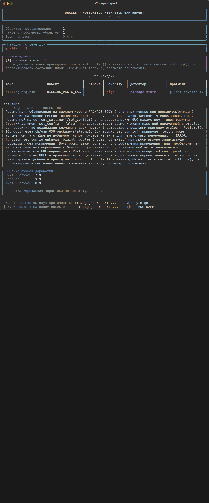

# ora2pg-gap-report

*English | [Русский](README.ru.md)*

[](https://github.com/Lunch418/ora2pg-gap-report/actions/workflows/tests.yml)
[](https://pypi.org/project/ora2pg-gap-report/)
[](https://pypi.org/project/ora2pg-gap-report/)
[](LICENSE)

A tool for assessing an Oracle → PostgreSQL Pro (Standard/Certified) migration **before** it starts.

```sh
pip install ora2pg-gap-report
ora2pg-gap-report path/to/oracle_schema_dump/
```

```
Oracle DDL (PACKAGE BODY / TRIGGER / TABLE / INDEX / ...)
                    │
                    ▼
            ora2pg-gap-report
                    │
                    ▼
   37 confirmed types of ora2pg migration gaps
   ┌────────────────────────────────────────────────────────┐
   │ HIGH    GAP-006  database_link    — @dblink not in PG  │
   │ HIGH    GAP-023  oracle_text      — CONTAINS()/...     │
   │ MEDIUM  GAP-025  invisible_index  — loses invisibility │
   └────────────────────────────────────────────────────────┘
```



## The problem

Migrating from Oracle to Postgres Pro Standard/Certified (i.e. without a Postgres
Pro Enterprise license and without the proprietary `ora2pgpro` utility), the only
available automated converter is the open-source
[`ora2pg`](https://github.com/darold/ora2pg). By independent estimates it covers
around ~80% of the PL/SQL → PL/pgSQL conversion job on average. The remaining
~20% (packages, autonomous transactions, `CONNECT BY`, `DBMS_*`/`UTL_*` calls,
compound triggers) is currently sorted out by hand, and is typically discovered
after the fact — once something has already broken in production.

## What this tool does

Scans an Oracle schema **before** migration and reports exactly which objects
`ora2pg` will skip without warning, underestimate the effort for, or convert
potentially incorrectly — and why. Not a replacement for `ora2pg`, a layer on
top of it: the list of what it actually fails to carry over was verified
empirically against real PL/SQL code
(`docs/research/step0-show-report-baseline.md`), not taken on faith.

| | |
|---|---|
| **Static analysis** | Looks for patterns in the source Oracle code, no `ora2pg` install required (except `connect_by`, see below) |
| **Reproducible** | Every finding is confirmed by a real `ora2pg` + PostgreSQL run, not by reading the docs |
| **6 output formats** | terminal, markdown, json, csv, `sarif`, `html` — the same set of findings every time |
| **CI gate** | `--fail-on` + SARIF for GitHub/GitLab code scanning |
| **Works offline** | Self-contained bundle for closed networks (`scripts/build_offline_bundle.py`), see below |
| **Baseline** | `--save`/`--baseline` — NEW/RESOLVED/UNCHANGED between runs |
| **Post-migration check** | `--verify` — which pre-migration findings are still present in the generated code (not a functional check, see below) |

## Detectors

| Detector | What it catches |
|---|---|
| `autonomous_tx` | `PRAGMA AUTONOMOUS_TRANSACTION` inside a `PACKAGE BODY` — ora2pg converts it via dblink, but under-costs or drops the cost entirely in `SHOW_REPORT`/`--estimate_cost` |
| `compound_triggers` | `COMPOUND TRIGGER` — ora2pg's file parser silently returns 0 triggers, with no error at all |
| `dbms_utl_calls` | Classifier for specific `DBMS_*`/`UTL_*` calls — which ones ora2pg actually converts, and which are left as-is |
| `connect_by` | Lints ora2pg's own generated `WITH RECURSIVE` for the `LEVEL` bug. Enabled with `--check-connect-by` and, unlike the others, requires `ora2pg` to be installed |
| `merge_delete_clause` | `MERGE ... WHEN MATCHED THEN UPDATE SET ... DELETE WHERE ...` — a compound Oracle construct with no equivalent in PostgreSQL's MERGE. A plain MERGE without DELETE WHERE isn't flagged — that's fine, it's not a gap |
| `bulk_collect` | Local `TYPE ... IS TABLE OF`, `BULK COLLECT INTO`, `FORALL` — practically never converted by ora2pg. The most common finding in real-world code of any detector in this project |
| `database_link` | `table@dblink_name` — a direct reference to a remote DB via database link. Copied as-is, no equivalent without manually setting up postgres_fdw/dblink |
| `model_clause` | `MODEL PARTITION BY ... DIMENSION BY ... MEASURES ... RULES` — spreadsheet-style computation in SQL. Has no direct equivalent in PostgreSQL at all |
| `pivot_clause` | `PIVOT`/`UNPIVOT` — rotating rows into columns directly in SQL. Copied as-is, PostgreSQL has no built-in equivalent |
| `object_type` | `CREATE TYPE ... AS OBJECT`/`TYPE BODY` — Oracle object types. `--estimate_cost` has no costing mechanism for them at all, not just an underestimate |
| `with_function` | `WITH FUNCTION`/`WITH PROCEDURE` — an inline function inside a query's own WITH clause. ora2pg's parser breaks the source structure, it doesn't just fail to convert it |
| `flashback_query` | `AS OF TIMESTAMP`/`AS OF SCN` — a flashback query. Copied as-is, no equivalent in PostgreSQL at all |
| `global_temp_table` | `CREATE GLOBAL TEMPORARY TABLE` — the `ON COMMIT` clause is dropped entirely, and Oracle's and PostgreSQL's defaults are opposite (a silent behavior change, not an error) |
| `table_partitioning` | `PARTITION BY RANGE/LIST/HASH` — table partitioning is dropped entirely, with no warning at all |
| `connect_by_nocycle` | `CONNECT BY NOCYCLE`/`ORDER SIBLINGS BY` — unlike plain `CONNECT BY`, breaks the structure of the entire surrounding PL/SQL block |
| `context_object` | `CREATE CONTEXT` — an application context (often the basis for VPD) isn't converted at all, leaving only a trace in the DEBUG log |
| `insert_all` | `INSERT ALL`/`INSERT FIRST` — a multi-table insert. Copied as-is, PL/pgSQL fails at body-compilation time |
| `json_table` | `JSON_TABLE(...)` — doesn't exist in PostgreSQL 16 and earlier (it exists in 17, but with a different COLUMNS syntax) |
| `external_table` | `CREATE TABLE ... ORGANIZATION EXTERNAL` — the section is dropped entirely, the table becomes an ordinary, empty one |
| `sql_macro` | `SQL_MACRO` — converted into an ordinary function, fails when called the way it was written to be used |
| `invisible_column` | An `INVISIBLE` column loses its invisibility — silently shows up in `SELECT *` after conversion |
| `collection_type` | `CREATE TYPE ... TABLE OF`/`VARRAY OF` — the collection type vanishes without a trace, dependent tables fail as soon as the DDL is loaded |
| `cross_apply` | `CROSS APPLY`/`OUTER APPLY` — PostgreSQL has no APPLY syntax at all, the closest equivalent is JOIN LATERAL |
| `oracle_text` | Oracle Text — the domain index (`INDEXTYPE IS CTXSYS.*`) is dropped, `CONTAINS`/`CATSEARCH`/`MATCHES` are not carried over |
| `recursive_with` | A native recursive `WITH ... AS (...)` (not via CONNECT BY) missing the `RECURSIVE` keyword that PostgreSQL requires |
| `invisible_index` | An `INVISIBLE` index loses its invisibility to the optimizer — PostgreSQL has no equivalent |
| `read_only_table` | `CREATE TABLE ... READ ONLY` loses its immutability guarantee — INSERT succeeds where Oracle would have reliably blocked it |
| `materialized_view_log` | `CREATE MATERIALIZED VIEW LOG` isn't converted at all, leaving only a trace in the DEBUG log |
| `identity_column` | `GENERATED ... AS IDENTITY (...)` with options — a double-parenthesis substitution bug in ora2pg itself, not a skipped conversion |
| `rowid_type` | `ROWID`/`UROWID` as a column's data type — converted to `oid`, a replacement type incompatible with the data it's supposed to hold |
| `sequence_cycle` | `CREATE SEQUENCE ... CYCLE` — the `CYCLE` section is dropped, `NEXTVAL` fails once the range is exhausted instead of wrapping around |
| `default_on_null` | `DEFAULT ON NULL` is copied verbatim — a syntax error the moment `CREATE TABLE` itself is applied |
| `public_synonym` | `CREATE [PUBLIC] SYNONYM` — loses the target object's schema; when the names match, the result is a self-referencing VIEW |
| `virtual_column` | `GENERATED ALWAYS AS (...) VIRTUAL` — loses the `ORA-54016` protection against explicit assignment; the generated trigger silently overwrites the value |
| `nested_subprogram` | A locally nested procedure/function "leaks" out as a separate object, its containing block disappears, and its body gets corrupted |
| `conditional_compilation` | `$IF`/`$ELSIF`/`$ELSE`/`$END` are copied verbatim — fails on the first call, not at CREATE time |
| `package_state` | A package-level variable — the `set_config`/`current_setting` emulation is broken (no type cast, no `missing_ok`) |
| `index_organized_table` | `ORGANIZATION INDEX` (IOT) is dropped — the table becomes an ordinary heap with a separate index, losing the storage architecture |

Plus `ora2pg_wrapper.py` — runs `ora2pg` per object type against exported DDL
and parses `--estimate_cost`, and `oracle_connector.py`/`oracle_export.py` —
a live export of `PACKAGE BODY`/`TRIGGER` straight from an Oracle schema via
`DBMS_METADATA.GET_DDL`.

### Why almost everything is `high`

Of the 37 registered gaps (`gap_registry.py`), 33 are `high` and 4 are
`medium` (`context_object`, `invisible_index`, `virtual_column`,
`index_organized_table`). Separately, there's a 38th detector,
`dbms_utl_calls` — a classifier for `DBMS_*`/`UTL_*` calls, not tied to a
specific GAP-NNN (it has no single reproducible minimal example — that's a
deliberately broad category), also `medium`. `low` is a valid value in the
registry (`--severity low`, with an hour range in `effort_estimator.py`), but
hasn't been assigned to any detector yet — honestly, not because the
criterion wasn't thought through, but because none of the confirmed cases
landed there. Not a distribution chosen for its own sake — it fell out of
real findings, following this principle:

- **`high`** — either the generated code genuinely fails to compile/run in
  PostgreSQL (confirmed by running it on real PostgreSQL 16 — `ERROR: syntax
  error...` and similar, see the table in `docs/research/AUDIT.md`), or the
  construct disappears silently but the loss is architecturally significant:
  partitioning, an external table, a materialized view log, a `READ ONLY`
  guarantee, a database link — things that either break the migration
  outright or silently change system behavior in a way that isn't noticed
  right away, only in production.
- **`medium`** — doesn't block the migration and doesn't lose data, but a
  real behavioral divergence worth double-checking: `invisible_index` (the
  index stops being hidden from the optimizer — affects the query plan, not
  correctness), `context_object` (an application feature, often the basis
  for VPD, but the migration itself doesn't fail from losing it),
  `virtual_column` (the final value in the column is correct — what's lost
  isn't data, it's early diagnostics for a mistaken explicit assignment),
  `index_organized_table` (integrity constraints are preserved — what's lost
  is storage architecture, not correctness), and separately `dbms_utl_calls`
  (a deliberately broad classifier — the real impact of a specific call
  varies too much to honestly call all of them `high`).

## Methodology

This project doesn't try to find a detector for every Oracle-specific
construct that exists. `ROWNUM`, `DECODE`, `NVL`, `SYSDATE`, `%TYPE`,
sequences, standard exception semantics — `ora2pg` converts all of these
correctly, and no detector is needed for them, however exotically
Oracle-flavored they sound.

A new detector only appears once the hypothesis has been checked in practice:

1. Pick a specific Oracle construct.
2. Build a minimal reproducible example.
3. Run the example through real `ora2pg`.
4. Check the generated PostgreSQL code for correctness.
5. If `ora2pg` handled it — the hypothesis is rejected, no detector gets
   written. If a real, reproducible bug turns up — a test fixture is added
   and a detector gets written.

That's how the initial hypothesis about `CREATE PACKAGE` was ruled out, for
example — an obvious-looking candidate at first glance, but in practice
`ora2pg` carries it over without issue
(`docs/research/step0-show-report-baseline.md`). And that's how `COMPOUND
TRIGGER` and the `LEVEL` bug in `CONNECT BY` were confirmed — both
reproduced on a real `ora2pg` run, not assumed from a description.

Every confirmed finding is numbered and collected in
[`docs/research/GAP_REGISTRY.md`](docs/research/GAP_REGISTRY.md) — each
entry states which detector covers it and against which `ora2pg` version it
was confirmed. [`docs/research/AUDIT.md`](docs/research/AUDIT.md) is a
summary check of the evidence behind every confirmed gap (research doc, real
ora2pg output, expected/actual, tests, including guard tests against false
positives).

## Installation and usage

```sh
pip install ora2pg-gap-report   # (or: pip install . from a repo checkout)
```

The detector library itself (`detectors/`, `models.py`,
`report_generator.py`) is pure Python with zero external dependencies — it
can be imported on its own (e.g. from your own scripts) without installing
anything else at all. The CLI has exactly one required dependency —
[`rich`](https://github.com/Textualize/rich), purely for a pleasant terminal
output; it installs itself via `pip install`.

Right after installation, the command is available:

```sh
ora2pg-gap-report path/to/schema_dump.pkb another_file.sql
```

In an interactive terminal, the default is a colored report: a summary panel
(how many findings, breakdown by severity, a rough hour estimate), a compact
findings table, and an explanation under every detector that fired. For
scripts/redirects — `--format markdown`, `--format json`, `--format csv`,
`--format sarif`, or `--format html` (markdown also serves as the default
format whenever stdout isn't a terminal):

```sh
ora2pg-gap-report path/to/schema_dump.pkb --format json --output report.json
ora2pg-gap-report path/to/schema_dump.pkb --format markdown > report.md
ora2pg-gap-report path/to/schema_dump.pkb --format csv --output report.csv

# SARIF 2.1.0 — for GitHub code scanning (Security tab) or GitLab SAST.
# Severity is mapped to SARIF levels: high → error, medium → warning,
# low → note (SARIF has no separate critical level, and neither does
# this tool).
ora2pg-gap-report path/to/schema_dump.pkb --format sarif --output report.sarif

# A self-contained HTML page (no external CSS/JS/fonts — opens offline)
# — to show a client/manager, without installing anything.
ora2pg-gap-report path/to/schema_dump.pkb --format html --output report.html

# Optional: lint ora2pg's own generated code for CONNECT BY.
# Requires ora2pg to be installed (see https://github.com/darold/ora2pg)
# — the only external (non-Python) dependency anywhere in this project,
# and only for this one specific check.
ora2pg-gap-report path/to/schema_dump.pkb --check-connect-by
```

The `--format json` format is described by a formal JSON Schema —
[`schemas/report.schema.json`](schemas/report.schema.json) (and the
baseline-snapshot format from `--save`/`--baseline` is in
[`schemas/baseline.schema.json`](schemas/baseline.schema.json)), so
third-party tools can reliably parse the output instead of guessing from
examples. Both schemas are checked in the tests against real output
(`tests/test_schemas.py`) — not just written and left as-is. `--format
sarif` is checked the same way in `tests/test_sarif.py` against the
official OASIS SARIF 2.1.0 schema (vendored into `tests/fixtures/`, so the
tests don't depend on the network).

DDL files can be passed as-is — a single file may contain multiple
packages/triggers, the detectors figure out object boundaries themselves.
A directory can be passed too: everything with a `.sql`/`.pks`/`.pkb`
extension inside gets scanned recursively (e.g. an entire
`DBMS_METADATA.GET_DDL` export directory):

```sh
ora2pg-gap-report path/to/schema_dump_dir/
```

`ora2pg-gap-report --version` — show the installed version.

### Documentation straight from the CLI

`--explain GAP-023` (or just `--explain 23`) prints a specific gap's research
document from the registry — the Oracle construct, real `ora2pg` output, the
observed problem, the verdict, and the `ora2pg`/PostgreSQL versions the
finding was confirmed against (currently 25.0/16 for all 37 — a single
version, because there hasn't been a second one yet; `gap_registry.py` is
already set up to store different versions for future findings) — without
scanning any files:

```sh
ora2pg-gap-report --explain GAP-023
```

Research documents (`docs/research/`) are part of the repository but not
part of the pip package (the package is `ora2pg_gap_report/` only). When run
from a package installed via `pip install`, rather than from a repo
checkout, `--explain` shows a direct link to the document on GitHub instead
of the document's text.

### Output language

The default output is in Russian — it doesn't change without an explicit
action, so existing scripts and CI that parse the current output keep
working unchanged. English is available as an option:

- `--lang en` — for this run only, saves nothing;
- `--set-lang` — opens a language picker (`[1] English` / `[2] Русский`) and
  saves it as the default for all future runs
  (`~/.config/ora2pg-gap-report/language`, or `$XDG_CONFIG_HOME`);
- `ORA2PG_GAP_REPORT_LANG=en` — for CI, not saved;
- on first run in an interactive terminal, if no language is set anywhere,
  the `--set-lang` picker shows itself once and saves the choice.

Priority order: `--lang` → environment variable → saved choice → interactive
picker (a real terminal only) → Russian by default.

The entire scan output is translated: the terminal report, `--format
markdown/html`, per-detector explanations and remediation hints, error
messages. Not translated: `--help` (would need to know the language before
argparse has parsed `--lang` out of argv — a separate piece of work, not
done in this pass) and the research documents themselves in
`docs/research/` (`--explain` under `--lang en` still prints their text in
Russian, as before — only the version header is translated).

### Tracking migration progress (baseline)

A schema is usually fixed up iteratively — a snapshot of "what's wrong
right now," then some fixes, then a re-run. `--save` stores the current
run's findings as a snapshot; `--baseline` compares the next run against it
and shows NEW/RESOLVED/UNCHANGED (on stderr, separate from the report
itself):

```sh
ora2pg-gap-report path/to/schema_dump/ --save baseline.json
# ... fix up the schema, convert some objects by hand ...
ora2pg-gap-report path/to/schema_dump/ --baseline baseline.json
```

Findings are matched between runs not by line number (which shifts on any
file edit), but by a fingerprint built from the detector, file, object, and
matched snippet — so a finding is recognized as "the same one" even if the
code around it was rewritten. `--save`/`--baseline` always operate on the
full set of findings, regardless of `--severity`/`--object` (those flags
only affect what gets displayed in the report).

### CI gate

`--fail-on high` (or `medium`/`low`) — exit with code `1` if there's at
least one finding at that severity level or higher (`high` above `medium`
above `low`). Like `--save`/`--baseline`, this is evaluated against the full
set of findings, not what's left after `--severity`/`--object`:

```sh
ora2pg-gap-report path/to/schema_dump/ --fail-on high
echo $?   # 1 if at least one high finding turned up
```

A real-world output example against an open-source package —
[`docs/examples/logger-autonomous_tx-report.md`](docs/examples/logger-autonomous_tx-report.md).

The effort estimate in the report is a rough heuristic by severity (an hour
range, not a single number). It's a planning reference, not an estimate
calibrated against real migrations — don't hand it to a client as a
commitment. The severity range only prices the *first* occurrence of each
detector — repeat findings from the same detector (the same already-learned
fix applied again, not a new task) are priced with a separate, much smaller
range instead of being counted as independent high/medium tasks each: 8
`autonomous_tx` findings in one package isn't 8 separate problems.

### Post-migration check (`--verify`)

`--save`/`--baseline` compare two runs against the Oracle source over time.
`--verify` is different: it compares pre-migration findings against what
actually remains in the **generated ora2pg PostgreSQL code**:

```sh
ora2pg-gap-report oracle_schema/ --save migration.json   # before migration
# ... run ora2pg, get generated_postgresql/ ...
ora2pg-gap-report --verify --baseline migration.json generated_postgresql/
```

```text
Baseline detectors  4
Still present        2
Not detected          1
Not verifiable        1

cross_apply       GAP-022   3 → 1   STILL_PRESENT
json_table        GAP-017   2 → 0   NOT_DETECTED
identity_column   GAP-028   4 → 4   STILL_PRESENT
read_only_table   GAP-026   1 → —   NOT_VERIFIABLE
```

This is **not** a functional check — the tool never connects to a database,
never executes anything, never compares data. It statically looks for the
same pattern already in the generated code. And even so, it doesn't work
the same way for every detector:

- **Some constructs `ora2pg` copies into its output as-is** (`cross_apply`,
  `json_table`, `identity_column`, and 10 more — full list in
  [`docs/ARCHITECTURE.md`](docs/ARCHITECTURE.md)) — for these, re-running the
  detector against the output is meaningful: `STILL_PRESENT` if the pattern
  remains, `NOT_DETECTED` if it's gone.
- **Some `ora2pg` drops silently** (`read_only_table`, `table_partitioning`,
  13 more) — the construct isn't in the output *by definition*, regardless
  of whether someone fixed the problem by hand some other way. For these,
  the honest status is `NOT_VERIFIABLE`, not a fabricated `NOT_DETECTED`:
  treating absence as proof of a fix would be exactly the kind of
  manufactured confidence this project specifically avoids (see "Why almost
  everything is `high`" above).

`NOT_DETECTED` also doesn't mean "provably fixed" — only "the pattern wasn't
found in this code." A small difference, but it's exactly what separates an
honest check from a comfortable lie.

`--verify` is a standalone mode: requires `--baseline`, incompatible with
`--explain`/`--save`/`--fail-on`/`--check-connect-by`/`--severity`/`--object`,
supports only `--format terminal` (default) and `--format json`.

## Exporting DDL directly from Oracle (optional)

If you have a live Oracle schema on hand instead of an already-prepared DDL
dump:

```sh
pip install "ora2pg-gap-report[oracle]"   # adds python-oracledb, thin mode, no Instant Client

ora2pg-gap-export --dsn host:1521/ORCLPDB1 --user hr --output-dir dumps/
# the password comes from the ORACLE_PASSWORD environment variable, or is prompted for interactively

ora2pg-gap-report dumps/*.sql
```

`ora2pg-gap-export` is a separate command, not a flag on
`ora2pg-gap-report`, deliberately: exporting requires network access to
Oracle, analysis never does. In a closed environment this is often two
different machines (a jump host with DB access, and an isolated workstation
for analysis) — the only thing that needs to cross that boundary is the
already-exported `.sql` files.

## Installing without internet access (closed network)

This tool's target audience is exactly isolated networks with no outside
access, so `pip install` usually isn't an option there. The solution: build
a self-contained archive on a machine with internet access, move it over by
whatever means the environment allows (`scp`/`sftp`/via a jump host/on a USB
drive), and install it on the target machine with no network at all:

```sh
# On a machine with internet access, from a repo checkout:
python scripts/build_offline_bundle.py --oracle   # --oracle is optional, --dev for pytest
# → ora2pg-gap-report-offline.tar.gz (the package + rich + everything
#   transitively, including oracledb and its dependencies if --oracle is given)

scp ora2pg-gap-report-offline.tar.gz user@jump-host:/tmp/
# ...however you can get it the rest of the way to the target machine —
# sftp, another jump host, a physical transfer

# On the target machine, WITHOUT internet access:
tar xzf ora2pg-gap-report-offline.tar.gz
cd ora2pg-gap-report-offline
./install.sh oracle        # or: python3 install.py oracle
```

`install.sh`/`install.py` call `pip install --no-index
--find-links=./wheels ...` — pip installs entirely from the `.whl` files
sitting next to it, not a single network call.

`rich` and its dependencies (`markdown-it-py`, `pygments`, `mdurl`) are pure
Python — one set of wheels works everywhere. `oracledb` (only pulled in with
`--oracle`) ships platform-specific wheels — if the build machine differs
from the target machine's OS/architecture/Python version, pass
`--platform`/`--python-version`/`--abi` to `build_offline_bundle.py` (see
`--help`) to download wheels for the actual target platform, not the one
the script happens to be running on.

Every GitHub Release also ships a base bundle (no `--oracle`) as a
downloadable asset — built the same way in CI — for anyone who just wants
the base install without running the script themselves.

## Development and architecture

```sh
pip install -e ".[dev]"   # editable mode + pytest
pytest
```

How the tool is built internally (the lexer, masking, finding attribution,
dynamic SQL handling, file layout) — in
[`docs/ARCHITECTURE.md`](docs/ARCHITECTURE.md). How to verify changes, what
real open-source code corpus is used to check detectors for false
positives, how to confirm a finding against a live Oracle instance — in
[`docs/DEVELOPMENT.md`](docs/DEVELOPMENT.md). How to submit a finding or a
PR — in [`CONTRIBUTING.md`](CONTRIBUTING.md), code of conduct — in
[`CODE_OF_CONDUCT.md`](CODE_OF_CONDUCT.md), how to report a vulnerability —
in [`SECURITY.md`](SECURITY.md). Where the project is headed, and what is
already built versus still just an idea waiting for a real use case — in
[`ROADMAP.md`](ROADMAP.md).

(These deeper docs are currently in Russian only.)

## Changelog

Version history — [CHANGELOG.md](CHANGELOG.md).

## License

MIT, see [LICENSE](LICENSE).
