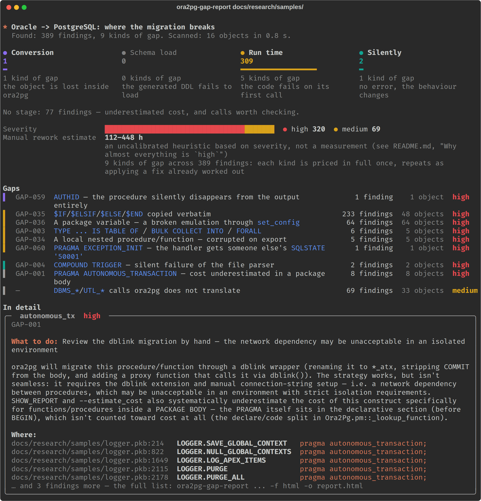
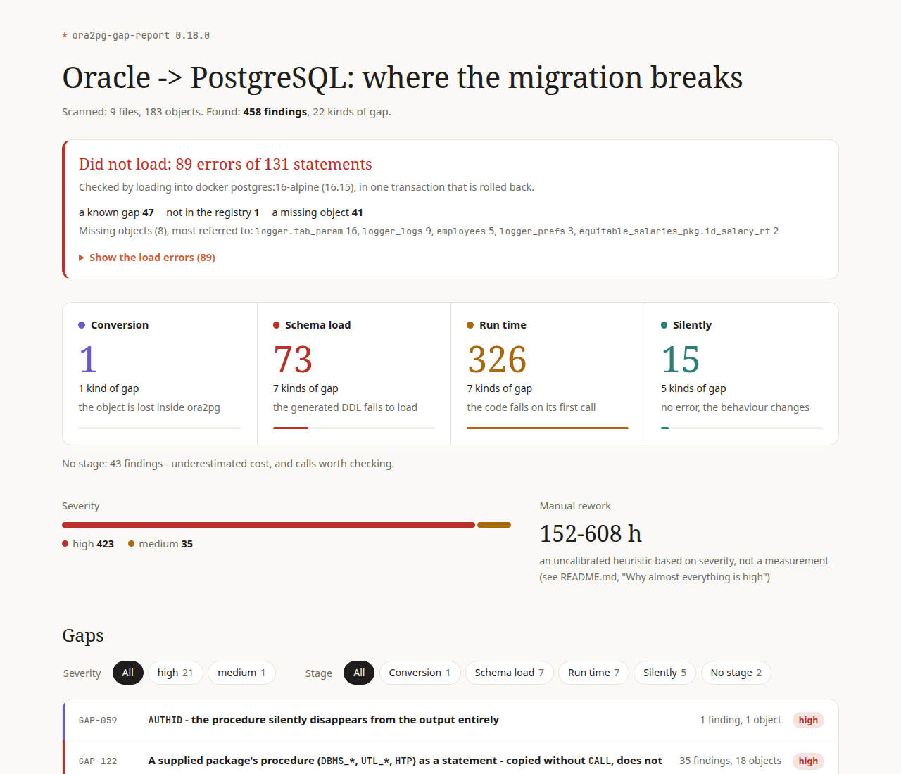
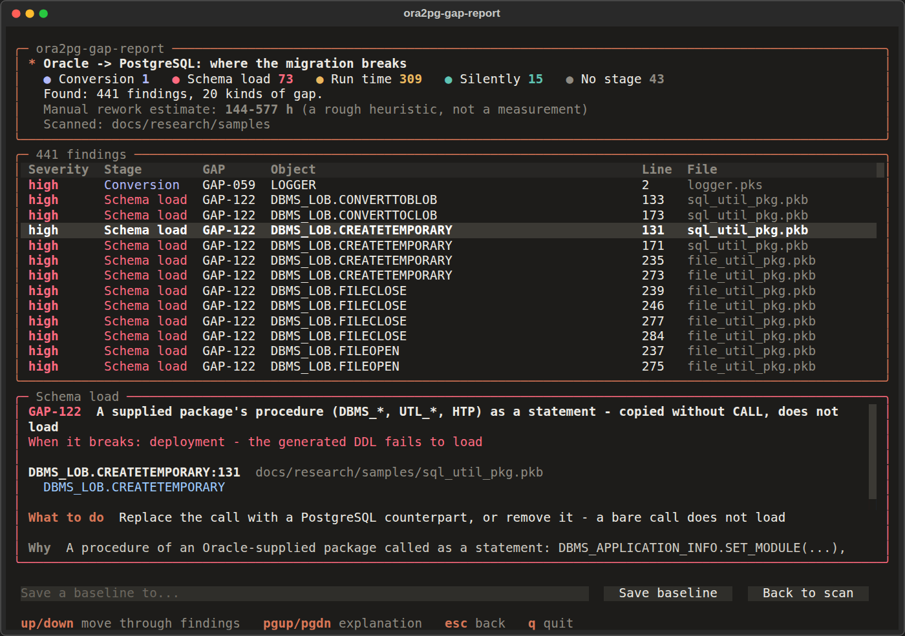
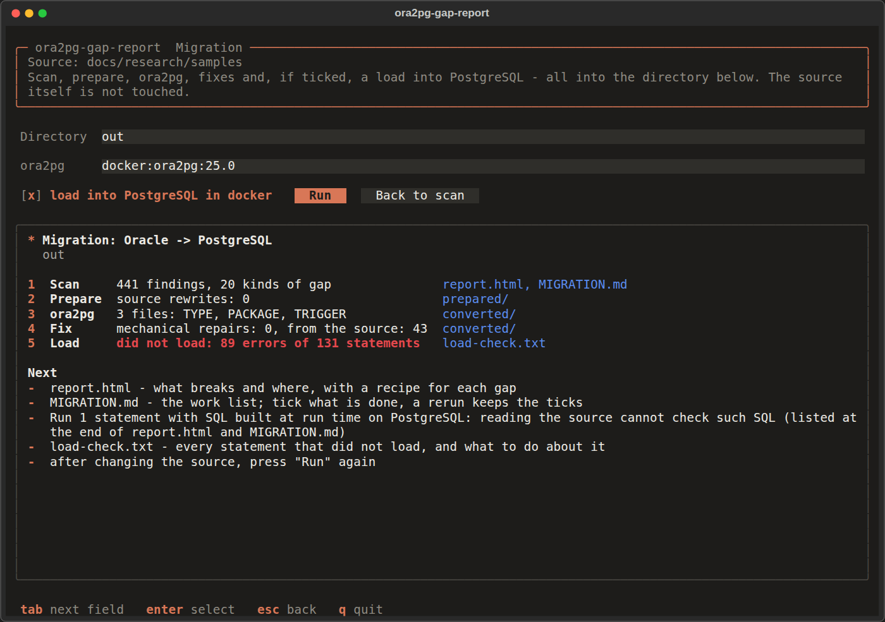
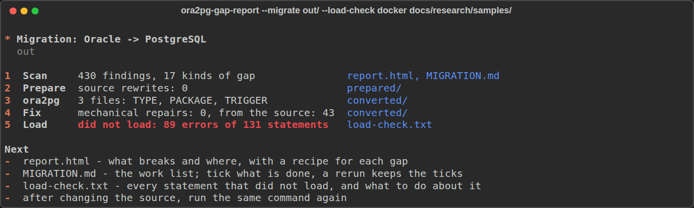

# ora2pg-gap-report

*English | [Русский](README.ru.md)*

[](https://github.com/Lunch418/ora2pg-gap-report/actions/workflows/tests.yml)
[](https://pypi.org/project/ora2pg-gap-report/)
[](https://pypi.org/project/ora2pg-gap-report/)
[](LICENSE)

A companion for migrating Oracle, MySQL/MariaDB and SQL Server to
PostgreSQL with `ora2pg`: it finds what `ora2pg` will get wrong before you
start, repairs what can be repaired mechanically, and checks the result
against a real PostgreSQL - so the gaps turn up on your laptop, not in
production.

```sh
pip install ora2pg-gap-report

# What will break, before anything is converted
ora2pg-gap-report schema/

# The whole path, checked against a real, throwaway PostgreSQL
ora2pg-gap-report --migrate out/ --load-check docker schema/
```

What `--migrate` does with `schema/`, step by step - each step is also a
mode of its own:

```
 schema/ (Oracle DDL, a mysqldump, an SSMS script)
    |
    |  1. scan       133 confirmed ora2pg gaps    -> out/report.html, out/MIGRATION.md
    |  2. prepare    rewrite what ora2pg's parser trips over  (--prepare)
    |  3. convert    ora2pg, once per object type             -> out/converted/
    |  4. fix        repair ora2pg's known mechanical bugs    (--fix), and what the source says
    |  5. load       into a real PostgreSQL, every error tied to its gap  (--load-check)
    v
 out/converted/*.sql that loads - or a list of exactly what does not, and why
```

`--dialect mysql` or `--dialect mssql` for the other two sources. `ora2pg`
itself is needed for `--migrate` (on `PATH`, or `--ora2pg-bin
docker:IMAGE`); scanning alone needs nothing but Python.

**Or nothing but docker.** The image has the tool, ora2pg 25.0 and psql
in it; give it the docker socket for `--load-check docker`:

```sh
docker run --rm --user "$(id -u):$(id -g)" --group-add "$(stat -c %g /var/run/docker.sock)" \
  -v "$PWD:/work" -v /var/run/docker.sock:/var/run/docker.sock \
  ghcr.io/lunch418/ora2pg-gap-report --migrate out/ --load-check docker schema/
```

`--user` and `--group-add` make the files in `out/` yours and let the
container reach docker; for a scan alone, `docker run --rm -v
"$PWD:/work" ghcr.io/lunch418/ora2pg-gap-report schema/` is enough. The
image speaks English; add `--lang ru` for Russian. With the tool installed
by pip but no ora2pg, the same image can be just the ora2pg:
`--ora2pg-bin docker:ghcr.io/lunch418/ora2pg-gap-report`.



## The problem

Migrating from Oracle to Postgres Pro Standard/Certified (i.e. without a Postgres
Pro Enterprise license and without the proprietary `ora2pgpro` utility), the only
available automated converter is the open-source
[`ora2pg`](https://github.com/darold/ora2pg). By independent estimates it covers
around ~80% of the PL/SQL -> PL/pgSQL conversion job on average. The remaining
~20% (packages, autonomous transactions, `CONNECT BY`, `DBMS_*`/`UTL_*` calls,
compound triggers) is currently sorted out by hand, and is typically discovered
after the fact — once something has already broken in production.

## What this tool does

Scans an Oracle, MySQL/MariaDB or SQL Server schema **before** migration and
reports exactly which objects `ora2pg` will skip without warning,
underestimate the effort for, or convert incorrectly - and why; then, if you
want, runs the migration itself and checks the result against a real
PostgreSQL. Not a replacement for `ora2pg`, a layer on
top of it: the list of what it actually fails to carry over was verified
empirically against real PL/SQL code
(`docs/research/step0-show-report-baseline.md`), not taken on faith.

| | |
|---|---|
| **Static analysis** | Looks for patterns in the source code (Oracle, MySQL/MariaDB or T-SQL), no `ora2pg` install required (except `connect_by`, see below) |
| **Reproducible** | Every finding is confirmed by a real `ora2pg` + PostgreSQL run, not by reading the docs |
| **7 output formats** | terminal, markdown, json, csv, `sarif`, `html`, `checklist` - the same set of findings every time |
| **CI gate** | `--fail-on` + SARIF for GitHub/GitLab code scanning, and a ready-made GitHub Action |
| **Works offline** | Self-contained bundle for closed networks (`scripts/build_offline_bundle.py`), see below |
| **Baseline** | `--save`/`--baseline` — NEW/RESOLVED/UNCHANGED between runs |
| **Post-migration check** | `--verify` — which pre-migration findings are still present in the generated code; takes its dialect from the baseline (not a functional check, see below) |
| **Interactive mode** | `--tui` (optional, `pip install "ora2pg-gap-report[tui]"`) — browse and click instead of remembering flags, `--migrate` included |
| **Autofix** | `--fix`/`--write` - seven known-safe mechanical fixes for `ora2pg`'s generated code (three for Oracle, three for T-SQL), picked by `--dialect`, see below |
| **One-command migration** | `--migrate out/` - scan, prepare, convert with ora2pg, fix (including what only the source still knows: statement triggers, package constants, ENUM types) and load, everything into one directory, see below |
| **Docker image** | `ghcr.io/lunch418/ora2pg-gap-report` - the tool, ora2pg 25.0 and psql in one image: nothing to install but docker |
| **Source preparation** | `--prepare` - rewrites what ora2pg's parser trips over in the dump itself (DELIMITER, DEFINER, `[brackets]`, `q'[...]'`), before ora2pg runs, see below |
| **Recipes and a checklist** | A tested PostgreSQL pattern for each class of problem, and `-f checklist`: a task list that keeps its ticks between runs, see below |
| **Load check** | `--load-check docker` - loads the generated code into a real, throwaway PostgreSQL and ties every statement that fails to its GAP-NNN, to `--fix`, or to an earlier failure; nothing is committed, see below |

## Detectors

| Detector | What it catches |
|---|---|
| `autonomous_tx` | `PRAGMA AUTONOMOUS_TRANSACTION` inside a `PACKAGE BODY` — ora2pg converts it via dblink, but under-costs or drops the cost entirely in `SHOW_REPORT`/`--estimate_cost` |
| `compound_triggers` | `COMPOUND TRIGGER` — ora2pg's file parser silently returns 0 triggers, with no error at all |
| `dbms_utl_calls` | Classifier for specific `DBMS_*`/`UTL_*` calls — which ones ora2pg actually converts, and which are left as-is |
| `connect_by` | Lints ora2pg's own generated `WITH RECURSIVE` for the `LEVEL` bug. Enabled with `--check-connect-by` and, unlike the others, requires `ora2pg` to be installed |
| `merge_delete_clause` | `MERGE ... WHEN MATCHED THEN UPDATE SET ... DELETE WHERE ...` — a compound Oracle construct with no equivalent in PostgreSQL's MERGE. A plain MERGE without DELETE WHERE isn't flagged — that's fine, it's not a gap |
| `bulk_collect` | Local `TYPE ... IS TABLE OF`, `BULK COLLECT INTO`, `FORALL` — practically never converted by ora2pg. The most common finding in real-world code of any detector in this project |
| `database_link` | `table@dblink_name` — a direct reference to a remote DB via database link. Copied as-is, no equivalent without manually setting up postgres_fdw/dblink |
| `model_clause` | `MODEL PARTITION BY ... DIMENSION BY ... MEASURES ... RULES` — spreadsheet-style computation in SQL. Has no direct equivalent in PostgreSQL at all |
| `pivot_clause` | `PIVOT`/`UNPIVOT` — rotating rows into columns directly in SQL. Copied as-is, PostgreSQL has no built-in equivalent |
| `object_type` | `CREATE TYPE ... AS OBJECT`/`TYPE BODY` — Oracle object types. `--estimate_cost` has no costing mechanism for them at all, not just an underestimate |
| `with_function` | `WITH FUNCTION`/`WITH PROCEDURE` — an inline function inside a query's own WITH clause. ora2pg's parser breaks the source structure, it doesn't just fail to convert it |
| `flashback_query` | `AS OF TIMESTAMP`/`AS OF SCN` — a flashback query. Copied as-is, no equivalent in PostgreSQL at all |
| `global_temp_table` | `CREATE GLOBAL TEMPORARY TABLE` — the `ON COMMIT` clause is dropped entirely, and Oracle's and PostgreSQL's defaults are opposite (a silent behavior change, not an error) |
| `table_partitioning` | `PARTITION BY RANGE/LIST/HASH` — table partitioning is dropped entirely, with no warning at all |
| `connect_by_nocycle` | `CONNECT BY NOCYCLE`/`ORDER SIBLINGS BY` — unlike plain `CONNECT BY`, breaks the structure of the entire surrounding PL/SQL block |
| `context_object` | `CREATE CONTEXT` — an application context (often the basis for VPD) isn't converted at all, leaving only a trace in the DEBUG log |
| `insert_all` | `INSERT ALL`/`INSERT FIRST` — a multi-table insert. Copied as-is, PL/pgSQL fails at body-compilation time |
| `json_table` | `JSON_TABLE(...)` — doesn't exist in PostgreSQL 16 and earlier (it exists in 17, but with a different COLUMNS syntax) |
| `external_table` | `CREATE TABLE ... ORGANIZATION EXTERNAL` — the section is dropped entirely, the table becomes an ordinary, empty one |
| `sql_macro` | `SQL_MACRO` — converted into an ordinary function, fails when called the way it was written to be used |
| `invisible_column` | An `INVISIBLE` column loses its invisibility — silently shows up in `SELECT *` after conversion |
| `collection_type` | `CREATE TYPE ... TABLE OF`/`VARRAY OF` — the collection type vanishes without a trace, dependent tables fail as soon as the DDL is loaded |
| `cross_apply` | `CROSS APPLY`/`OUTER APPLY` — PostgreSQL has no APPLY syntax at all, the closest equivalent is JOIN LATERAL |
| `oracle_text` | Oracle Text — the domain index (`INDEXTYPE IS CTXSYS.*`) is dropped, `CONTAINS`/`CATSEARCH`/`MATCHES` are not carried over |
| `recursive_with` | A native recursive `WITH ... AS (...)` (not via CONNECT BY) missing the `RECURSIVE` keyword that PostgreSQL requires |
| `invisible_index` | An `INVISIBLE` index loses its invisibility to the optimizer — PostgreSQL has no equivalent |
| `read_only_table` | `CREATE TABLE ... READ ONLY` loses its immutability guarantee — INSERT succeeds where Oracle would have reliably blocked it |
| `materialized_view_log` | `CREATE MATERIALIZED VIEW LOG` isn't converted at all, leaving only a trace in the DEBUG log |
| `identity_column` | `GENERATED ... AS IDENTITY (...)` with options — a double-parenthesis substitution bug in ora2pg itself, not a skipped conversion |
| `rowid_type` | `ROWID`/`UROWID` as a column's data type — converted to `oid`, a replacement type incompatible with the data it's supposed to hold |
| `sequence_cycle` | `CREATE SEQUENCE ... CYCLE` — the `CYCLE` section is dropped, `NEXTVAL` fails once the range is exhausted instead of wrapping around |
| `default_on_null` | `DEFAULT ON NULL` is copied verbatim — a syntax error the moment `CREATE TABLE` itself is applied |
| `public_synonym` | `CREATE [PUBLIC] SYNONYM` — loses the target object's schema; when the names match, the result is a self-referencing VIEW |
| `virtual_column` | `GENERATED ALWAYS AS (...) VIRTUAL` — loses the `ORA-54016` protection against explicit assignment; the generated trigger silently overwrites the value |
| `nested_subprogram` | A locally nested procedure/function "leaks" out as a separate object, its containing block disappears, and its body gets corrupted |
| `conditional_compilation` | `$IF`/`$ELSIF`/`$ELSE`/`$END` are copied verbatim — fails on the first call, not at CREATE time |
| `package_state` | A package-level variable — the `set_config`/`current_setting` emulation is broken (no type cast, no `missing_ok`) |
| `index_organized_table` | `ORGANIZATION INDEX` (IOT) is dropped — the table becomes an ordinary heap with a separate index, losing the storage architecture |
| `match_recognize` | `MATCH_RECOGNIZE` — row pattern matching, copied verbatim; PostgreSQL has no equivalent at all, so the DDL fails to load |
| `connect_by_pseudocolumn` | `CONNECT_BY_ROOT`/`CONNECT_BY_ISLEAF`/`CONNECT_BY_ISCYCLE` — carried into the generated recursive CTE unconverted. `SYS_CONNECT_BY_PATH` is deliberately *not* flagged: ora2pg converts that one correctly |
| `keep_dense_rank` | `KEEP (DENSE_RANK FIRST/LAST ORDER BY ...)` — Oracle's aggregate modifier, copied verbatim; no KEEP syntax in PostgreSQL |
| `multiset_operator` | `CAST(MULTISET(...))`, `MULTISET UNION/INTERSECT/EXCEPT`, `MEMBER OF`, `SUBMULTISET OF` — collection operators, none of which exist in PostgreSQL |
| `sample_clause` | `SAMPLE (n)` / `SAMPLE BLOCK (n)` — PostgreSQL has the same capability under different syntax (`TABLESAMPLE`), but ora2pg doesn't translate it |
| `accessible_by` | `ACCESSIBLE BY` — the caller whitelist is copied straight into the generated function header, which PostgreSQL rejects |
| `local_time_zone` | `TIMESTAMP WITH LOCAL TIME ZONE` becomes a bare `timestamp` — the session-time-zone conversion silently disappears (`timestamptz` would be faithful). No error, ever |
| `temporal_validity` | `PERIOD FOR` (Temporal Validity) is mangled into a truncated `period FOR` fragment — breaks the whole `CREATE TABLE`, not just the feature |
| `bitmap_index` | `CREATE BITMAP INDEX` becomes `USING gin`, which PostgreSQL refuses on an ordinary scalar column (no default operator class) — the index isn't created at all |
| `object_table` | `CREATE TABLE ... OF <type>` — `OF` ends up as a *column name* and the constraints are lost. With the type present the load succeeds silently, leaving a structurally wrong table |
| `ignore_nulls` | `IGNORE NULLS` / `RESPECT NULLS` on analytic functions is copied verbatim; PostgreSQL 16 has no such syntax at all, so the query fails to parse |
| `nlssort` | `NLSSORT` becomes a `COLLATE` clause carrying the Oracle language name across — PostgreSQL has no collation by that name, so the query fails at run time |
| `long_raw_type` | `LONG RAW` is mapped to `text` even though ora2pg's own documented default is `LONG RAW:bytea` — binary data then cannot be loaded at all |
| `anydata_type` | `SYS.ANYDATA` / `ANYDATASET` / `ANYTYPE` is copied through as a type name; PostgreSQL has neither the type nor a `SYS` schema |
| `system_trigger` | A trigger `ON DATABASE`/`ON SCHEMA` is emitted as an ordinary table trigger on a table literally named `database`/`schema`, keeping the Oracle event keyword |
| `trigger_follows` | `FOLLOWS`/`PRECEDES` leaks *inside* the generated trigger function's body — the trigger loads cleanly and then breaks every write to the table |
| `table_collection` | The `TABLE(...)` collection-unnesting operator is copied verbatim; PostgreSQL has no such operator |
| `cursor_expression` | `CURSOR(SELECT ...)` is copied verbatim; PostgreSQL has no cursor expressions |
| `for_update_wait` | `FOR UPDATE ... WAIT n` is copied verbatim; PostgreSQL offers only `NOWAIT` and `SKIP LOCKED` there |
| `rownum_dml` | `ROWNUM` in an `UPDATE`/`DELETE` is rewritten to `LIMIT n`, which PostgreSQL does not accept on DML (in a subquery it converts correctly and is not flagged) |
| `to_date_rr` | An `RR` format model inside `TO_DATE` is left in place; PostgreSQL silently returns year 1 BC instead of raising anything — wrong data, no error |
| `authid_clause` | `AUTHID CURRENT_USER`/`DEFINER` makes ora2pg drop the entire routine — no output, no error, not even a DEBUG log line |
| `pragma_exception_init` | `PRAGMA EXCEPTION_INIT` handlers all collapse onto `SQLSTATE '50001'`, which PostgreSQL never raises — the handler becomes dead code and the error escapes |
| `subtype_range` | `SUBTYPE ... RANGE lo .. hi` is carried into `CREATE DOMAIN` verbatim, and PostgreSQL's `CREATE DOMAIN` has no `RANGE` clause |
| `alt_quote_literal` | Oracle's `q'[...]'` alternative quoting is copied verbatim; PostgreSQL parses `q` as an identifier and the rest of the statement derails |
| `goto_statement` | `GOTO` is copied verbatim; PL/pgSQL has no `GOTO` at all |
| `cursor_rowtype` | `<cursor>%ROWTYPE` is copied verbatim; PL/pgSQL allows `%ROWTYPE` only against a table or view (plain `<table>%ROWTYPE` converts fine and is not flagged) |
| `wm_concat` | `WM_CONCAT` is copied verbatim — unlike `LISTAGG`, which ora2pg does rewrite to `string_agg` |
| `read_only_view` | `WITH READ ONLY` is dropped; the resulting PostgreSQL view is auto-updatable, so writes Oracle rejected now silently succeed |
| `sdo_geometry` | `SDO_GEOMETRY` becomes the PostGIS `geometry` type with no `CREATE EXTENSION postgis` emitted — the DDL fails to load on a stock server |
| `table_if_not_exists` | 23ai's `CREATE TABLE IF NOT EXISTS` — ora2pg takes `IF` for the table's name and emits `CREATE TABLE if ( not EXISTS ...`; the load fails and `ON_ERROR_STOP` stops the whole schema |
| `identity_on_null` | `GENERATED BY DEFAULT ON NULL AS IDENTITY` — `ON NULL` is dropped, so an `INSERT` that passes `NULL` for the column (Oracle fills it in) fails on NOT NULL in PostgreSQL |
| `package_constant_chain` | A package constant initialized from another (`c_stamp := c_date \|\| ' HH24'`) - ora2pg splices the two `current_setting()` calls into a non-expression; every routine reading it fails to load |
| `ref_cursor_type` | `TYPE x IS REF CURSOR` - becomes `CREATE OR REPLACE TYPE ... AS REFCURSOR`, which PostgreSQL has no syntax for; functions returning it fail too |
| `repeated_package_call` | `pkg.proc;` written without parentheses, when the same routine already called it - the repeat loses `CALL` and the routine fails to load |
| `trigger_package_call` | A trigger calling a package procedure - triggers are converted on their own, so the call is copied without `CALL` and the trigger fails to load |
| `statement_trigger` | A statement-level trigger (no `FOR EACH ROW`) - ora2pg writes `FOR EACH ROW`, so it fires once per row instead of once per statement, silently |
| `package_constant_default` | A package constant as a parameter default (`p_os := g_os_windows`) - copied as it is while the body's reads are rewritten; the function fails to load |
| `package_type_anchor` | `%TYPE`/`%ROWTYPE` in a package RECORD field or SUBTYPE - copied into the `CREATE TYPE`/`CREATE DOMAIN` ora2pg makes of it; DDL has no `%TYPE`, it does not load |
| `package_type_reference` | A package type (`SUBTYPE`, `RECORD`, `TABLE OF`) used in the package's own routines without its name - ora2pg creates it in the package schema and leaves the uses bare: `type does not exist` |
| `supplied_package_call` | A procedure of a supplied package called as a statement (`DBMS_STATS.GATHER_TABLE_STATS(...)`, `UTL_FILE.FCLOSE(f)`, `HTP.P(...)`) - copied without `CALL`, the routine does not load |
| `dbms_sleep` | `DBMS_LOCK.SLEEP` / `DBMS_SESSION.SLEEP` - ora2pg writes `pg_sleep(n);` without `PERFORM`, the routine does not load; `--fix` repairs it |
| `empty_string_null` | `''` compared, assigned, as a `DEFAULT` or the fallback of `NVL`/`COALESCE` - NULL in Oracle, an empty string in PostgreSQL: loads, then returns different results |
| `number_without_precision` | `NUMBER` without a precision (column, variable, parameter, return) - ora2pg makes it `bigint`: 9.99 is stored as 10. Once per file; `DEFAULT_NUMERIC numeric` in ora2pg.conf fixes it |
| `number_as_float` | `NUMBER(p,s)` and `FLOAT` - ora2pg makes them `real`/`double precision`: 0.1 + 0.2 is no longer 0.3. Once per file; `PG_NUMERIC_TYPE 0` and `DATA_TYPE FLOAT:numeric` fix it |
| `integer_division` | A division of integers (`7 / 2`, `i / 2` with `i PLS_INTEGER`) - 3.5 in Oracle, 3 in PostgreSQL |
| `substr_start` | `SUBSTR(s, 0, n)` or `SUBSTR(s, -n)` - PostgreSQL's `substr` returns another part of the string |
| `schema_qualified_name` | A schema-qualified name (`"HR"."EMP"`, the way `GET_DDL` writes every one) - ora2pg keeps the schema on tables, views and sequences but never creates it, and drops it on triggers and in view bodies: nothing loads on a fresh database |

The twenty-seven below are the MySQL/MariaDB dialect (`--dialect mysql`, `ora2pg
-m` — see "Source dialects" further down); every other detector in this
table is Oracle-only.

| Detector | What it catches |
|---|---|
| `mysql_enum_type` | `ENUM(...)` — ora2pg synthesizes a named PostgreSQL type for it but never emits the `CREATE TYPE ... AS ENUM (...)` that type needs; `CREATE TABLE` fails to load |
| `mysql_on_update_current_timestamp` | `DEFAULT CURRENT_TIMESTAMP ON UPDATE CURRENT_TIMESTAMP` — the `ON UPDATE ...` fragment is copied verbatim into `DEFAULT`, which PostgreSQL's `DEFAULT` has no syntax for at all |
| `mysql_on_duplicate_key_update` | `INSERT ... ON DUPLICATE KEY UPDATE` — copied verbatim into the function/procedure body; PostgreSQL's `INSERT` has no such clause, fails on first call |
| `mysql_signal` | `SIGNAL`/`RESIGNAL` — copied verbatim; neither exists in PL/pgSQL, fails on first call |
| `mysql_fulltext_index` | `FULLTEXT KEY`/`FULLTEXT INDEX` inside `CREATE TABLE`'s column list — not recognized as an index at all; the bare keywords are left where a column definition was expected, and `CREATE TABLE` fails to load |
| `mysql_key_index` | `KEY <name> (<cols>)` — mysqldump's own default spelling for a secondary index. Left as a `key <NAME>` stub where a column was expected, so `CREATE TABLE` fails to load. The `INDEX` synonym and `UNIQUE KEY` both convert fine |
| `mysql_index_prefix` | An index on a column prefix (`KEY idx (note(20))`, required for TEXT/BLOB) - ora2pg writes `(note"(20)`, an unclosed quote that swallows the rest of the file; PostgreSQL has no prefix index, so it is a decision per index |
| `mysql_index_name_collision` | One index name on several tables - fine in MySQL, a clash in PostgreSQL, where the second `CREATE INDEX` fails; `--prepare` renames them `<table>_<name>` |
| `mysql_spatial_index` | `SPATIAL KEY`/`SPATIAL INDEX` — same shape as FULLTEXT, but restored as a GiST index over a PostGIS type |
| `mysql_limit_comma` | `LIMIT offset, count` — copied verbatim; PostgreSQL rejects the comma form outright (`LIMIT #,# syntax is not supported`) |
| `mysql_replace_into` | `REPLACE INTO` — copied verbatim; no PostgreSQL equivalent, and `ON CONFLICT DO UPDATE` is not a literal substitute (REPLACE deletes, so delete-side cascades fire) |
| `mysql_insert_ignore` | `INSERT IGNORE` — copied verbatim; `ON CONFLICT DO NOTHING` is narrower than what IGNORE actually suppresses |
| `mysql_prepare_from` | `PREPARE <name> FROM <string>` — PostgreSQL spells its own PREPARE differently (`AS <query>`, not a string variable); PL/pgSQL's `EXECUTE` is the real equivalent |
| `mysql_last_insert_id` | `LAST_INSERT_ID()` — copied verbatim; no such function in PostgreSQL |
| `mysql_auto_increment_start` | `AUTO_INCREMENT=<n>` table option — on the file-based path the column becomes `serial` correctly but the starting value is lost (a live-DB export gets it via `INFORMATION_SCHEMA.TABLES`, which the file-based path never queries), so the sequence restarts at 1 and the first insert after a data migration collides on the primary key |
| `mysql_date_format` | `DATE_FORMAT(...)` — emitted as a bare row constructor with the `to_char` name missing and `%d` untranslated. Nothing errors at any stage; the query just silently returns a tuple instead of a formatted string |
| `mysql_foreign_key` | `FOREIGN KEY` — dropped (both the named-CONSTRAINT and bare forms) whenever the target `PG_VERSION` is left unset or set to 12 or lower, ora2pg's own default; a Perl autovivification accident in shared, dialect-agnostic code makes every referenced table look partitioned, so the constraint is silently skipped, on file input or a live connection alike, with no error at all |
| `mysql_zero_date` | `'0000-00-00'` — MySQL's "not set" marker is silently rewritten to a real `'1970-01-01'`, so unfilled-date queries stop matching and reports start showing 1970 as an event |
| `mysql_declare_handler` | `DECLARE ... HANDLER` — dropped with no `EXCEPTION` block in its place, so a routine's whole error-handling policy disappears: what MySQL swallowed now aborts the caller's transaction |
| `mysql_collate` | `COLLATE`/`CHARACTER SET` on a column — dropped. MySQL's usual `*_ci` rules are case-insensitive, PostgreSQL's default is not, so queries silently start returning different rows |
| `mysql_set_type` | `SET(...)` — becomes plain `text`. The only `medium` of the MySQL batch: the schema works and existing data survives, but nothing validates future writes |
| `mysql_delimiter_routine` | A procedure/function under `DELIMITER ;;`/`//`/`$$` — how mysqldump and every `mysql`-client script write routines. The delimiter and `DELIMITER ;` leak into the generated body, which does not load; from a real sakila dump not one routine was created |
| `mysql_delimiter_trigger` | A trigger under a delimiter without `;` (`//`, `$$`, `\|`) — ora2pg finds no trigger at all: no output, no error, the table just has no trigger |
| `mysql_definer_procedure` | `CREATE DEFINER=... PROCEDURE` (mysqldump's spelling) — `-t PROCEDURE` skips it silently, because its parser, unlike `-t FUNCTION`'s, has no `DEFINER=` pattern |
| `mysql_versioned_comment` | A trigger/view/routine inside `/*!50003 ... */` — mysqldump's own output for every trigger and view. ora2pg strips comments first, and the objects go with them |
| `mysql_create_table_if_not_exists` | `CREATE TABLE IF NOT EXISTS` — becomes a table called `if`; the load fails and stops the whole schema |
| `mysql_temporary_table` | `CREATE TEMPORARY TABLE` — `TEMPORARY` is dropped, so the table is permanent and shared: one session's rows are visible to every other |

And these twenty-one are the T-SQL/SQL Server dialect (`--dialect mssql`,
`ora2pg -M`).

| Detector | What it catches |
|---|---|
| `mssql_bracket_identifier` | `[dbo].[Orders]`, `[Id]`, `[int]` — the brackets SSMS emits for every name are never stripped on the file-based path; they end up inside the generated identifier and inside type names, and the DDL fails to load. The widest-reaching gap of the batch |
| `mssql_newid_default` | `NEWID()` — mapped onto `uuid_generate_v4()` with no `CREATE EXTENSION "uuid-ossp"` emitted, so `CREATE TABLE` fails to load |
| `mssql_update_set` | `UPDATE ... SET` — mistaken for T-SQL's variable-assignment `SET`: the keyword is deleted and `=` becomes `:=`, breaking every UPDATE in every procedure |
| `mssql_identity_column` | `IDENTITY(1,1)` — dropped on the file-based path (no serial, no sequence; ora2pg reads identity metadata only from a live `sys.identity_columns` query, with no DDL-text fallback), so the first ordinary insert fails on NOT NULL |
| `mssql_parameterless_procedure` | A procedure with no parameters gets an unparseable empty `DECLARE ;` block — verified by A/B against the same procedure with a parameter, which comes out clean |
| `mssql_if_statement` | `IF` — with a `BEGIN/END` block it gets `THEN` but never `END IF`; without one it gets no `THEN` at all |
| `mssql_raiserror` | `RAISERROR`/`THROW` — copied verbatim; PL/pgSQL has neither |
| `mssql_try_catch` | `BEGIN TRY`/`BEGIN CATCH` — copied verbatim, `END TRY`/`END CATCH` included |
| `mssql_top_clause` | `SELECT TOP n` — copied verbatim; PostgreSQL has no TOP |
| `mssql_scope_identity` | `SCOPE_IDENTITY()`/`@@IDENTITY`/`IDENT_CURRENT()` — copied verbatim |
| `mssql_output_clause` | `OUTPUT INSERTED.*` — copied verbatim; `RETURNING` is the equivalent, and not an exact one |
| `mssql_iif` | `IIF()` — copied verbatim, while the neighbouring CHARINDEX in the same statement does get translated |
| `mssql_datediff` | `DATEDIFF()` — copied verbatim, though `DATEADD` and `DATEPART` beside it convert correctly |
| `mssql_charindex` | `CHARINDEX()` — translated into `position()`, but with the quotes doubled: `position(''abc'' in x)`, which is not valid SQL |
| `mssql_filtered_index` | `CREATE INDEX ... WHERE` — dropped entirely, even though PostgreSQL has partial indexes with the same syntax (an `INCLUDE` index beside it converts fine) |
| `mssql_foreign_key` | `FOREIGN KEY` — dropped whenever the target `PG_VERSION` is left unset or set to 12 or lower, same shared-code mechanism as on the MySQL side; no error at any stage |
| `mssql_collation` | `COLLATE` — ignored by the `CASE_INSENSITIVE_SEARCH citext` default, which checks a column's base type but never its actual collation, so every string column becomes case-insensitive `citext`; for a `_CS_` source collation that inverts comparison behaviour, verified on live data |
| `mssql_computed_column` | A computed column (`AS (expr) PERSISTED`) is typed `citext` whatever the expression computes, so a numeric result is stored as text |
| `mssql_rowversion` | `ROWVERSION` -> `bytea`, which never self-updates, so optimistic-locking checks silently stop detecting conflicts |
| `mssql_schema_qualified_name` | `[dbo].[Orders]` - the schema is kept on every name but never created, so nothing loads on a fresh database; `--fix` writes `CREATE SCHEMA IF NOT EXISTS` |
| `mssql_go_separator` | A procedure, function or trigger followed by `GO`, as SSMS ends every object - ora2pg puts the `GO` into the body (`END GO END;`), the routine does not load; `--prepare` removes the `GO` lines |

Plus `ora2pg_wrapper.py` — runs `ora2pg` per object type against exported DDL
and parses `--estimate_cost`, and `oracle_connector.py`/`oracle_export.py` —
a live export of `PACKAGE BODY`/`TRIGGER` straight from an Oracle schema via
`DBMS_METADATA.GET_DDL`.

### Why almost everything is `high`

Of the 133 registered gaps (`gap_registry.py`) — 85 from the Oracle source
dialect, 27 from MySQL/MariaDB (`dialect="mysql"`, `ora2pg -m`) and 21 from
T-SQL/SQL Server (`dialect="mssql"`, `ora2pg -M`); see "Source dialects"
below — 127 are `high` and 6 are `medium` (`context_object`,
`invisible_index`, `virtual_column`, `index_organized_table`, `sdo_geometry`
on the Oracle side, `mysql_set_type` on the MySQL side; the MSSQL batch has
no `medium` at all) — `severity` is a `GapEntry` field now, cross-checked by
`scripts/doctor.py` against the literal a detector's own source actually
uses, not just a count taken on faith. Separately, there's one more detector
on top of those 133, `dbms_utl_calls` — a
classifier for `DBMS_*`/`UTL_*` calls, not tied to a specific GAP-NNN (it has
no single reproducible minimal example — that's a deliberately broad
category), also `medium`. `low` is a valid value in the
registry (`--severity low`, with an hour range in `effort_estimator.py`), but
hasn't been assigned to any detector yet — honestly, not because the
criterion wasn't thought through, but because none of the confirmed cases
landed there. Not a distribution chosen for its own sake — it fell out of
real findings, following this principle:

- **`high`** — either the generated code genuinely fails to compile/run in
  PostgreSQL (confirmed by running it on real PostgreSQL 16 — `ERROR: syntax
  error...` and similar, see the table in `docs/research/AUDIT.md`), or the
  construct disappears silently but the loss is architecturally significant:
  partitioning, an external table, a materialized view log, a `READ ONLY`
  guarantee, a database link — things that either break the migration
  outright or silently change system behavior in a way that isn't noticed
  right away, only in production.
- **`medium`** — doesn't block the migration and doesn't lose data, but a
  real behavioral divergence worth double-checking: `invisible_index` (the
  index stops being hidden from the optimizer — affects the query plan, not
  correctness), `context_object` (an application feature, often the basis
  for VPD, but the migration itself doesn't fail from losing it),
  `virtual_column` (the final value in the column is correct — what's lost
  isn't data, it's early diagnostics for a mistaken explicit assignment),
  `index_organized_table` (integrity constraints are preserved — what's lost
  is storage architecture, not correctness), and separately `dbms_utl_calls`
  (a deliberately broad classifier — the real impact of a specific call
  varies too much to honestly call all of them `high`).

## Methodology

This project doesn't try to find a detector for every Oracle-specific
construct that exists. `ROWNUM`, `DECODE`, `NVL`, `SYSDATE`, `%TYPE`,
sequences, standard exception semantics — `ora2pg` converts all of these
correctly, and no detector is needed for them, however exotically
Oracle-flavored they sound.

A new detector only appears once the hypothesis has been checked in practice:

1. Pick a specific Oracle construct.
2. Build a minimal reproducible example.
3. Run the example through real `ora2pg`.
4. Check the generated PostgreSQL code for correctness.
5. If `ora2pg` handled it — the hypothesis is rejected, no detector gets
   written. If a real, reproducible bug turns up — a test fixture is added
   and a detector gets written.

That's how the initial hypothesis about `CREATE PACKAGE` was ruled out, for
example — an obvious-looking candidate at first glance, but in practice
`ora2pg` carries it over without issue
(`docs/research/step0-show-report-baseline.md`). And that's how `COMPOUND
TRIGGER` and the `LEVEL` bug in `CONNECT BY` were confirmed — both
reproduced on a real `ora2pg` run, not assumed from a description.

Every confirmed finding is numbered and collected in
[`docs/research/GAP_REGISTRY.md`](docs/research/GAP_REGISTRY.md) — each
entry states which detector covers it and against which `ora2pg` version it
was confirmed. [`docs/research/AUDIT.md`](docs/research/AUDIT.md) is a
summary check of the evidence behind every confirmed gap (research doc, real
ora2pg output, expected/actual, tests, including guard tests against false
positives).

## Installation and usage

```sh
pip install ora2pg-gap-report   # (or: pip install . from a repo checkout)
```

The detector library itself (`detectors/`, `models.py`,
`report_generator.py`) is pure Python with zero external dependencies — it
can be imported on its own (e.g. from your own scripts) without installing
anything else at all. The CLI has exactly one required dependency —
[`rich`](https://github.com/Textualize/rich), purely for a pleasant terminal
output; it installs itself via `pip install`.

Right after installation, the command is available:

```sh
ora2pg-gap-report path/to/schema_dump.pkb another_file.sql
```

In an interactive terminal, the default is a colored report laid out like
the HTML one: how many findings wait at each stage a migration reaches
(conversion, schema load, run time, silently), the severity split and a
rough hour range, every gap once, then each gap in detail — why, what to
do, and its first few occurrences. For
scripts/redirects — `--format markdown`, `--format json`, `--format csv`,
`--format sarif`, or `--format html` (markdown also serves as the default
format whenever stdout isn't a terminal):

`--format` can be omitted when `--output`'s extension already says which
one you want — `.json`, `.csv`, `.sarif`, `.html`/`.htm` and `.md` are
recognised, anything else falls back to markdown, and an explicit
`--format` always wins. `-f`, `-o` and `-l` are short forms of
`--format`, `--output` and `--lang`.

```sh
ora2pg-gap-report path/to/schema_dump.pkb -o report.json   # format from the extension
ora2pg-gap-report path/to/schema_dump.pkb --format markdown > report.md
ora2pg-gap-report path/to/schema_dump.pkb --format csv --output report.csv

# SARIF 2.1.0 — for GitHub code scanning (Security tab) or GitLab SAST.
# Severity is mapped to SARIF levels: high -> error, medium -> warning,
# low -> note (SARIF has no separate critical level, and neither does
# this tool).
ora2pg-gap-report path/to/schema_dump.pkb --format sarif --output report.sarif

# A self-contained HTML page (no external CSS/JS/fonts — opens offline)
# — to show a client/manager, without installing anything.
ora2pg-gap-report path/to/schema_dump.pkb --format html --output report.html

# Optional: lint ora2pg's own generated code for CONNECT BY.
# Requires ora2pg to be installed (see https://github.com/darold/ora2pg)
# — the only external (non-Python) dependency anywhere in this project,
# and only for this one specific check.
ora2pg-gap-report path/to/schema_dump.pkb --check-connect-by
```



The `--format json` format is described by a formal JSON Schema —
[`schemas/report.schema.json`](schemas/report.schema.json) (and the
baseline-snapshot format from `--save`/`--baseline` is in
[`schemas/baseline.schema.json`](schemas/baseline.schema.json)), so
third-party tools can reliably parse the output instead of guessing from
examples. Both schemas are checked in the tests against real output
(`tests/test_schemas.py`) — not just written and left as-is. `--format
sarif` is checked the same way in `tests/test_sarif.py` against the
official OASIS SARIF 2.1.0 schema (vendored into `tests/fixtures/`, so the
tests don't depend on the network).

DDL files can be passed as-is — a single file may contain multiple
packages/triggers, the detectors figure out object boundaries themselves,
including from a script's own separators — SQL*Plus's `/`, T-SQL's `GO`,
MySQL's `DELIMITER`.
A directory can be passed too: everything with a `.sql`/`.pks`/`.pkb`
extension inside gets scanned recursively (e.g. an entire
`DBMS_METADATA.GET_DDL` export directory):

```sh
ora2pg-gap-report path/to/schema_dump_dir/
```

`ora2pg-gap-report --version` — show the installed version.

### Interactive mode (`--tui`)

Everything above is flag-driven, on purpose — that's what makes it
scriptable and CI-friendly. For browsing interactively instead of
remembering flags, `--tui` opens a mouse/keyboard-driven screen: pick a
file or directory in a tree, choose severity/language, scan, then move
through the results table with the arrow keys: the box under it follows the
cursor and shows each finding's `GAP-NNN`, when it actually breaks, what to
do and why — the same information `--explain` and the terminal report
show. It is styled after Claude Code's own terminal UI. To install and open it:

```sh
pip install "ora2pg-gap-report[tui]"   # adds textual — not part of the base install
ora2pg-gap-report --tui                # opens in the current directory
ora2pg-gap-report --tui path/to/schema_dump/   # opens there instead
```



Standalone mode, like `--explain`/`--verify`: the CLI takes at most one
path (a starting point for the tree, not a list to scan directly — picking
what to scan is the point of being inside the tree) and none of the
scan-shaping flags (`--severity`, `--format`, `--fail-on`, `--save`, and so
on all no-op once you're inside the TUI, so combining them is rejected
outright rather than silently ignored). Once inside, the screen itself
covers the same ground the flag-based workflow does: queue more than one
file/directory with "Add to selection" before scanning, tick "Check
CONNECT BY" for the same opt-in ora2pg-backed check `--check-connect-by`
runs, and point the baseline field at a `--save` snapshot to see
NEW/RESOLVED/UNCHANGED counts on the results screen (with its own "Save
baseline" button to write one), or tick "Verify mode" to run the same
post-migration `--verify` comparison against it. Running `--tui` without
the `[tui]` extra installed prints a plain install hint, not a traceback.

"Migrate" runs `--migrate` on what is picked: a screen asks where to write,
which ora2pg to use (`ora2pg` on `PATH` or `docker:IMAGE`) and whether to
load the result into PostgreSQL in docker, shows each step while it runs,
and ends with the same summary the command line prints. The directory it
writes is the same too - `report.html`, `MIGRATION.md`, `converted/`, and
`load-check.txt`/`.json` with the load.



### Documentation straight from the CLI

`--explain GAP-023` (or just `--explain 23`) prints a specific gap's research
document from the registry — the Oracle construct, real `ora2pg` output, the
observed problem, the verdict, and the `ora2pg`/PostgreSQL versions the
finding was confirmed against (currently 25.0/16 for all 133 — a single
version, because there hasn't been a second one yet; `gap_registry.py` is
already set up to store different versions for future findings) — without
scanning any files:

```sh
ora2pg-gap-report --explain GAP-023
```

Research documents (`docs/research/`) are part of the repository but not
part of the pip package (the package is `ora2pg_gap_report/` only). When run
from a package installed via `pip install`, rather than from a repo
checkout, `--explain` shows a direct link to the document on GitHub instead
of the document's text.

### Migration recipes

The research docs say what goes wrong. The
[recipes](docs/recipes/README.md) say what to write instead: fifteen pages,
one per class of problem (hierarchical queries, collections and
`BULK COLLECT`, autonomous transactions, package state, temporary tables,
`PIVOT`, `MERGE`/upserts, error handling, database links, `DBMS_*` calls,
analytic functions, read-only and invisible objects, partitioning, T-SQL
and MySQL expressions), each with the PostgreSQL pattern and what does
not carry over. Every gap that has a recipe links to it from `--explain`,
the terminal and HTML reports, the TUI, the checklist and `--load-check`.

The code in the recipes is not illustration: the test suite loads every
page's SQL into a real PostgreSQL 16 and runs the `ASSERT`s in it, in
both languages, so a recipe that stops working fails the build.

### Target PostgreSQL version (`--pg-version`)

Every gap was confirmed on PostgreSQL 16. Some stop being a problem on a
newer version, and `--pg-version` takes that into account - only where it
was checked on that version:

```sh
ora2pg-gap-report --pg-version 17 schema/                          # JSON_TABLE is not reported
ora2pg-gap-report --pg-version 17 --load-check docker generated/   # loads into postgres:17
```

So far: `JSON_TABLE` (GAP-017) loads and returns the same rows on 17 and
18, `NESTED PATH` included - except with Oracle's `ERROR ON ERROR` before
`COLUMNS`, which is still reported. What was left out is said on stderr.
With a version older than 16 nothing is left out, and a note says the
gaps were confirmed on 16: check the generated code with `--load-check
docker --pg-version N`, which loads it into that version.

### What the scan cannot see: SQL built at run time

`EXECUTE IMMEDIATE v_sql`, `OPEN c FOR v_sql`, `DBMS_SQL.PARSE(c, v_sql)`,
MySQL's `PREPARE s FROM @sql`, T-SQL's `EXEC(@sql)` and `sp_executesql
@sql` run SQL whose text is only known when the program runs. No reading
of the source can check it, this tool included. So instead of staying
silent about it, every report lists these statements in a section of
their own, "Not checked", after the findings: file, line, object, the
statement, and "partly" where the text is joined from string literals and
variables (the literals are scanned, what the variables add is not). SQL
made only of literals is scanned in full and is not listed.

They are not findings: they count toward no severity, stage, effort
estimate or `--fail-on`. In `MIGRATION.md` each is a box to tick once it
has been run on PostgreSQL, and the ticks are kept like the others'. In
JSON they are the `unchecked` array (`schema_version` 3); CSV and SARIF
carry findings only.

### Source dialects (`--dialect`)

`ora2pg` isn't Oracle-only: `-m`/`--mysql` and `-M`/`--mssql` point it at a
MySQL/MariaDB or SQL Server source instead, still targeting PostgreSQL.
Both were confirmed to work file-based (`-i <file>`, no live source
database needed), so this project scans all three:

```sh
ora2pg-gap-report schema/                        # Oracle (the default)
ora2pg-gap-report --dialect mysql mysqldump.sql  # GAP-068..086, 106..111, 127..128
ora2pg-gap-report --dialect mssql ssms.sql       # GAP-087..105, 125, 126
```

Every non-Oracle gap was confirmed exactly the way the Oracle ones were: a
minimal example, a real `ora2pg -m`/`-M` run, the generated PostgreSQL
loaded onto a real PostgreSQL 16 server — and for the ones that never
raise an error, a query actually run against real data to show what
changes.

The three dialects' detectors are structurally separate (`core.py`'s
`_ORACLE_DETECTORS`/`_MYSQL_DETECTORS`/`_MSSQL_DETECTORS` tuples), so a
file scanned under the wrong `--dialect` cannot trigger another dialect's
detectors — by construction, not by keyword luck.

`--verify`, `--fix` and `--tui` all work across the three dialects too:

- **`--verify` needs no `--dialect` at all.** Which detectors re-scan the
  generated output is worked out from the baseline itself — every detector
  belongs to exactly one dialect, so the names already in the snapshot
  determine it. That also means baselines written before dialects existed
  keep verifying unchanged, with no schema bump. Passing `--dialect`
  anyway is allowed but cross-checked: a snapshot taken with one dialect
  and verified with another's detectors would report "not detected" for
  every finding, which is a tautology rather than a check, so the pair is
  rejected instead. A snapshot mixing dialects, or naming detectors this
  build doesn't have, is rejected for the same reason — verifying against
  part of a baseline would produce a confident number computed from
  incomplete input.
- **`--fix` runs the mechanical fixes registered for `--dialect`.** Each
  dialect has its own (see below); a dialect with none would say so instead
  of reporting every file as "nothing to fix", which would read as "your
  output is fine".
- **`--tui`** has a dialect picker beside the severity and language ones,
  and applies the same rules — including taking the dialect from the
  baseline in verify mode.

`--check-connect-by` stays Oracle-only and now says so: `CONNECT BY` is
Oracle syntax and the check runs `ora2pg` in Oracle mode, so on another
dialect's file it could only ever find nothing.

### Output language

The default output is in Russian — it doesn't change without an explicit
action, so existing scripts and CI that parse the current output keep
working unchanged. English is available as an option:

- `--lang en` — for this run only, saves nothing;
- `--set-lang` — opens a language picker (`[1] English` / `[2] Русский`) and
  saves it as the default for all future runs
  (`~/.config/ora2pg-gap-report/language`, or `$XDG_CONFIG_HOME`);
- `ORA2PG_GAP_REPORT_LANG=en` — for CI, not saved;
- on first run in an interactive terminal, if no language is set anywhere,
  the `--set-lang` picker shows itself once and saves the choice.

Priority order: `--lang` -> environment variable -> saved choice -> interactive
picker (a real terminal only) -> Russian by default.

The entire scan output is translated: the terminal report, `--format
markdown/html`, per-detector explanations and remediation hints, error
messages, and `--help` (it follows `--lang` and the same priority order
above). The research documents in `docs/research/` exist in both
languages — the English text at `gap-NNN-*.md`, the Russian beside it as
`.ru.md`, for every gap — and `--explain` prints the one matching the
output language.

### Tracking migration progress (baseline)

A schema is usually fixed up iteratively — a snapshot of "what's wrong
right now," then some fixes, then a re-run. `--save` stores the current
run's findings as a snapshot; `--baseline` compares the next run against it
and shows NEW/RESOLVED/UNCHANGED (on stderr, separate from the report
itself):

```sh
ora2pg-gap-report path/to/schema_dump/ --save baseline.json
# ... fix up the schema, convert some objects by hand ...
ora2pg-gap-report path/to/schema_dump/ --baseline baseline.json
```

Findings are matched between runs not by line number (which shifts on any
file edit), but by a fingerprint built from the detector, file, object, and
matched snippet — so a finding is recognized as "the same one" even if the
code around it was rewritten. `--save`/`--baseline` always operate on the
full set of findings, regardless of `--severity`/`--object` (those flags
only affect what gets displayed in the report).

### A checklist that remembers (`-f checklist`)

For the weeks of work after the first scan, `-f checklist` writes a
Markdown task list: one box per object and gap, grouped like the reports,
each gap with what to do, its recipe and the `--explain` command. Commit it
to the repository or paste it into an issue, and tick boxes as you go.

```sh
ora2pg-gap-report schema/ -f checklist -o MIGRATION.md
# ... fix things, tick boxes in MIGRATION.md ...
ora2pg-gap-report schema/ -f checklist -o MIGRATION.md   # same -o: progress is kept
```

```text
**Done: 2 of 4 (50 %)**

## GAP-003 `TYPE ... IS TABLE OF` / `BULK COLLECT INTO` / `FORALL`

high · breaks at: run time · 1 of 2 open

**What to do:** Rewrite TYPE/BULK COLLECT as a PostgreSQL array ...
**Recipe:** [Collections and bulk operations](docs/recipes/collections-and-bulk.md)

- [ ] `EQUITABLE_SALARY_TRG` - `triggers.sql` (line 215)
- [x] `EQUITABLE_SALARIES_PKG` - `triggers.sql` (line 76)
```

Regenerating into the same `-o` reads the previous file first: a box you
ticked stays ticked, an item no longer found in a file this run scanned
again ticks itself ("no longer found"), and an item in a file not scanned
this time keeps its state, so scanning a subset never marks the rest done.
Run it from the same directory each time: items are keyed by object and
by file path relative to it. A tick follows its object when the file is
renamed or moved, and a routine when its package is split or renamed
(`PKG.LOG` -> `PKG_LOGGING.LOG`), marked "was: ..." - but only when the
match is unambiguous; otherwise the old item and the new one both stay.
An existing file that is not a checklist this tool wrote is never
overwritten.

### CI gate

`--fail-on high` (or `medium`/`low`) — exit with code `1` if there's at
least one finding at that severity level or higher (`high` above `medium`
above `low`). Like `--save`/`--baseline`, this is evaluated against the full
set of findings, not what's left after `--severity`/`--object`:

```sh
ora2pg-gap-report path/to/schema_dump/ --fail-on high
echo $?   # 1 if at least one high finding turned up
```

Exit codes, all distinct on purpose so a CI job can tell a real result from
a broken run:

| Code | Meaning |
| --- | --- |
| `0` | The scan finished and the gate (if any) passed |
| `1` | `--fail-on` gate failed — findings at or above the threshold |
| `2` | Bad usage, or some input couldn't be scanned (missing/unreadable file, empty directory, broken baseline) |
| `3` | Internal error — a bug in this tool, not a migration finding. The scan continues past a crashing detector and still reports everything else, but the run is incomplete and `--save` is skipped |
| `141` | The reader closed the pipe (`\| head`, quitting `\| less`). Not a scan result at all — output was cut off by the reader, and the tool exits quietly. 128 + SIGPIPE, the status a shell reports for a process killed by SIGPIPE |

Code `3` matters most in CI: an analyzer that crashed used to exit `1`,
indistinguishable from a gate that had honestly done its job and found
problems.

A real-world output example against an open-source package —
[`docs/examples/logger-autonomous_tx-report.md`](docs/examples/logger-autonomous_tx-report.md).
On GitHub, the repository is a ready-made Action that does the scan, the
SARIF upload to code scanning and the gate in one step:

```yaml
- uses: Lunch418/ora2pg-gap-report@v0.17.0
  with:
    paths: schema/
    fail-on: high
```

Its inputs, and a full CI recipe — gating a PR, running alongside `ora2pg`
itself, findings as inline PR annotations via SARIF — are in
[`docs/ci-integration.md`](docs/ci-integration.md).

The effort estimate in the report is a rough heuristic by severity (an hour
range, not a single number). It's a planning reference, not an estimate
calibrated against real migrations — don't hand it to a client as a
commitment. The severity range only prices the *first* occurrence of each
detector — repeat findings from the same detector (the same already-learned
fix applied again, not a new task) are priced with a separate, much smaller
range instead of being counted as independent high/medium tasks each: 8
`autonomous_tx` findings in one package isn't 8 separate problems.

### Post-migration check (`--verify`)

`--save`/`--baseline` compare two runs against the Oracle source over time.
`--verify` is different: it compares pre-migration findings against what
actually remains in the **generated ora2pg PostgreSQL code**:

```sh
ora2pg-gap-report oracle_schema/ --save migration.json   # before migration
# ... run ora2pg, get generated_postgresql/ ...
ora2pg-gap-report --verify --baseline migration.json generated_postgresql/
```

```text
Baseline detectors  4
Still present        2
Not detected          1
Not verifiable        1

cross_apply       GAP-022   3 -> 1   STILL_PRESENT
json_table        GAP-017   2 -> 0   NOT_DETECTED
identity_column   GAP-028   4 -> 4   STILL_PRESENT
read_only_table   GAP-026   1 -> —   NOT_VERIFIABLE
```

This is **not** a functional check — the tool never connects to a database,
never executes anything, never compares data. It statically looks for the
same pattern already in the generated code. And even so, it doesn't work
the same way for every detector:

- **Some constructs `ora2pg` copies into its output as-is** (`cross_apply`,
  `json_table`, `identity_column`, and 56 more — 59 of the 134 detectors) —
  for these, re-running the detector against the output is meaningful:
  `STILL_PRESENT` if the pattern remains, `NOT_DETECTED` if it's gone.
- **Some `ora2pg` drops or rewrites away entirely** (`read_only_table`,
  `table_partitioning`, and 70 more — 74 of the 134) — the construct isn't
  in the output *by definition*, regardless of whether someone fixed the
  problem by hand some other way. For these, the honest status is `NOT_VERIFIABLE`, not a
  fabricated `NOT_DETECTED`: treating absence as proof of a fix would be
  exactly the kind of manufactured confidence this project specifically
  avoids (see "Why almost everything is `high`" above).

Which mode applies to which detector, and why, for all 133 gaps —
[`docs/verification-capability-matrix.md`](docs/verification-capability-matrix.md).

`NOT_DETECTED` also doesn't mean "provably fixed" — only "the pattern wasn't
found in this code." A small difference, but it's exactly what separates an
honest check from a comfortable lie.

`--verify` is a standalone mode: requires `--baseline`, incompatible with
`--explain`/`--save`/`--fail-on`/`--check-connect-by`/`--severity`/`--object`,
supports only `--format terminal` (default) and `--format json`.

### The whole path in one command (`--migrate`)

```sh
ora2pg-gap-report --migrate out/ --load-check docker schema/
ora2pg-gap-report --migrate out/ --ora2pg-bin docker:my-ora2pg-image schema/   # ora2pg from an image
```



```
out/
  report.html        the scan of the source: what breaks, when, where, with a recipe per gap
  MIGRATION.md       the work as a checklist (keeps your ticks on the next run)
  prepared/          a copy of the source after --prepare; the source itself is not touched
  converted/         ora2pg's output, one file per object type, in load order, after --fix
  load-check.txt     with --load-check: every statement that did not load, and why
  load-check.json    the same for a pipeline
```

The steps are the modes described below, run in the order a migration
needs them. A few things `--migrate` does that running them by hand would
not:

- ora2pg runs once per object type on all the source files at once, so a
  call from one package to another converts (two separate runs lose it,
  see GAP-117);
- in file mode ora2pg's `-t TYPE`, `FUNCTION` and `PROCEDURE` also extract
  the members of packages, without the package name, so every one of them
  would come out twice; those runs get the source without its packages,
  and `-t PACKAGE` gets only the packages (it would glue an object that
  follows the last package body into that body);
- it puts back what ora2pg's output has lost but the source still says,
  checked on PostgreSQL 16 the way `--fix` is: a trigger without `FOR EACH
  ROW` stays a statement trigger (GAP-118), a package constant whose value
  is a literal is written as that literal wherever ora2pg left a
  `current_setting()` read or a `DEFAULT` naming it (GAP-114, GAP-119,
  GAP-036), a MySQL `ENUM` column gets the `CREATE TYPE` ora2pg names but
  never writes (GAP-068);
- running again into the same `out/` replaces the generated files and
  keeps the checklist's ticks; a directory it did not create is refused.

Exit code `1` when `--load-check` finds statements that do not load, `2`
when the run cannot be done (no ora2pg, no docker), `0` otherwise.

### Preparing the source (`--prepare`)

Some gaps cannot be repaired in ora2pg's output, because ora2pg has
already thrown away what the repair would need: a T-SQL script with
bracketed names comes out with a column of type `[INT]` and the
`nvarchar(100)` length gone, a MySQL trigger under `DELIMITER //` does not
come out at all. Each of these converts correctly when the same source is
written in the plainer form ora2pg's parser expects. `--prepare` writes it
that way, before ora2pg reads the dump:

| Dialect | Gaps | What it rewrites |
|---|---|---|
| `mysql` | GAP-106, 107 | `DELIMITER //` blocks: the directive goes, each statement ends with `;` |
| `mysql` | GAP-108 | `DEFINER=user@host` is removed from `CREATE` |
| `mysql` | GAP-109 | `/*!50003 CREATE ... */` around triggers, views and routines is unwrapped (session settings stay comments) |
| `mysql` | GAP-110 | `CREATE TABLE IF NOT EXISTS` -> `CREATE TABLE` |
| `mysql` | GAP-073, 128 | `KEY idx (a)` -> `INDEX idx (a)`; an unnamed index gets `<table>_<column>_idx`; an index name used on several tables becomes `<table>_<name>` |
| `oracle` | GAP-062 | `q'[it's]'` -> `'it''s'` |
| `oracle` | GAP-112 | `CREATE TABLE IF NOT EXISTS` -> `CREATE TABLE` |
| `mssql` | GAP-087 | `[dbo].[Orders]` -> `dbo.Orders`, `[nvarchar](100)` -> `nvarchar(100)` |
| `mssql` | GAP-126 | `GO` lines are removed, and a bare `END` that closed a batch gets its `;` |

```sh
cp -r dump/ dump.prepared/                                        # work on a copy
ora2pg-gap-report --prepare --dialect mysql dump.prepared/          # prints a diff
ora2pg-gap-report --prepare --dialect mysql --write dump.prepared/  # rewrites the files
ora2pg -m -i dump.prepared/schema.sql ...
```

The text means the same before and after: brackets, a `DELIMITER`
directive, a version-comment wrapper or a definer change how it is
written, not what it defines. Nothing inside a string or a comment is
touched. Every rewrite was confirmed by running ora2pg 25.0 on both forms
and loading the results into PostgreSQL 16, and the test suite repeats
that: against the real ora2pg in CI, and against PostgreSQL with checks of
behaviour (the trigger fires, the procedure updates its row). The scan
report and `--explain` name the command for every gap it removes.

### Autofix (`--fix`)

Everything above only flags and explains — this project is a detector, not
a parser, and rewriting DDL about to be deployed is a much riskier thing to
get wrong than a missed or extra flag (see `docs/ARCHITECTURE.md`). `--fix`
is a narrow, deliberate exception: only corrections where the "buggy" shape
is never what a correct migration would produce and the fix is a pure,
unambiguous text transformation. Seven qualify so far, and which of them
run is decided by `--dialect`:

| Dialect | Fix | What it undoes |
|---|---|---|
| `oracle` | GAP-028 | `ora2pg` wraps an identity column's sequence options in an extra, redundant pair of parens (`GENERATED ALWAYS AS IDENTITY ((START WITH 1))`), which won't load. Strips exactly that outer pair |
| `oracle` | GAP-024 | A recursive `WITH` is copied without the `RECURSIVE` keyword Oracle does not need and PostgreSQL does (`relation "tree" does not exist`). Adds the keyword to a `WITH` whose CTE refers to itself; one followed by Oracle's `SEARCH`/`CYCLE` clause is left alone |
| `oracle` | GAP-123 | `DBMS_LOCK.SLEEP` becomes `pg_sleep(n);` - ora2pg's own `PERFORM` rule is shadowed by an earlier bare rewrite, and PL/pgSQL rejects a function called as a statement. Writes `PERFORM` before a `pg_sleep(` that starts a statement |
| `mssql` | GAP-100 | `CHARINDEX` is translated to the right function but with the quotes doubled — `position(''abc'' in x)`, which is not valid SQL. Removes the doubling, touching nothing else |
| `mssql` | GAP-091 | A parameterless procedure gets an empty, unparseable `DECLARE ;` block. Deletes it — which is exactly what `ora2pg` itself emits for the same procedure when it takes a parameter |
| `mssql` | GAP-125 | SSMS qualifies every name with its schema (`[dbo].[Orders]`); ora2pg keeps it everywhere but never creates it, so nothing loads (`schema "dbo" does not exist`). Writes `CREATE SCHEMA IF NOT EXISTS dbo;` after the header for each schema the file uses and does not create |
| `mysql` | GAP-075 | MySQL's `LIMIT offset, count` is copied as it is, and PostgreSQL rejects it (`LIMIT #,# syntax is not supported`). Rewrites it to `LIMIT count OFFSET offset`; every other MySQL gap needs a design decision or data the generated file no longer has, so it gets no fix |

All seven were verified the same way the gaps themselves were: the broken
output failing to load into a real PostgreSQL 16, and the fixed output
loading and running.

```sh
ora2pg-gap-report --fix generated_postgresql/          # prints a diff, changes nothing
ora2pg-gap-report --fix --write generated_postgresql/  # actually rewrites the files
ora2pg-gap-report --fix --dialect mssql --write out/   # the T-SQL fixes
```

Like `--verify`, it reads its paths as `ora2pg`'s *generated* PostgreSQL
output, not the Oracle source — the bug lives in `ora2pg`'s own conversion
logic, not in anything the Oracle DDL says. Dry-run by default; `--write`
is required to touch anything on disk. A file changes only where it is
fixed: its encoding (cp1251 included), Windows line endings, BOM and
permissions are kept, and the diff is written in the file's own bytes, so
it applies with `patch`/`git apply`. Standalone mode, same as
`--verify`/`--tui`/`--explain` — not combinable with the scan-shaping
flags.

A runnable, real (not simulated) walk through the whole SCAN -> migrate ->
VERIFY lifecycle — real `ora2pg 25.0` output, both the broken and a
manually fixed version confirmed against a real PostgreSQL 16 server —
[`examples/end-to-end/`](examples/end-to-end/).

### Load check against a real PostgreSQL (`--load-check`)

`--verify` and `--fix` read text. `--load-check` asks PostgreSQL itself: it
loads `ora2pg`'s generated files into a real server and says, for every
statement that fails, what it is and what to do about it.

```sh
ora2pg-gap-report --load-check docker generated_postgresql/
ora2pg-gap-report --load-check docker:postgres:17 generated_postgresql/   # another image
ora2pg-gap-report --load-check postgresql://me@localhost/scratch out/     # an existing server
ora2pg-gap-report --load-check docker out/ -f json -o load.json           # for a pipeline
```

```text
* Load check against PostgreSQL

  Server       docker postgres:16-alpine (16.4)
  Loaded       12 files, 418 statements
  Didn't load  9
    --fix repairs it       2
    a known gap            4
    not in the registry    1
    a missing object       2

● --fix repairs these  2
  out/TABLE_output.sql:41  42601  syntax error at or near "("
    GAP-028 · GENERATED ... AS IDENTITY (...) with options — a doubled-parenthesis bug
    -> ora2pg-gap-report --fix --write out/TABLE_output.sql

● Known ora2pg gaps  4
  out/PACKAGE_output.sql:212  42601  syntax error at or near "IS"
    GAP-003 · TYPE ... IS TABLE OF / BULK COLLECT INTO / FORALL
    -> What to do: ora2pg-gap-report --explain GAP-003
  ...
```

Each error lands in one of five groups, in the order worth working through:

| Group | Meaning |
|---|---|
| `--fix` repairs it | One of the `--fix` fixes applies to the failing statement |
| a known gap | A registered gap's construct sits in the failing statement - `--explain GAP-NNN` says what to do |
| not in the registry | Fails, and matches nothing this tool knows. If it is `ora2pg`'s doing, [tell us](https://github.com/Lunch418/ora2pg-gap-report/issues/2) |
| a missing object | Refers to a table, type or function that doesn't exist - usually the echo of an earlier failure, so fix the groups above first |
| can't be checked here | Not a migration error: the statement can't run inside the check's transaction (`CREATE INDEX CONCURRENTLY`), the server refused a privilege, or a timeout fired. Doesn't affect the exit code |

**Targets.** `docker` starts a fresh `postgres:16-alpine` container (the
version every gap here was confirmed on), publishes no port, and removes it
afterwards - only docker is needed, `psql` runs inside the container.
`docker:IMAGE` uses an image of your own (say, one with `orafce`). Anything
else is a libpq connection string or URI, used through the local `psql`.

**Nothing is left behind.** All files run in one transaction with psql's
`ON_ERROR_ROLLBACK`, so a failed statement doesn't stop the rest, and the
transaction is rolled back at the end. Before loading, each file's own
`COMMIT`/`BEGIN`/`END` and psql commands (`\set ON_ERROR_STOP`, `\i`,
`\connect`) are blanked out - replaced with spaces, so line numbers stay
exactly those of your file. Even so, with a connection string point it at
an empty scratch database: DDL holds its locks until the rollback.

**What "loaded" means.** `ora2pg` puts `SET check_function_bodies = false`
at the top of every file it writes, which makes PostgreSQL accept a
PL/pgSQL body without parsing it - so a procedure still full of Oracle
syntax "loads". The check turns it back on, which is where most of this
registry's "fails at compile time" gaps show up. Nothing is executed:
a statement that loads can still behave differently from Oracle at run
time, and the report says so.

**Order.** Files named on the command line load in the order given. A
directory's files load in `ora2pg`'s type order - types, sequences, tables,
views, routines, triggers, indexes, constraints, foreign keys, grants - so a
table exists before its indexes and foreign keys.

Exit codes: `0` everything loaded, `1` something didn't (a CI gate, like
`--fail-on`), `2` the check couldn't run (no docker or `psql`, no
connection) or a file was skipped. `--format terminal` (default) and
`--format json` ([schema](schemas/load-check.schema.json)); `--dialect`
picks the detectors and fixes used to explain the errors. Standalone mode,
like `--verify`/`--fix`.

## Exporting DDL directly from Oracle (optional)

If you have a live Oracle schema on hand instead of an already-prepared DDL
dump:

```sh
pip install "ora2pg-gap-report[oracle]"   # adds python-oracledb, thin mode, no Instant Client

ora2pg-gap-export --dsn host:1521/ORCLPDB1 --user hr --output-dir dumps/
# the password comes from the ORACLE_PASSWORD environment variable, or is prompted for interactively

ora2pg-gap-report dumps/*.sql
```

It exports 14 object types — package specs and bodies, triggers,
standalone procedures and functions, types and type bodies, views,
materialized views and their logs, tables, indexes, sequences and
synonyms — one `.sql`
file per object, so the schema-level detectors (table clauses, indexes,
sequences, synonyms) see as much as the code-level ones do. Narrow it
with `--types` when a schema is large and only part of it is in scope:

```sh
ora2pg-gap-export --dsn host:1521/ORCLPDB1 --user hr --types package-body,trigger
```

An object whose DDL the connected user may not read (`ORA-31603`, routine
on a real schema) is skipped and named at the end, rather than failing the
whole export. Exporting again into
the same directory replaces the previous export's files.

`ora2pg-gap-export` is a separate command, not a flag on
`ora2pg-gap-report`, deliberately: exporting requires network access to
Oracle, analysis never does. In a closed environment this is often two
different machines (a jump host with DB access, and an isolated workstation
for analysis) — the only thing that needs to cross that boundary is the
already-exported `.sql` files.

## Installing without internet access (closed network)

This tool's target audience is exactly isolated networks with no outside
access, so `pip install` usually isn't an option there. The solution: build
a self-contained archive on a machine with internet access, move it over by
whatever means the environment allows (`scp`/`sftp`/via a jump host/on a USB
drive), and install it on the target machine with no network at all:

```sh
# On a machine with internet access, from a repo checkout:
python scripts/build_offline_bundle.py --oracle   # --oracle is optional, --dev for pytest
# -> ora2pg-gap-report-offline.tar.gz (the package + rich + everything
#   transitively, including oracledb and its dependencies if --oracle is given)

scp ora2pg-gap-report-offline.tar.gz user@jump-host:/tmp/
# ...however you can get it the rest of the way to the target machine —
# sftp, another jump host, a physical transfer

# On the target machine, WITHOUT internet access:
tar xzf ora2pg-gap-report-offline.tar.gz
cd ora2pg-gap-report-offline
./install.sh oracle        # or: python3 install.py oracle
```

`install.sh`/`install.py` call `pip install --no-index
--find-links=./wheels ...` — pip installs entirely from the `.whl` files
sitting next to it, not a single network call.

`rich` and its dependencies (`markdown-it-py`, `pygments`, `mdurl`) are pure
Python — one set of wheels works everywhere. `oracledb` (only pulled in with
`--oracle`) ships platform-specific wheels — if the build machine differs
from the target machine's OS/architecture/Python version, pass
`--platform`/`--python-version`/`--abi` to `build_offline_bundle.py` (see
`--help`) to download wheels for the actual target platform, not the one
the script happens to be running on.

Every GitHub Release also ships a base bundle (no `--oracle`) as a
downloadable asset — built the same way in CI — for anyone who just wants
the base install without running the script themselves.

## Development and architecture

```sh
pip install -e ".[dev]"   # editable mode + pytest
pytest
```

How the tool is built internally (the lexer, masking, finding attribution,
dynamic SQL handling, file layout) — in
[`docs/ARCHITECTURE.md`](docs/ARCHITECTURE.md). How to verify changes, what
real open-source code corpus is used to check detectors for false
positives, how to confirm a finding against a live Oracle instance — in
[`docs/DEVELOPMENT.md`](docs/DEVELOPMENT.md). How to submit a finding or a
PR — in [`CONTRIBUTING.md`](CONTRIBUTING.md), code of conduct — in
[`CODE_OF_CONDUCT.md`](CODE_OF_CONDUCT.md), how to report a vulnerability —
in [`SECURITY.md`](SECURITY.md). Where the project is headed, and what is
already built versus still just an idea waiting for a real use case — in
[`ROADMAP.md`](ROADMAP.md).

(Each of these also has a Russian version beside it, as `.ru.md`.)

## Changelog

Version history — [CHANGELOG.md](CHANGELOG.md).

## License

Apache 2.0, see [LICENSE](LICENSE).
