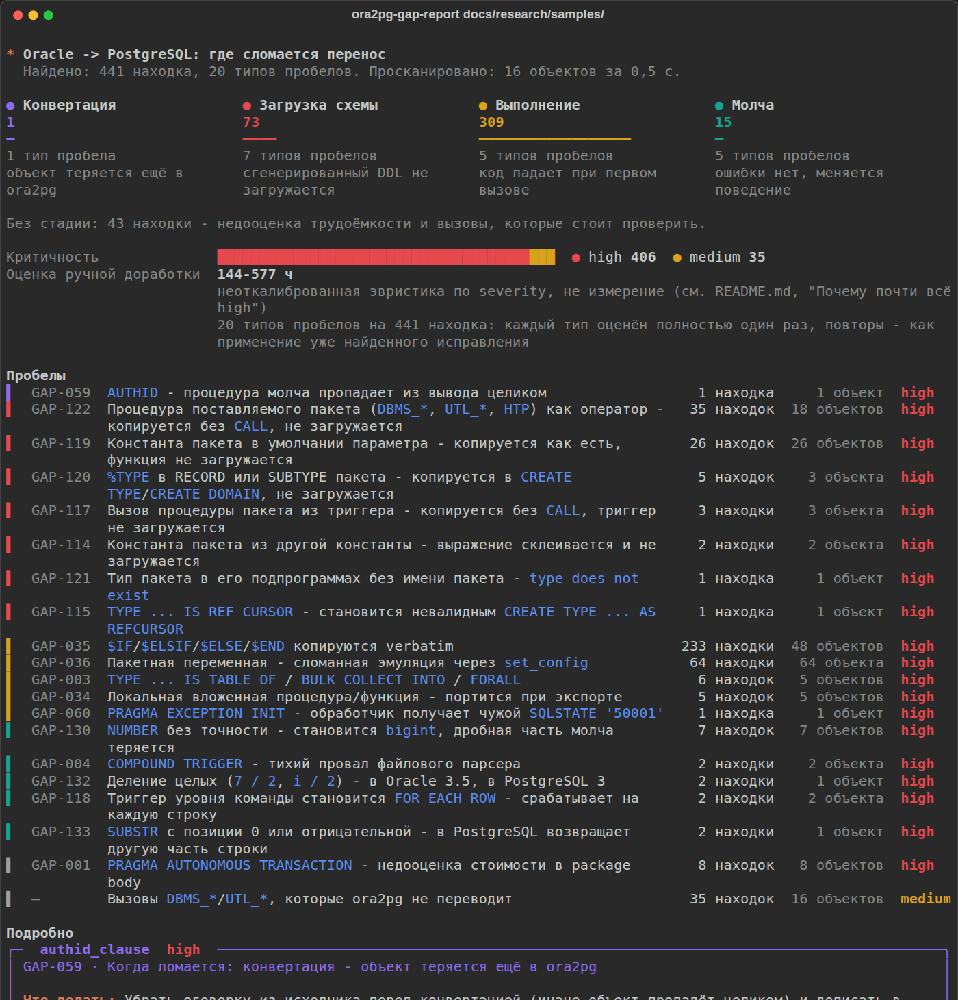
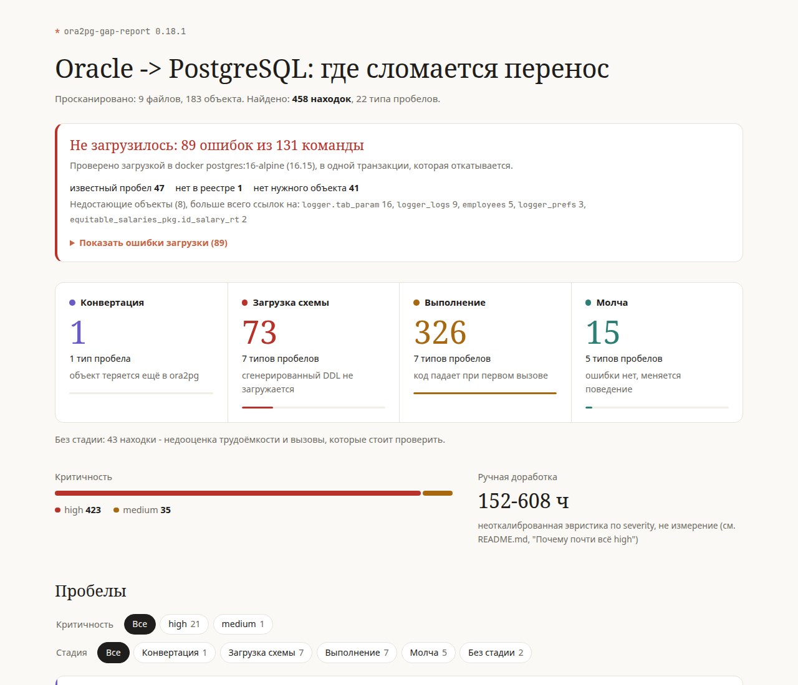
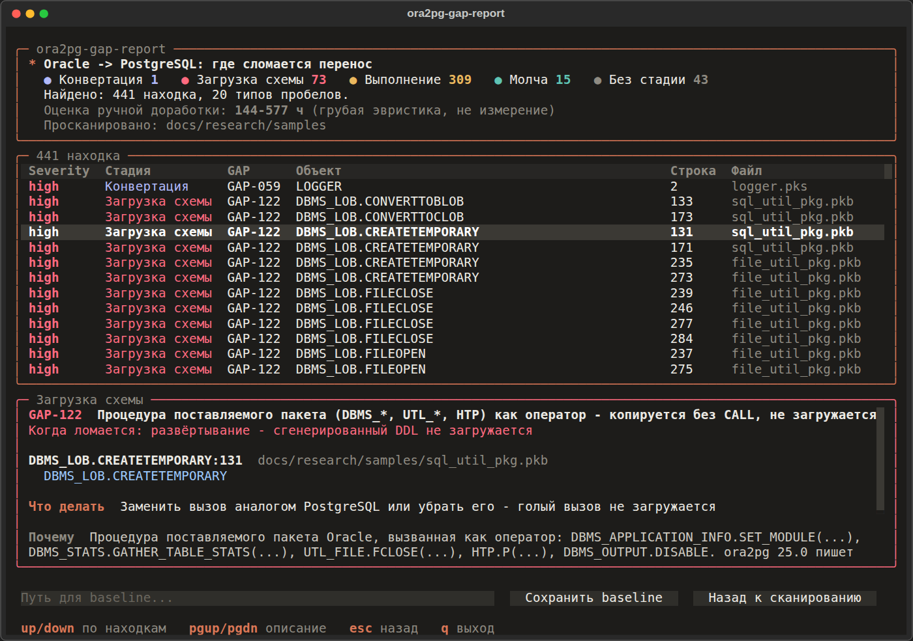
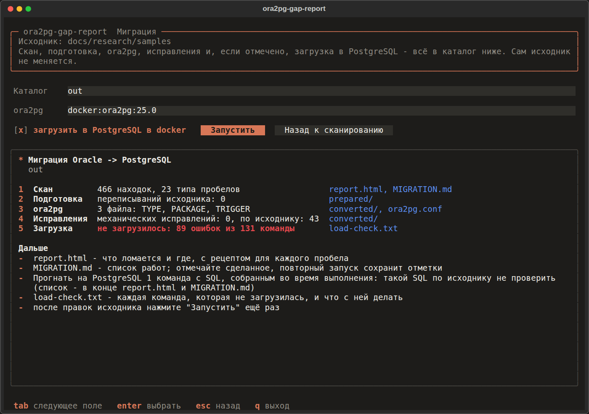
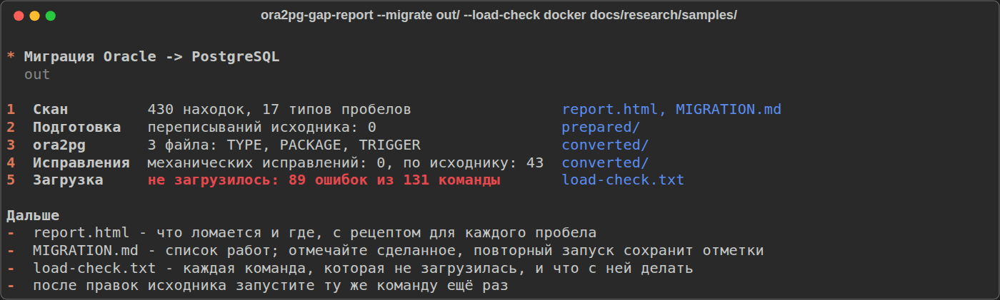

# ora2pg-gap-report

*[English](README.md) | Русский*

[](https://github.com/Lunch418/ora2pg-gap-report/actions/workflows/tests.yml)
[](https://pypi.org/project/ora2pg-gap-report/)
[](https://pypi.org/project/ora2pg-gap-report/)
[](LICENSE)

Помощник для миграции Oracle, MySQL/MariaDB и SQL Server на PostgreSQL
через `ora2pg`: до начала находит то, что `ora2pg` сделает не так,
механически исправляет то, что исправляется, и проверяет результат на
настоящем PostgreSQL - чтобы пробелы всплыли на вашем ноутбуке, а не в
проде.

```sh
pip install ora2pg-gap-report

# Что сломается - ещё до конвертации
ora2pg-gap-report schema/

# Весь путь, с проверкой на настоящем одноразовом PostgreSQL
ora2pg-gap-report --migrate out/ --load-check docker schema/
```

Что `--migrate` делает со `schema/`, по шагам - каждый шаг есть и как
отдельный режим:

```
 schema/ (DDL Oracle, mysqldump, скрипт SSMS)
    |
    |  1. скан          125 подтверждённых пробелов ora2pg  -> out/report.html, out/MIGRATION.md
    |  2. подготовка    переписать то, на чём спотыкается парсер ora2pg  (--prepare)
    |  3. конвертация   ora2pg, по одному запуску на тип объектов        -> out/converted/
    |  4. исправления   известные механические баги ora2pg (--fix) и то, что знает исходник
    |  5. загрузка      в настоящий PostgreSQL, каждая ошибка с её пробелом  (--load-check)
    v
 out/converted/*.sql, который загружается, - или точный список того, что нет, и почему
```

Для двух других источников - `--dialect mysql` или `--dialect mssql`. Для
`--migrate` нужен сам `ora2pg` (в `PATH` или `--ora2pg-bin docker:IMAGE`);
для одного сканирования не нужно ничего, кроме Python.

**Или ничего, кроме docker.** В образе есть сам инструмент, ora2pg 25.0 и
psql; для `--load-check docker` дайте ему docker-сокет:

```sh
docker run --rm --user "$(id -u):$(id -g)" --group-add "$(stat -c %g /var/run/docker.sock)" \
  -v "$PWD:/work" -v /var/run/docker.sock:/var/run/docker.sock \
  ghcr.io/lunch418/ora2pg-gap-report --lang ru --migrate out/ --load-check docker schema/
```

`--user` и `--group-add` делают файлы в `out/` вашими и дают контейнеру
доступ к docker; для одного сканирования хватит `docker run --rm -v
"$PWD:/work" ghcr.io/lunch418/ora2pg-gap-report --lang ru schema/`. По
умолчанию образ говорит по-английски. Если инструмент стоит через pip, а
ora2pg нет, тот же образ может быть просто ora2pg:
`--ora2pg-bin docker:ghcr.io/lunch418/ora2pg-gap-report`.



## Проблема

При миграции с Oracle на Postgres Pro в сегменте Standard/Certified (то есть без
лицензии на Postgres Pro Enterprise и без проприетарной утилиты `ora2pgpro`)
единственный доступный автоматический конвертер — открытый
[`ora2pg`](https://github.com/darold/ora2pg). По независимым оценкам он закрывает
в среднем ~80% задачи перевода PL/SQL -> PL/pgSQL. Оставшиеся ~20% (пакеты,
автономные транзакции, `CONNECT BY`, вызовы `DBMS_*`/`UTL_*`, составные триггеры)
сейчас разбираются вручную и, как правило, обнаруживаются постфактум — когда
что-то уже сломалось в проде.

## Что делает этот инструмент

Сканирует схему Oracle, MySQL/MariaDB или SQL Server **до** миграции и
говорит, какие конкретно объекты `ora2pg` пропустит без предупреждения,
недооценит по трудоёмкости или сконвертирует неправильно - и почему; а если
нужно, сам проводит миграцию и проверяет результат на настоящем
PostgreSQL. Не замена `ora2pg`, а
надстройка над ним: список того, что он реально не переносит, проверен
эмпирически на открытом PL/SQL-коде (`docs/research/step0-show-report-baseline.md`),
а не взят на веру.

| | |
|---|---|
| **Статический анализ** | Ищет паттерны в исходном коде (Oracle, MySQL/MariaDB или T-SQL), не требует установленного `ora2pg` (кроме `connect_by`, см. ниже) |
| **Воспроизводимо** | Каждая находка подтверждена реальным прогоном `ora2pg` + PostgreSQL, а не по документации |
| **7 форматов вывода** | terminal, markdown, json, csv, `sarif`, `html`, `checklist` - один и тот же набор находок |
| **CI-гейт** | `--fail-on` + SARIF для GitHub/GitLab code scanning и готовый GitHub Action |
| **Работает офлайн** | Автономный бандл для закрытых контуров (`scripts/build_offline_bundle.py`), см. ниже |
| **Baseline** | `--save`/`--baseline` — NEW/RESOLVED/UNCHANGED между прогонами |
| **Проверка после миграции** | `--verify` — что из pre-migration находок осталось в сгенерированном коде; диалект берёт из baseline (не функциональная проверка, см. ниже) |
| **Интерактивный режим** | `--tui` (опционально, `pip install "ora2pg-gap-report[tui]"`) — мышь/клавиатура вместо флагов, `--migrate` тоже |
| **Автоисправление** | `--fix`/`--write` - семь заведомо безопасных механических исправлений сгенерированного `ora2pg` кода (три для Oracle, три для T-SQL), набор выбирается по `--dialect`, см. ниже |
| **Миграция одной командой** | `--migrate out/` - скан, подготовка, конвертация ora2pg, исправления (в том числе то, что знает только исходник: триггеры на команду, константы пакетов, типы ENUM) и загрузка, всё в один каталог, см. ниже |
| **Docker-образ** | `ghcr.io/lunch418/ora2pg-gap-report` - инструмент, ora2pg 25.0 и psql в одном образе: ставить ничего не нужно, кроме docker |
| **Подготовка исходника** | `--prepare` - переписывает в самом дампе то, на чём спотыкается парсер ora2pg (DELIMITER, DEFINER, `[скобки]`, `q'[...]'`), до запуска ora2pg, см. ниже |
| **Рецепты и чеклист** | Проверенный приём PostgreSQL для каждого класса проблем и `-f checklist`: список задач, который хранит отметки между запусками, см. ниже |
| **Проверка загрузкой** | `--load-check docker` - загружает сгенерированный код в настоящий одноразовый PostgreSQL и для каждой команды, которая не загрузилась, говорит её GAP-NNN, поможет ли `--fix` или это эхо более ранней ошибки; ничего не коммитится, см. ниже |

## Детекторы

| Детектор | Что ловит |
|---|---|
| `autonomous_tx` | `PRAGMA AUTONOMOUS_TRANSACTION` внутри `PACKAGE BODY` — ora2pg конвертирует через dblink, но занижает/теряет стоимость в `SHOW_REPORT`/`--estimate_cost` |
| `compound_triggers` | `COMPOUND TRIGGER` — файловый парсер ora2pg тихо возвращает 0 триггеров, без единой ошибки |
| `dbms_utl_calls` | Классификатор конкретных вызовов `DBMS_*`/`UTL_*` — что из них ora2pg реально конвертирует, а что остаётся как есть |
| `connect_by` | Линтинг сгенерированного ora2pg `WITH RECURSIVE` на баг с `LEVEL`. Включается флагом `--check-connect-by` и, в отличие от остальных, требует установленный `ora2pg` |
| `merge_delete_clause` | `MERGE ... WHEN MATCHED THEN UPDATE SET ... DELETE WHERE ...` — составная Oracle-конструкция без аналога в MERGE PostgreSQL. Обычный MERGE без DELETE WHERE не ловится — не проблема |
| `bulk_collect` | Локальные `TYPE ... IS TABLE OF`, `BULK COLLECT INTO`, `FORALL` — практически не конвертируются ora2pg. Самый частый в реальном коде из всех детекторов проекта |
| `database_link` | `table@dblink_name` — прямая ссылка на удалённую БД через database link. Копируется как есть, эквивалента нет без ручной настройки postgres_fdw/dblink |
| `model_clause` | `MODEL PARTITION BY ... DIMENSION BY ... MEASURES ... RULES` — spreadsheet-вычисления в SQL. Не имеет прямого эквивалента в PostgreSQL вообще |
| `pivot_clause` | `PIVOT`/`UNPIVOT` — поворот строк в столбцы прямо в SQL. Копируется как есть, встроенного эквивалента в PostgreSQL нет |
| `object_type` | `CREATE TYPE ... AS OBJECT`/`TYPE BODY` — объектные типы Oracle. `--estimate_cost` не имеет для них механизма оценки вообще, не просто занижает |
| `with_function` | `WITH FUNCTION`/`WITH PROCEDURE` — встроенная функция внутри WITH. Парсер ora2pg разваливает структуру исходника, а не просто не конвертирует |
| `flashback_query` | `AS OF TIMESTAMP`/`AS OF SCN` — flashback-запрос. Копируется как есть, эквивалента в PostgreSQL нет вообще |
| `global_temp_table` | `CREATE GLOBAL TEMPORARY TABLE` — секция `ON COMMIT` теряется целиком, а умолчания Oracle и PostgreSQL противоположны (тихая смена поведения, не ошибка) |
| `table_partitioning` | `PARTITION BY RANGE/LIST/HASH` — секционирование таблицы отбрасывается целиком, без единого предупреждения |
| `connect_by_nocycle` | `CONNECT BY NOCYCLE`/`ORDER SIBLINGS BY` — в отличие от базового `CONNECT BY`, разваливает структуру всего окружающего PL/SQL-блока |
| `context_object` | `CREATE CONTEXT` — application context (часто основа VPD) не конвертируется вообще, след только в DEBUG-логе |
| `insert_all` | `INSERT ALL`/`INSERT FIRST` — многотабличная вставка. Копируется как есть, PL/pgSQL падает на этапе компиляции тела |
| `json_table` | `JSON_TABLE(...)` — не существует в PostgreSQL 16 и старше (в 17 есть, но с другим синтаксисом COLUMNS) |
| `external_table` | `CREATE TABLE ... ORGANIZATION EXTERNAL` — секция отбрасывается целиком, таблица становится обычной пустой |
| `sql_macro` | `SQL_MACRO` — конвертируется в обычную функцию, падает при вызове тем способом, для которого была написана |
| `invisible_column` | Столбец `INVISIBLE` теряет своё скрытие — тихо появляется в SELECT * после конвертации |
| `collection_type` | `CREATE TYPE ... TABLE OF`/`VARRAY OF` — коллекционный тип пропадает без следа, зависимые таблицы падают уже при загрузке DDL |
| `cross_apply` | `CROSS APPLY`/`OUTER APPLY` — синтаксиса APPLY нет в PostgreSQL вообще, ближайший эквивалент — JOIN LATERAL |
| `oracle_text` | Oracle Text — домен-индекс (`INDEXTYPE IS CTXSYS.*`) отбрасывается, `CONTAINS`/`CATSEARCH`/`MATCHES` не переносятся |
| `recursive_with` | Нативная рекурсивная `WITH ... AS (...)` (не через CONNECT BY) без ключевого слова `RECURSIVE`, которое требует PostgreSQL |
| `invisible_index` | Индекс `INVISIBLE` теряет своё скрытие от оптимизатора — PostgreSQL не имеет аналога |
| `read_only_table` | `CREATE TABLE ... READ ONLY` теряет гарантию неизменяемости — INSERT проходит там, где Oracle гарантированно блокирует его |
| `materialized_view_log` | `CREATE MATERIALIZED VIEW LOG` не конвертируется вообще, след только в DEBUG-логе |
| `identity_column` | `GENERATED ... AS IDENTITY (...)` с опциями — баг двойных скобок в самой подстановке ora2pg, не пропуск конвертации |
| `rowid_type` | `ROWID`/`UROWID` как тип столбца — конвертируется в `oid`, тип-заменитель несовместим с данными, которые должен хранить |
| `sequence_cycle` | `CREATE SEQUENCE ... CYCLE` — секция `CYCLE` отбрасывается, `NEXTVAL` падает после исчерпания диапазона вместо циклического перезапуска |
| `default_on_null` | `DEFAULT ON NULL` копируется verbatim — синтаксическая ошибка уже при применении `CREATE TABLE`, а не при первой вставке |
| `public_synonym` | `CREATE [PUBLIC] SYNONYM` — теряет схему целевого объекта, при совпадении имён получается самоссылающийся VIEW |
| `virtual_column` | `GENERATED ALWAYS AS (...) VIRTUAL` — теряет защиту `ORA-54016` от явного присваивания, триггер молча подменяет значение |
| `nested_subprogram` | Локальная вложенная процедура/функция — "утекает" наружу отдельным объектом, содержащий блок пропадает, тело искажается |
| `conditional_compilation` | `$IF`/`$ELSIF`/`$ELSE`/`$END` копируются verbatim — падает при первом вызове, не при CREATE |
| `package_state` | Пакетная переменная — эмуляция через `set_config`/`current_setting` сломана (нет приведения типа, нет `missing_ok`) |
| `index_organized_table` | `ORGANIZATION INDEX` (IOT) отбрасывается — таблица становится обычной кучей с отдельным индексом, теряется архитектура хранения |
| `match_recognize` | `MATCH_RECOGNIZE` — сопоставление строк с шаблоном, копируется verbatim; аналога в PostgreSQL нет вообще, DDL не загружается |
| `connect_by_pseudocolumn` | `CONNECT_BY_ROOT`/`CONNECT_BY_ISLEAF`/`CONNECT_BY_ISCYCLE` — переносятся в сгенерированный рекурсивный CTE без конвертации. `SYS_CONNECT_BY_PATH` намеренно *не* помечается: его ora2pg конвертирует правильно |
| `keep_dense_rank` | `KEEP (DENSE_RANK FIRST/LAST ORDER BY ...)` — модификатор агрегата Oracle, копируется verbatim; синтаксиса KEEP в PostgreSQL нет |
| `multiset_operator` | `CAST(MULTISET(...))`, `MULTISET UNION/INTERSECT/EXCEPT`, `MEMBER OF`, `SUBMULTISET OF` — операторы над коллекциями, ни одного из них в PostgreSQL нет |
| `sample_clause` | `SAMPLE (n)` / `SAMPLE BLOCK (n)` — у PostgreSQL та же возможность есть под другим синтаксисом (`TABLESAMPLE`), но ora2pg её не переводит |
| `accessible_by` | `ACCESSIBLE BY` — белый список вызывающих копируется прямо в заголовок сгенерированной функции, PostgreSQL его не принимает |
| `local_time_zone` | `TIMESTAMP WITH LOCAL TIME ZONE` становится простым `timestamp` — пересчёт в часовой пояс сессии молча исчезает (верным был бы `timestamptz`). Ошибки не будет никогда |
| `temporal_validity` | `PERIOD FOR` (Temporal Validity) превращается в обрубок `period FOR` — ломается весь `CREATE TABLE`, а не только сама фича |
| `bitmap_index` | `CREATE BITMAP INDEX` становится `USING gin`, который PostgreSQL не принимает на обычном скалярном столбце (нет класса операторов) — индекс не создаётся вообще |
| `object_table` | `CREATE TABLE ... OF <тип>` — `OF` попадает в вывод как *имя столбца*, ограничения теряются. При существующем типе загрузка проходит молча, оставляя структурно неверную таблицу |
| `ignore_nulls` | `IGNORE NULLS` / `RESPECT NULLS` у аналитических функций копируется как есть; в PostgreSQL 16 такого синтаксиса нет вообще, запрос не разбирается |
| `nlssort` | `NLSSORT` превращается в `COLLATE` с перенесённым один в один Oracle-именем языка — сортировки с таким именем в PostgreSQL нет, запрос падает на выполнении |
| `long_raw_type` | `LONG RAW` отображается в `text`, хотя собственное задокументированное значение ora2pg — `LONG RAW:bytea`; двоичные данные после этого вообще не загрузить |
| `anydata_type` | `SYS.ANYDATA` / `ANYDATASET` / `ANYTYPE` переносится как имя типа; в PostgreSQL нет ни такого типа, ни схемы `SYS` |
| `system_trigger` | триггер `ON DATABASE`/`ON SCHEMA` выводится как обычный табличный — на таблицу с именем `database`/`schema`, с сохранением Oracle-события |
| `trigger_follows` | `FOLLOWS`/`PRECEDES` попадает **внутрь** тела сгенерированной функции — триггер загружается чисто, а потом ломает любую запись в таблицу |
| `table_collection` | оператор разворота коллекции `TABLE(...)` копируется как есть; в PostgreSQL такого оператора нет |
| `cursor_expression` | `CURSOR(SELECT ...)` копируется как есть; курсорных выражений в PostgreSQL нет |
| `for_update_wait` | `FOR UPDATE ... WAIT n` копируется как есть; у PostgreSQL там есть только `NOWAIT` и `SKIP LOCKED` |
| `rownum_dml` | `ROWNUM` в `UPDATE`/`DELETE` переписывается в `LIMIT n`, который PostgreSQL в DML не принимает (во вложенном подзапросе конвертируется корректно и не помечается) |
| `to_date_rr` | формат `RR` внутри `TO_DATE` остаётся как есть; PostgreSQL молча возвращает 1 год до нашей эры вместо ошибки — неверные данные без единого сообщения |
| `authid_clause` | из-за `AUTHID CURRENT_USER`/`DEFINER` ora2pg выбрасывает процедуру целиком — ни вывода, ни ошибки, ни даже строки DEBUG в логе |
| `pragma_exception_init` | все обработчики `PRAGMA EXCEPTION_INIT` схлопываются в `SQLSTATE '50001'`, который PostgreSQL никогда не возбуждает — обработчик становится мёртвым кодом, ошибка вылетает наружу |
| `subtype_range` | `SUBTYPE ... RANGE lo .. hi` переносится в `CREATE DOMAIN` дословно, а у `CREATE DOMAIN` в PostgreSQL оговорки `RANGE` нет |
| `alt_quote_literal` | альтернативные кавычки Oracle `q'[...]'` копируются как есть; PostgreSQL читает `q` как идентификатор, и разбор остатка оператора уезжает |
| `goto_statement` | `GOTO` копируется как есть; в PL/pgSQL оператора `GOTO` нет вообще |
| `cursor_rowtype` | `<курсор>%ROWTYPE` копируется как есть; PL/pgSQL допускает `%ROWTYPE` только от таблицы или представления (обычное `<таблица>%ROWTYPE` конвертируется нормально и не помечается) |
| `wm_concat` | `WM_CONCAT` копируется как есть — в отличие от `LISTAGG`, который ora2pg переписывает в `string_agg` |
| `read_only_view` | `WITH READ ONLY` выбрасывается; полученное представление PostgreSQL автоматически обновляемое, поэтому запись, которую Oracle запрещал, теперь молча проходит |
| `sdo_geometry` | `SDO_GEOMETRY` становится типом PostGIS `geometry`, но строка `CREATE EXTENSION postgis` не выводится — на обычном сервере DDL не загружается |
| `table_if_not_exists` | `CREATE TABLE IF NOT EXISTS` из 23ai — ora2pg принимает `IF` за имя таблицы и выдаёт `CREATE TABLE if ( not EXISTS ...`; загрузка падает, и `ON_ERROR_STOP` останавливает всю схему |
| `identity_on_null` | `GENERATED BY DEFAULT ON NULL AS IDENTITY` — `ON NULL` выбрасывается, и `INSERT`, передающий в столбец `NULL` (Oracle подставляет значение), в PostgreSQL падает на NOT NULL |
| `package_constant_chain` | Константа пакета из другой константы (`c_stamp := c_date \|\| ' HH24'`) - ora2pg склеивает два вызова `current_setting()` в не-выражение; не загружается каждая подпрограмма, которая её читает |
| `ref_cursor_type` | `TYPE x IS REF CURSOR` - становится `CREATE OR REPLACE TYPE ... AS REFCURSOR`, такого синтаксиса в PostgreSQL нет; функции, возвращающие тип, тоже падают |
| `repeated_package_call` | `pkg.proc;` без скобок, когда та же подпрограмма уже его вызывала - повтор теряет `CALL`, подпрограмма не загружается |
| `trigger_package_call` | Триггер вызывает процедуру пакета - триггеры конвертируются отдельно, вызов копируется без `CALL`, триггер не загружается |
| `statement_trigger` | Триггер уровня команды (без `FOR EACH ROW`) - ora2pg пишет `FOR EACH ROW`, и он молча срабатывает на каждую строку, а не один раз на команду |
| `package_constant_default` | Константа пакета в умолчании параметра (`p_os := g_os_windows`) - копируется как есть, хотя чтения в теле переписаны; функция не загружается |
| `package_type_anchor` | `%TYPE`/`%ROWTYPE` в поле RECORD или SUBTYPE пакета - копируется в `CREATE TYPE`/`CREATE DOMAIN`, которые из них делает ora2pg; в DDL `%TYPE` нет, не загружается |
| `package_type_reference` | Тип пакета (`SUBTYPE`, `RECORD`, `TABLE OF`) в подпрограммах самого пакета без его имени - ora2pg создаёт тип в схеме пакета, а использования оставляет без схемы: `type does not exist` |
| `supplied_package_call` | Процедура поставляемого пакета, вызванная как оператор (`DBMS_STATS.GATHER_TABLE_STATS(...)`, `UTL_FILE.FCLOSE(f)`, `HTP.P(...)`) - копируется без `CALL`, подпрограмма не загружается |
| `dbms_sleep` | `DBMS_LOCK.SLEEP` / `DBMS_SESSION.SLEEP` - ora2pg пишет `pg_sleep(n);` без `PERFORM`, подпрограмма не загружается; `--fix` это чинит |
| `schema_qualified_name` | Имя со схемой (`"HR"."EMP"`, так `GET_DDL` пишет каждое) - ora2pg оставляет схему у таблиц, представлений и последовательностей, но не создаёт её, а в триггерах и телах представлений убирает: на чистой базе ничего не загружается |

Двадцать пять детекторов ниже — диалект MySQL/MariaDB (`--dialect mysql`,
`ora2pg -m` — см. «Исходные диалекты» ниже); все остальные детекторы этой
таблицы — только для Oracle.

| Детектор | Что ловит |
|---|---|
| `mysql_enum_type` | `ENUM(...)` — ora2pg синтезирует для него именованный тип PostgreSQL, но не выдаёт нужный этому типу `CREATE TYPE ... AS ENUM (...)`; `CREATE TABLE` не загружается |
| `mysql_on_update_current_timestamp` | `DEFAULT CURRENT_TIMESTAMP ON UPDATE CURRENT_TIMESTAMP` — фрагмент `ON UPDATE ...` копируется прямо в `DEFAULT`, у которого в PostgreSQL такого синтаксиса нет вовсе |
| `mysql_on_duplicate_key_update` | `INSERT ... ON DUPLICATE KEY UPDATE` — копируется в тело функции/процедуры как есть; у `INSERT` в PostgreSQL такого предложения нет, падает на первом вызове |
| `mysql_signal` | `SIGNAL`/`RESIGNAL` — копируются как есть; в PL/pgSQL нет ни того, ни другого, падает на первом вызове |
| `mysql_fulltext_index` | `FULLTEXT KEY`/`FULLTEXT INDEX` в списке столбцов `CREATE TABLE` — не распознаётся как индекс вовсе; голые ключевые слова остаются там, где ожидалось определение столбца, и `CREATE TABLE` не загружается |
| `mysql_key_index` | `KEY <имя> (<столбцы>)` — собственная запись вторичного индекса в mysqldump по умолчанию. Остаётся заглушкой `key <ИМЯ>` на месте столбца, и `CREATE TABLE` не загружается. Синоним `INDEX` и `UNIQUE KEY` конвертируются нормально |
| `mysql_spatial_index` | `SPATIAL KEY`/`SPATIAL INDEX` — та же форма, что у FULLTEXT, только восстанавливается как GiST-индекс по типу PostGIS |
| `mysql_limit_comma` | `LIMIT смещение, количество` — копируется как есть; запятую PostgreSQL отвергает прямо (`LIMIT #,# syntax is not supported`) |
| `mysql_replace_into` | `REPLACE INTO` — копируется как есть; в PostgreSQL аналога нет, а `ON CONFLICT DO UPDATE` — не буквальная замена (REPLACE удаляет строку, и срабатывают каскады удаления) |
| `mysql_insert_ignore` | `INSERT IGNORE` — копируется как есть; `ON CONFLICT DO NOTHING` уже того, что на самом деле подавляет IGNORE |
| `mysql_prepare_from` | `PREPARE <имя> FROM <строка>` — `PREPARE` в PostgreSQL пишется иначе (`AS <запрос>`, а не строковая переменная); настоящий аналог — `EXECUTE` в PL/pgSQL |
| `mysql_last_insert_id` | `LAST_INSERT_ID()` — копируется как есть; такой функции в PostgreSQL нет |
| `mysql_auto_increment_start` | Опция таблицы `AUTO_INCREMENT=<n>` — на файловом пути столбец правильно становится `serial`, но стартовое значение теряется (выгрузка с живой БД берёт его из `INFORMATION_SCHEMA.TABLES`, к которой файловый путь не обращается), последовательность начинает с 1, и первая вставка после переноса данных падает на первичном ключе |
| `mysql_date_format` | `DATE_FORMAT(...)` — выдаётся голым конструктором строки без имени `to_char` и с непереведённым `%d`. Ничего не падает ни на одной стадии; запрос просто молча возвращает кортеж вместо отформатированной строки |
| `mysql_foreign_key` | `FOREIGN KEY` — выбрасывается (и с именованным CONSTRAINT, и без него), если целевой `PG_VERSION` не задан или равен 12 и ниже — собственное значение ora2pg по умолчанию; случайная автовивификация Perl в общем для всех диалектов коде делает каждую ссылаемую таблицу «секционированной», и ограничение молча пропускается — и на файловом входе, и при живом подключении, без единой ошибки |
| `mysql_zero_date` | `'0000-00-00'` — маркер MySQL «не задано» молча переписывается в настоящую дату `'1970-01-01'`, и запросы по незаполненным датам перестают находить строки, а отчёты начинают показывать 1970 год как событие |
| `mysql_declare_handler` | `DECLARE ... HANDLER` — выбрасывается без блока `EXCEPTION` на его месте, и вся политика обработки ошибок подпрограммы исчезает: то, что MySQL проглатывал, теперь обрывает транзакцию вызывающего |
| `mysql_collate` | `COLLATE`/`CHARACTER SET` у столбца — выбрасывается. Обычные правила MySQL `*_ci` нечувствительны к регистру, умолчание PostgreSQL — чувствительно, и запросы молча начинают возвращать другие строки |
| `mysql_set_type` | `SET(...)` — становится обычным `text`. Единственный `medium` в партии MySQL: схема работает и данные сохраняются, но будущие записи ничто не проверяет |
| `mysql_delimiter_routine` | Процедура/функция под `DELIMITER ;;`/`//`/`$$` — так пишут подпрограммы mysqldump и любой скрипт для клиента `mysql`. Разделитель и `DELIMITER ;` попадают в сгенерированное тело, и оно не загружается; из настоящего дампа sakila не создалось ни одной подпрограммы |
| `mysql_delimiter_trigger` | Триггер под разделителем без `;` (`//`, `$$`, `\|`) — ora2pg не находит триггер вовсе: ни вывода, ни ошибки, у таблицы просто нет триггера |
| `mysql_definer_procedure` | `CREATE DEFINER=... PROCEDURE` (запись mysqldump) — `-t PROCEDURE` молча её пропускает: в его разборе, в отличие от `-t FUNCTION`, нет шаблона `DEFINER=` |
| `mysql_versioned_comment` | Триггер/представление/подпрограмма внутри `/*!50003 ... */` — собственный вывод mysqldump для каждого триггера и представления. ora2pg сначала удаляет комментарии, и объекты уходят вместе с ними |
| `mysql_create_table_if_not_exists` | `CREATE TABLE IF NOT EXISTS` — превращается в таблицу `if`; загрузка падает и останавливает всю схему |
| `mysql_temporary_table` | `CREATE TEMPORARY TABLE` — `TEMPORARY` выбрасывается, таблица становится постоянной и общей: строки одного сеанса видны всем остальным |

А эти двадцать - диалект T-SQL/SQL Server (`--dialect mssql`,
`ora2pg -M`).

| Детектор | Что ловит |
|---|---|
| `mssql_bracket_identifier` | `[dbo].[Orders]`, `[Id]`, `[int]` — скобки, которые SSMS ставит у каждого имени, на файловом пути не снимаются; они попадают внутрь сгенерированного идентификатора и имён типов, и DDL не загружается. Самый широкий по охвату gap партии |
| `mssql_newid_default` | `NEWID()` — отображается в `uuid_generate_v4()` без `CREATE EXTENSION "uuid-ossp"`, и `CREATE TABLE` не загружается |
| `mssql_update_set` | `UPDATE ... SET` — путается с `SET` присваивания переменной в T-SQL: ключевое слово удаляется, а `=` становится `:=`, что ломает каждый UPDATE в каждой процедуре |
| `mssql_identity_column` | `IDENTITY(1,1)` — на файловом пути выбрасывается (ни serial, ни последовательности; ora2pg читает identity только живым запросом к `sys.identity_columns`, без запасного разбора текста DDL), и первая же обычная вставка падает на NOT NULL |
| `mssql_parameterless_procedure` | Процедура без параметров получает неразбираемый пустой блок `DECLARE ;` — проверено A/B против той же процедуры с параметром, которая выходит чистой |
| `mssql_if_statement` | `IF` — с блоком `BEGIN/END` получает `THEN`, но не `END IF`; без блока не получает и `THEN` |
| `mssql_raiserror` | `RAISERROR`/`THROW` — копируются как есть; в PL/pgSQL нет ни того, ни другого |
| `mssql_try_catch` | `BEGIN TRY`/`BEGIN CATCH` — копируются как есть, вместе с `END TRY`/`END CATCH` |
| `mssql_top_clause` | `SELECT TOP n` — копируется как есть; в PostgreSQL TOP нет |
| `mssql_scope_identity` | `SCOPE_IDENTITY()`/`@@IDENTITY`/`IDENT_CURRENT()` — копируются как есть |
| `mssql_output_clause` | `OUTPUT INSERTED.*` — копируется как есть; аналог — `RETURNING`, и не точный |
| `mssql_iif` | `IIF()` — копируется как есть, хотя соседний CHARINDEX в той же инструкции переводится |
| `mssql_datediff` | `DATEDIFF()` — копируется как есть, хотя `DATEADD` и `DATEPART` рядом конвертируются правильно |
| `mssql_charindex` | `CHARINDEX()` — переводится в `position()`, но с удвоенными кавычками: `position(''abc'' in x)`, что не является корректным SQL |
| `mssql_filtered_index` | `CREATE INDEX ... WHERE` — выбрасывается целиком, хотя в PostgreSQL есть частичные индексы с тем же синтаксисом (индекс с `INCLUDE` рядом конвертируется нормально) |
| `mssql_foreign_key` | `FOREIGN KEY` — выбрасывается, если целевой `PG_VERSION` не задан или равен 12 и ниже, тот же механизм общего кода, что и у MySQL; ни на одной стадии ошибки нет |
| `mssql_collation` | `COLLATE` — игнорируется умолчанием `CASE_INSENSITIVE_SEARCH citext`, которое проверяет базовый тип столбца, но не его collation, и каждый строковый столбец становится нечувствительным к регистру `citext`; для collation `_CS_` в источнике это инвертирует сравнение, проверено на живых данных |
| `mssql_computed_column` | Вычисляемый столбец (`AS (выражение) PERSISTED`) получает тип `citext`, что бы выражение ни вычисляло, и числовой результат хранится как текст |
| `mssql_rowversion` | `ROWVERSION` -> `bytea`, который сам не обновляется, и проверки оптимистической блокировки молча перестают видеть конфликты |
| `mssql_schema_qualified_name` | `[dbo].[Orders]` - схема остаётся у всех имён, но не создаётся, и на чистой базе ничего не загружается; `--fix` пишет `CREATE SCHEMA IF NOT EXISTS` |

Плюс `ora2pg_wrapper.py` — запуск `ora2pg` по типам объектов на выгруженном
DDL с парсингом `--estimate_cost`, и `oracle_connector.py`/`oracle_export.py`
— живая выгрузка схемы Oracle через `DBMS_METADATA.GET_DDL`.

### Почему почти всё `high`

Из 125 зарегистрированных gap'ов (`gap_registry.py`) — 80 из исходного
диалекта Oracle, 25 из MySQL/MariaDB (`dialect="mysql"`, `ora2pg -m`) и 20
из T-SQL/SQL Server (`dialect="mssql"`, `ora2pg -M`); см. «Исходные
диалекты» ниже — 113 имеют severity `high` и 6 — `medium` (`context_object`,
`invisible_index`, `virtual_column`, `index_organized_table`, `sdo_geometry`
со стороны Oracle, `mysql_set_type` со стороны MySQL; в партии MSSQL
`medium` нет вовсе). `severity` — поле `GapEntry`, и `scripts/doctor.py`
сверяет его с литералом, который реально использует исходник детектора, а
не просто со счётчиком, принятым на веру. Отдельно от этих 125 есть ещё
один детектор, `dbms_utl_calls` — классификатор вызовов `DBMS_*`/`UTL_*`,
не привязанный к конкретному GAP-NNN (у него нет одного воспроизводимого
минимального примера — это намеренно широкая категория), тоже `medium`.
`low` — допустимое значение в реестре (`--severity low`, с диапазоном
часов в `effort_estimator.py`), но ни одному детектору пока не присвоено —
честно, не потому что критерий не продуман, а потому что ни один
подтверждённый случай туда не попал. Это не распределение, выбранное ради
самого себя: оно вытекло из реальных находок по такому принципу:

- **`high`** — либо сгенерированный код действительно не компилируется или
  не выполняется в PostgreSQL (подтверждено запуском на реальном
  PostgreSQL 16 — `ERROR: syntax error...` и подобное, см. таблицу в
  `docs/research/AUDIT.md`), либо конструкция пропадает молча, но потеря
  архитектурно значима: секционирование, внешняя таблица, журнал
  материализованного представления, гарантия `READ ONLY`, database link —
  то, что либо ломает миграцию напрямую, либо молча меняет поведение
  системы так, что это замечают не сразу, а в проде.
- **`medium`** — не блокирует миграцию и не теряет данные, но это реальное
  расхождение в поведении, которое стоит перепроверить: `invisible_index`
  (индекс перестаёт быть скрытым от оптимизатора — влияет на план запроса,
  а не на корректность), `context_object` (прикладная функция, часто основа
  VPD, но сама миграция от её потери не падает), `virtual_column` (итоговое
  значение в столбце верное — теряются не данные, а ранняя диагностика
  ошибочного явного присваивания), `index_organized_table` (ограничения
  целостности сохраняются — теряется архитектура хранения, а не
  корректность) и отдельно `dbms_utl_calls` (намеренно широкий
  классификатор — реальное влияние конкретного вызова слишком разное,
  чтобы честно назвать их все `high`).

## Методология

Этот проект не пытается завести детектор для каждой существующей
Oracle-специфичной конструкции. `ROWNUM`, `DECODE`, `NVL`, `SYSDATE`,
`%TYPE`, последовательности, стандартная семантика исключений — всё это
`ora2pg` конвертирует корректно, и детектор для них не нужен, как бы
экзотично по-оракловски они ни звучали.

Новый детектор появляется только после того, как гипотеза проверена на
практике:

1. Взять конкретную конструкцию Oracle.
2. Собрать минимальный воспроизводимый пример.
3. Прогнать пример через настоящий `ora2pg`.
4. Проверить сгенерированный PostgreSQL-код на корректность.
5. Если `ora2pg` справился — гипотеза отклонена, детектор не пишется.
   Если нашёлся настоящий воспроизводимый баг — добавляется тестовый
   пример и пишется детектор.

Так, например, была отвергнута исходная гипотеза про `CREATE PACKAGE` —
очевидный на первый взгляд кандидат, но на практике `ora2pg` переносит его
без проблем (`docs/research/step0-show-report-baseline.md`). И так же были
подтверждены `COMPOUND TRIGGER` и баг с `LEVEL` в `CONNECT BY` — оба
воспроизведены на реальном прогоне `ora2pg`, а не предположены по
описанию.

Каждая подтверждённая находка пронумерована и собрана в
[`docs/research/GAP_REGISTRY.ru.md`](docs/research/GAP_REGISTRY.ru.md) — у
каждой записи указано, какой детектор её покрывает и на какой версии
`ora2pg` она подтверждена. [`docs/research/AUDIT.ru.md`](docs/research/AUDIT.ru.md)
— сводная проверка доказательств по каждому подтверждённому gap'у
(research-документ, реальный вывод ora2pg, ожидаемое/фактическое, тесты,
включая guard-тесты против ложных срабатываний).

## Установка и использование

```sh
pip install ora2pg-gap-report   # (или: pip install . из клона репозитория)
```

Сама библиотека детекторов (`detectors/`, `models.py`,
`report_generator.py`) — чистый Python без внешних зависимостей: её можно
импортировать отдельно (например, из своих скриптов), не устанавливая
вообще ничего. У CLI ровно одна обязательная зависимость —
[`rich`](https://github.com/Textualize/rich), исключительно для приятного
вывода в терминал; она ставится сама через `pip install`.

Сразу после установки доступна команда:

```sh
ora2pg-gap-report path/to/schema_dump.pkb another_file.sql
```

В интерактивном терминале по умолчанию выводится цветной отчёт, устроенный
так же, как HTML: сколько находок ждёт на каждой стадии, до которой доходит
миграция (конвертация, загрузка схемы, выполнение, молча), разбивка по
критичности и грубый диапазон часов, каждый пробел один раз, а затем каждый
пробел подробно — почему, что делать и первые несколько мест.
Для скриптов и перенаправления — `--format markdown`, `--format json`,
`--format csv`, `--format sarif` или `--format html` (markdown также служит
форматом по умолчанию, когда stdout — не терминал):

`--format` можно опустить, если расширение `--output` уже говорит, какой
формат нужен: распознаются `.json`, `.csv`, `.sarif`, `.html`/`.htm` и
`.md`, всё остальное — markdown, а явный `--format` всегда главнее. `-f`,
`-o` и `-l` — короткие формы `--format`, `--output` и `--lang`.

```sh
ora2pg-gap-report path/to/schema_dump.pkb -o report.json   # формат по расширению
ora2pg-gap-report path/to/schema_dump.pkb --format markdown > report.md
ora2pg-gap-report path/to/schema_dump.pkb --format csv --output report.csv

# SARIF 2.1.0 — для GitHub code scanning (вкладка Security) или GitLab SAST.
# Severity отображается в уровни SARIF: high -> error, medium -> warning,
# low -> note (отдельного уровня critical нет ни в SARIF, ни в этом
# инструменте).
ora2pg-gap-report path/to/schema_dump.pkb --format sarif --output report.sarif

# Автономная HTML-страница (без внешних CSS/JS/шрифтов — открывается офлайн)
# — показать клиенту/руководителю, ничего не устанавливая.
ora2pg-gap-report path/to/schema_dump.pkb --format html --output report.html

# Опционально: проверить собственный сгенерированный ora2pg код для CONNECT BY.
# Требует установленного ora2pg (см. https://github.com/darold/ora2pg)
# — единственная внешняя (не Python) зависимость во всём проекте, и
# только для этой одной проверки.
ora2pg-gap-report path/to/schema_dump.pkb --check-connect-by
```



Формат `--format json` описан формальной JSON Schema —
[`schemas/report.schema.json`](schemas/report.schema.json) (а формат
снимка baseline из `--save`/`--baseline` — в
[`schemas/baseline.schema.json`](schemas/baseline.schema.json)), так что
сторонние инструменты могут надёжно разбирать вывод, а не угадывать по
примерам. Обе схемы проверяются в тестах на реальном выводе
(`tests/test_schemas.py`), а не просто написаны и оставлены. `--format
sarif` проверяется так же в `tests/test_sarif.py` по официальной схеме
OASIS SARIF 2.1.0 (вложена в `tests/fixtures/`, так что тесты не зависят
от сети).

DDL-файлы можно передавать как есть: в одном файле может быть несколько
пакетов/триггеров, детекторы сами находят границы объектов, в том числе
по разделителям скриптов — `/` в SQL*Plus, `GO` в T-SQL, `DELIMITER` в
MySQL. Можно передать и каталог: всё с расширением `.sql`/`.pks`/`.pkb`
внутри сканируется рекурсивно (например, весь каталог выгрузки
`DBMS_METADATA.GET_DDL`):

```sh
ora2pg-gap-report path/to/schema_dump_dir/
```

`ora2pg-gap-report --version` — показать установленную версию.

### Интерактивный режим (`--tui`)

Всё описанное выше управляется флагами — намеренно, именно это делает
инструмент удобным для скриптов и CI. Чтобы просматривать интерактивно, не
запоминая флаги, `--tui` открывает экран с управлением мышью и
клавиатурой: выбрать файл или каталог в дереве, выбрать severity и язык,
просканировать, а затем идти по таблице результатов стрелками: панель под
ней следует за курсором и показывает для каждой находки `GAP-NNN`, когда
именно ломается, что делать и почему — то же, что показывают `--explain` и
терминальный отчёт. Оформление повторяет терминальный интерфейс Claude Code.
Установка и запуск:

```sh
pip install "ora2pg-gap-report[tui]"   # добавляет textual — не входит в базовую установку
ora2pg-gap-report --tui                # открывается в текущем каталоге
ora2pg-gap-report --tui path/to/schema_dump/   # открывается там
```



Самостоятельный режим, как `--explain`/`--verify`: CLI принимает не больше
одного пути (стартовую точку дерева, а не список для сканирования — выбор
того, что сканировать, и есть смысл дерева) и ни одного флага, влияющего
на сканирование (`--severity`, `--format`, `--fail-on`, `--save` и т. п.
внутри TUI ничего не делают, поэтому их сочетание отклоняется сразу, а не
игнорируется молча). Внутри сам экран покрывает то же, что и работа с
флагами: добавить несколько файлов/каталогов кнопкой «Добавить в выборку»
перед сканированием, отметить «Проверить CONNECT BY» для той же проверки
через ora2pg, что и `--check-connect-by`, указать в поле baseline снимок
`--save`, чтобы увидеть счётчики NEW/RESOLVED/UNCHANGED на экране
результатов (с собственной кнопкой «Сохранить baseline»), или отметить
«Режим проверки», чтобы выполнить то же сравнение после миграции, что и
`--verify`. Запуск `--tui` без установленного extra `[tui]` выводит простую
подсказку по установке, а не traceback.

«Миграция» запускает `--migrate` на выбранном: экран спрашивает, куда
писать, какой ora2pg взять (`ora2pg` из `PATH` или `docker:ОБРАЗ`) и
загружать ли результат в PostgreSQL в docker, показывает шаги, пока идёт
работа, и в конце выдаёт ту же сводку, что и командная строка. Каталог
получается тот же - `report.html`, `MIGRATION.md`, `converted/`, а с
загрузкой ещё `load-check.txt`/`.json`.



### Документация прямо из CLI

`--explain GAP-023` (или просто `--explain 23`) печатает research-документ
конкретного gap'а из реестра — конструкцию, реальный вывод `ora2pg`,
наблюдаемую проблему, вердикт и версии `ora2pg`/PostgreSQL, на которых
находка подтверждена (сейчас 25.0/16 у всех 125 — единая версия, потому
что второй пока не было; `gap_registry.py` уже готов хранить разные версии
для будущих находок) — без сканирования файлов:

```sh
ora2pg-gap-report --explain GAP-023
```

Research-документы (`docs/research/`) — часть репозитория, но не
pip-пакета (пакет — это только `ora2pg_gap_report/`). При запуске из
пакета, установленного через `pip install`, а не из клона репозитория,
`--explain` вместо текста документа показывает прямую ссылку на него на
GitHub.

### Рецепты миграции

Исследования говорят, что идёт не так.
[Рецепты](docs/recipes/README.ru.md) говорят, что писать вместо этого:
пятнадцать страниц, по одной на класс проблем (иерархические запросы,
коллекции и `BULK COLLECT`, автономные транзакции, состояние пакета,
временные таблицы, `PIVOT`, `MERGE`/upsert, обработка ошибок, database
link, вызовы `DBMS_*`, аналитические функции, объекты только для чтения и
невидимые объекты, секционирование, выражения T-SQL и MySQL). В каждой -
приём для PostgreSQL и то, что не переносится. Каждый пробел, у которого
есть рецепт, ссылается на него из `--explain`, терминального и
HTML-отчётов, TUI, чеклиста и `--load-check`.

Код в рецептах - не иллюстрация: тесты загружают SQL каждой страницы в
настоящий PostgreSQL 16 и выполняют `ASSERT` из неё, на обоих языках, так
что рецепт, который перестал работать, роняет сборку.

### Исходные диалекты (`--dialect`)

`ora2pg` работает не только с Oracle: `-m`/`--mysql` и `-M`/`--mssql`
направляют его на источник MySQL/MariaDB или SQL Server, по-прежнему с
PostgreSQL в качестве цели. Оба режима подтверждённо работают с файлом
(`-i <файл>`, живая исходная база не нужна), поэтому этот проект сканирует
все три:

```sh
ora2pg-gap-report schema/                        # Oracle (по умолчанию)
ora2pg-gap-report --dialect mysql mysqldump.sql  # GAP-068..086, 106..111
ora2pg-gap-report --dialect mssql ssms.sql       # GAP-087..105, 125
```

Каждый не-Oracle gap подтверждён ровно так же, как Oracle-ские:
минимальный пример, реальный прогон `ora2pg -m`/`-M`, сгенерированный
PostgreSQL-код загружен на настоящий сервер PostgreSQL 16 — а для тех, что
никогда не дают ошибки, на реальных данных выполнен запрос, показывающий,
что меняется.

Детекторы трёх диалектов разделены структурно (кортежи
`_ORACLE_DETECTORS`/`_MYSQL_DETECTORS`/`_MSSQL_DETECTORS` в `core.py`), так
что файл, просканированный не с тем `--dialect`, не может вызвать детекторы
другого диалекта — по построению, а не благодаря удачным ключевым словам.

`--verify`, `--fix` и `--tui` тоже работают со всеми тремя диалектами:

- **`--verify` вообще не нужен `--dialect`.** Какими детекторами
  пересканировать сгенерированный вывод, определяется по самому baseline:
  каждый детектор принадлежит ровно одному диалекту, так что имена в
  снимке его и задают. Поэтому baseline, записанные до появления
  диалектов, проверяются как раньше, без смены версии схемы. Передать
  `--dialect` всё равно можно, но он сверяется: снимок одного диалекта,
  проверенный детекторами другого, показал бы «не обнаружено» для каждой
  находки — это тавтология, а не проверка, — поэтому такая пара
  отклоняется. Снимок, смешивающий диалекты или называющий детекторы,
  которых нет в этой сборке, отклоняется по той же причине: проверка по
  части baseline дала бы уверенное число, посчитанное по неполным данным.
- **`--fix` выполняет механические исправления, зарегистрированные для
  `--dialect`.** У каждого диалекта они свои (см. ниже); диалект без
  исправлений так бы и сказал, а не сообщал про каждый файл "исправлять
  нечего", что читалось бы как "ваш вывод в порядке".
- **`--tui`** имеет выбор диалекта рядом с выбором severity и языка и
  применяет те же правила — в том числе берёт диалект из baseline в
  режиме проверки.

`--check-connect-by` остаётся только для Oracle и теперь об этом говорит:
`CONNECT BY` — синтаксис Oracle, и проверка запускает `ora2pg` в режиме
Oracle, так что на файле другого диалекта она не могла бы найти ничего.

### Язык вывода

По умолчанию вывод на русском — это не меняется без явного действия, чтобы
существующие скрипты и CI, разбирающие текущий вывод, продолжали работать.
Английский доступен как опция:

- `--lang en` — только для этого запуска, ничего не сохраняет;
- `--set-lang` — открывает выбор языка (`[1] English` / `[2] Русский`) и
  сохраняет его как умолчание для всех будущих запусков
  (`~/.config/ora2pg-gap-report/language` или `$XDG_CONFIG_HOME`);
- `ORA2PG_GAP_REPORT_LANG=en` — для CI, не сохраняется;
- при первом запуске в интерактивном терминале, если язык нигде не задан,
  выбор `--set-lang` показывается один раз и сохраняется.

Порядок приоритета: `--lang` -> переменная окружения -> сохранённый выбор ->
интерактивный выбор (только в настоящем терминале) -> русский по умолчанию.

Переведён весь вывод сканирования: терминальный отчёт, `--format
markdown/html`, объяснения и рекомендации по каждому детектору, сообщения
об ошибках и `--help` (он следует `--lang` и тому же порядку приоритетов).
Research-документы `docs/research/` есть на обоих языках — английский
текст в `gap-NNN-*.md`, русский рядом, в `.ru.md`, для каждого gap'а, —
и `--explain` печатает тот, что совпадает с языком вывода.

### Отслеживание прогресса миграции (baseline)

Схему обычно исправляют итерациями: снимок «что сломано сейчас», потом
часть исправлений, потом повторный прогон. `--save` сохраняет находки
текущего прогона как снимок; `--baseline` сравнивает следующий прогон с
ним и показывает NEW/RESOLVED/UNCHANGED (в stderr, отдельно от самого
отчёта):

```sh
ora2pg-gap-report path/to/schema_dump/ --save baseline.json
# ... исправить схему, переписать часть объектов вручную ...
ora2pg-gap-report path/to/schema_dump/ --baseline baseline.json
```

Находки сопоставляются между прогонами не по номеру строки (он сдвигается
при любой правке файла), а по отпечатку из детектора, файла, объекта и
найденного фрагмента — так находка считается «той же самой», даже если код
вокруг неё переписан. `--save`/`--baseline` всегда работают с полным
набором находок, независимо от `--severity`/`--object` (эти флаги влияют
только на то, что показано в отчёте).

### Чеклист, который помнит (`-f checklist`)

Для недель работы после первого сканирования `-f checklist` пишет
Markdown-список задач: по галочке на объект и пробел, сгруппированных как в
отчётах, у каждого пробела - что делать, рецепт и команда `--explain`.
Положите его в репозиторий или в задачу и отмечайте сделанное по ходу.

```sh
ora2pg-gap-report schema/ -f checklist -o MIGRATION.md
# ... исправляете, отмечаете галочки в MIGRATION.md ...
ora2pg-gap-report schema/ -f checklist -o MIGRATION.md   # тот же -o: прогресс сохраняется
```

```text
**Сделано: 2 из 4 (50 %)**

## GAP-003 `TYPE ... IS TABLE OF` / `BULK COLLECT INTO` / `FORALL`

high · ломается: выполнение · осталось 1 из 2

**Что делать:** Переписать TYPE/BULK COLLECT на массив PostgreSQL ...
**Рецепт:** [Коллекции и массовые операции](docs/recipes/collections-and-bulk.ru.md)

- [ ] `EQUITABLE_SALARY_TRG` - `triggers.sql` (строка 215)
- [x] `EQUITABLE_SALARIES_PKG` - `triggers.sql` (строка 76)
```

Повторная генерация в тот же `-o` сначала читает прежний файл: галочка,
которую вы поставили, остаётся, пункт, которого больше нет в файле,
просканированном и в этот раз, отмечается сам ("больше не найдено"), а
пункт из файла, который в этот раз не сканировался, сохраняет своё
состояние, так что сканирование части файлов никогда не отмечает
остальное сделанным. Запускайте из одного и того же каталога: пункты
привязаны к объекту и к пути файла относительно него. Существующий файл,
который не является чеклистом этого инструмента, никогда не
перезаписывается.

### CI-гейт

`--fail-on high` (или `medium`/`low`) — завершиться с кодом `1`, если есть
хотя бы одна находка этого уровня или выше (`high` выше `medium` выше
`low`). Как и `--save`/`--baseline`, это вычисляется по полному набору
находок, а не по тому, что осталось после `--severity`/`--object`:

```sh
ora2pg-gap-report path/to/schema_dump/ --fail-on high
echo $?   # 1, если нашлась хотя бы одна находка high
```

Коды выхода, намеренно все разные, чтобы задача CI могла отличить
настоящий результат от сломанного запуска:

| Код | Значение |
| --- | --- |
| `0` | Сканирование завершено, гейт (если задан) пройден |
| `1` | Гейт `--fail-on` не пройден — есть находки на пороге или выше |
| `2` | Неверное использование, или часть входа не удалось просканировать (нет файла, нет доступа, пустой каталог, сломанный baseline) |
| `3` | Внутренняя ошибка — баг в самом инструменте, а не находка миграции. Сканирование продолжается мимо упавшего детектора и всё равно выдаёт остальное, но прогон неполный, и `--save` пропускается |
| `141` | Читатель закрыл канал (`\| head`, выход из `\| less`). Вообще не результат сканирования — вывод оборвал читатель, и инструмент тихо завершается. 128 + SIGPIPE — статус, который shell сообщает для процесса, убитого SIGPIPE |

Код `3` важнее всего в CI: упавший анализатор раньше завершался с `1`,
неотличимо от гейта, который честно сделал своё дело и нашёл проблемы.

Пример реального вывода на открытом пакете —
[`docs/examples/logger-autonomous_tx-report.ru.md`](docs/examples/logger-autonomous_tx-report.ru.md).
На GitHub репозиторий - готовый Action, который за один шаг делает скан,
загрузку SARIF в code scanning и порог:

```yaml
- uses: Lunch418/ora2pg-gap-report@main
  with:
    paths: schema/
    fail-on: high
```

Его входы и полный рецепт для CI - гейт на PR, запуск рядом с самим
`ora2pg`, находки как аннотации PR через SARIF - в
[`docs/ci-integration.ru.md`](docs/ci-integration.ru.md).

Оценка трудоёмкости в отчёте — грубая эвристика по severity (диапазон
часов, а не одно число). Это ориентир для планирования, а не оценка,
откалиброванная на реальных миграциях, — не отдавайте её клиенту как
обязательство. Диапазон severity оценивает только *первое* появление
каждого детектора: повторные находки того же детектора (то же уже
освоенное исправление, применённое ещё раз, а не новая задача) оцениваются
отдельным, гораздо меньшим диапазоном, а не как независимые задачи high/
medium каждая: 8 находок `autonomous_tx` в одном пакете — это не 8
отдельных проблем.

### Проверка после миграции (`--verify`)

`--save`/`--baseline` сравнивают два прогона по исходному Oracle во
времени. `--verify` устроен иначе: он сравнивает pre-migration находки с
тем, что реально осталось в **сгенерированном ora2pg PostgreSQL-коде**:

```sh
ora2pg-gap-report oracle_schema/ --save migration.json   # до миграции
# ... запустить ora2pg, получить generated_postgresql/ ...
ora2pg-gap-report --verify --baseline migration.json generated_postgresql/
```

```text
Baseline detectors  4
Still present        2
Not detected          1
Not verifiable        1

cross_apply       GAP-022   3 -> 1   STILL_PRESENT
json_table        GAP-017   2 -> 0   NOT_DETECTED
identity_column   GAP-028   4 -> 4   STILL_PRESENT
read_only_table   GAP-026   1 -> —   NOT_VERIFIABLE
```

Это **не** функциональная проверка: инструмент никогда не подключается к
базе, ничего не выполняет, не сравнивает данные. Он статически ищет тот же
паттерн уже в сгенерированном коде. И даже так это работает не для всех
детекторов одинаково:

- **Часть конструкций `ora2pg` копирует в вывод как есть** (`cross_apply`,
  `json_table`, `identity_column` и ещё 52 — 55 из 126 детекторов) — для
  них повторный прогон детектора по выводу осмыслен: `STILL_PRESENT`,
  если паттерн остался, `NOT_DETECTED`, если пропал.
- **Часть `ora2pg` молча выбрасывает или переписывает во что-то другое**
  (`read_only_table`, `table_partitioning` и ещё 68 — 70 из 126) —
  конструкции в выводе нет *по определению*, независимо от того, починил ли
  кто-то проблему вручную другим способом. Для них честный статус —
  `NOT_VERIFIABLE`, а не фиктивный `NOT_DETECTED`: считать отсутствие
  доказательством исправления было бы ровно той придуманной уверенностью,
  которой этот проект специально избегает (см. «Почему почти всё `high`»
  выше).

Какой режим у какого детектора и почему, по всем 125 gap'ам —
[`docs/verification-capability-matrix.ru.md`](docs/verification-capability-matrix.ru.md).

`NOT_DETECTED` тоже не означает «доказанно исправлено» — только «паттерн в
этом коде не найден». Разница небольшая, но именно она отделяет честную
проверку от удобной лжи.

`--verify` — самостоятельный режим: требует `--baseline`, несовместим с
`--explain`/`--save`/`--fail-on`/`--check-connect-by`/`--severity`/
`--object`, поддерживает только `--format terminal` (по умолчанию) и
`--format json`.

### Весь путь одной командой (`--migrate`)

```sh
ora2pg-gap-report --migrate out/ --load-check docker schema/
ora2pg-gap-report --migrate out/ --ora2pg-bin docker:my-ora2pg-image schema/   # ora2pg из образа
```



```
out/
  report.html        скан исходника: что ломается, когда, где, с рецептом для каждого пробела
  MIGRATION.md       работа в виде чеклиста (при следующем запуске отметки сохраняются)
  prepared/          копия исходника после --prepare; сам исходник не трогается
  converted/         вывод ora2pg, по файлу на тип объектов, в порядке загрузки, после --fix
  load-check.txt     с --load-check: каждая команда, которая не загрузилась, и почему
  load-check.json    то же для пайплайна
```

Шаги - это режимы, описанные ниже, запущенные в том порядке, который
нужен миграции. Несколько вещей `--migrate` делает, а ручной запуск - нет:

- ora2pg запускается по разу на тип объектов сразу на всех исходных
  файлах, поэтому вызов из одного пакета в другой конвертируется (два
  отдельных запуска его теряют, см. GAP-117);
- в файловом режиме `-t TYPE`, `FUNCTION` и `PROCEDURE` у ora2pg вытаскивают
  ещё и члены пакетов, без имени пакета, и каждый вышел бы дважды; эти
  запуски получают исходник без пакетов, а `-t PACKAGE` - только пакеты
  (объект после тела последнего пакета он вклеил бы в это тело);
- он возвращает то, что вывод ora2pg потерял, а исходник ещё помнит, с той
  же проверкой на PostgreSQL 16, что и у `--fix`: триггер без `FOR EACH ROW`
  остаётся триггером на команду (GAP-118), константа пакета со значением-
  литералом подставляется литералом везде, где ora2pg оставил чтение
  `current_setting()` или `DEFAULT` с её именем (GAP-114, GAP-119, GAP-036),
  для MySQL-столбца `ENUM` добавляется `CREATE TYPE`, который ora2pg
  называет, но не пишет (GAP-068);
- повторный запуск в тот же `out/` заменяет сгенерированные файлы и
  сохраняет отметки чеклиста; каталог, который создал не он, не трогается.

Код возврата `1`, если `--load-check` нашёл незагружающиеся команды, `2`,
если запуск невозможен (нет ora2pg, нет docker), иначе `0`.

### Подготовка исходника (`--prepare`)

Некоторые пробелы в выводе ora2pg уже не исправить: ora2pg выбросил то,
что для исправления нужно. Скрипт T-SQL с именами в скобках выходит со
столбцом типа `[INT]` и потерянной длиной `nvarchar(100)`, триггер MySQL
под `DELIMITER //` не выходит вовсе. Каждый из этих случаев
конвертируется правильно, если тот же исходник записан в более простой
форме, которую ждёт парсер ora2pg. `--prepare` так его и записывает - до
того, как ora2pg прочитает дамп:

| Диалект | Пробелы | Что переписывается |
|---|---|---|
| `mysql` | GAP-106, 107 | блоки `DELIMITER //`: директива убирается, каждая команда заканчивается `;` |
| `mysql` | GAP-108 | `DEFINER=user@host` убирается из `CREATE` |
| `mysql` | GAP-109 | `/*!50003 CREATE ... */` вокруг триггеров, представлений и подпрограмм разворачивается (настройки сессии остаются комментариями) |
| `mysql` | GAP-110 | `CREATE TABLE IF NOT EXISTS` -> `CREATE TABLE` |
| `oracle` | GAP-062 | `q'[it's]'` -> `'it''s'` |
| `oracle` | GAP-112 | `CREATE TABLE IF NOT EXISTS` -> `CREATE TABLE` |
| `mssql` | GAP-087 | `[dbo].[Orders]` -> `dbo.Orders`, `[nvarchar](100)` -> `nvarchar(100)` |

```sh
cp -r dump/ dump.prepared/                                        # работайте с копией
ora2pg-gap-report --prepare --dialect mysql dump.prepared/          # печатает diff
ora2pg-gap-report --prepare --dialect mysql --write dump.prepared/  # переписывает файлы
ora2pg -m -i dump.prepared/schema.sql ...
```

Текст до и после значит одно и то же: скобки, директива `DELIMITER`,
обёртка версионного комментария или definer меняют то, как он записан, а
не то, что он определяет. Ничего внутри строк и комментариев не
трогается. Каждое переписывание подтверждено прогоном ora2pg 25.0 на
обеих формах и загрузкой результатов в PostgreSQL 16, и тесты это
повторяют: с настоящим ora2pg в CI и с PostgreSQL с проверкой поведения
(триггер срабатывает, процедура обновляет строку). Отчёт сканирования и
`--explain` называют команду для каждого пробела, который она убирает.

### Автоисправление (`--fix`)

Всё описанное выше только отмечает и объясняет — этот проект детектор, а
не парсер, и переписывать DDL, который вот-вот будет развёрнут, гораздо
рискованнее, чем пропустить или лишний раз отметить находку (см.
`docs/ARCHITECTURE.ru.md`). `--fix` — узкое, намеренное исключение: только
исправления, где «сломанная» форма никогда не бывает тем, что дала бы
корректная миграция, а само исправление — чистое однозначное текстовое
преобразование. Таких пока семь, и какие из них выполняются, решает
`--dialect`:

| Диалект | Исправление | Что отменяет |
|---|---|---|
| `oracle` | GAP-028 | `ora2pg` оборачивает параметры последовательности identity-столбца в лишнюю пару скобок (`GENERATED ALWAYS AS IDENTITY ((START WITH 1))`), и это не загружается. Снимает ровно эту внешнюю пару |
| `oracle` | GAP-024 | Рекурсивный `WITH` копируется без ключевого слова `RECURSIVE`, которое не нужно Oracle и нужно PostgreSQL (`relation "tree" does not exist`). Добавляет его к `WITH`, чей CTE ссылается сам на себя; `WITH` с предложением `SEARCH`/`CYCLE` из Oracle не трогает |
| `oracle` | GAP-123 | `DBMS_LOCK.SLEEP` становится `pg_sleep(n);` - собственное правило ora2pg с `PERFORM` перекрыто более ранней голой заменой, а PL/pgSQL не принимает вызов функции как оператор. Дописывает `PERFORM` перед `pg_sleep(`, с которого начинается оператор |
| `mssql` | GAP-100 | `CHARINDEX` переводится в нужную функцию, но с удвоенными кавычками — `position(''abc'' in x)`, что не является корректным SQL. Убирает удвоение и ничего больше |
| `mssql` | GAP-091 | Процедура без параметров получает пустой неразбираемый блок `DECLARE ;`. Удаляет его — ровно то, что сам `ora2pg` выдаёт для той же процедуры с параметром |
| `mssql` | GAP-125 | SSMS уточняет схемой каждое имя (`[dbo].[Orders]`); ora2pg оставляет её везде, но не создаёт, и ничего не загружается (`schema "dbo" does not exist`). Дописывает `CREATE SCHEMA IF NOT EXISTS dbo;` после заголовка для каждой схемы, которую файл использует и не создаёт |
| `mysql` | GAP-075 | `LIMIT смещение, количество` из MySQL копируется как есть, и PostgreSQL его отвергает (`LIMIT #,# syntax is not supported`). Переписывает в `LIMIT количество OFFSET смещение`; остальным пробелам MySQL нужно проектное решение или данные, которых в сгенерированном файле уже нет, поэтому исправлений для них нет |

Все семь проверены так же, как сами gap'ы: сломанный вывод не загружается
в настоящий PostgreSQL 16, а исправленный загружается и работает.

```sh
ora2pg-gap-report --fix generated_postgresql/          # печатает diff, ничего не меняет
ora2pg-gap-report --fix --write generated_postgresql/  # действительно переписывает файлы
ora2pg-gap-report --fix --dialect mssql --write out/   # исправления T-SQL
```

Как и `--verify`, он читает свои пути как *сгенерированный* `ora2pg`
PostgreSQL-код, а не исходный Oracle: баг живёт в логике конвертации
самого `ora2pg`, а не в том, что написано в Oracle DDL. По умолчанию —
пробный прогон; чтобы что-то изменить на диске, нужен `--write`. Файл
меняется только в месте исправления: его кодировка (в том числе cp1251),
концы строк Windows, BOM и права доступа сохраняются, а diff выводится в
байтах самого файла и применяется через `patch`/`git apply`.
Самостоятельный режим, как `--verify`/`--tui`/`--explain`, — не
сочетается с флагами, влияющими на сканирование.

Готовый к запуску, настоящий (не симулированный) проход по всему циклу
SCAN -> миграция -> VERIFY — реальный вывод `ora2pg 25.0`, и сломанная, и
вручную исправленная версии подтверждены на настоящем PostgreSQL 16 —
в [`examples/end-to-end/`](examples/end-to-end/).

### Проверка загрузкой в настоящий PostgreSQL (`--load-check`)

`--verify` и `--fix` читают текст. `--load-check` спрашивает сам PostgreSQL:
загружает сгенерированные `ora2pg` файлы в настоящий сервер и для каждой
команды, которая не загрузилась, говорит, что это и что с ней делать.

```sh
ora2pg-gap-report --load-check docker generated_postgresql/
ora2pg-gap-report --load-check docker:postgres:17 generated_postgresql/   # другой образ
ora2pg-gap-report --load-check postgresql://me@localhost/scratch out/     # свой сервер
ora2pg-gap-report --load-check docker out/ -f json -o load.json           # для пайплайна
```

```text
* Проверка загрузкой в PostgreSQL

  Сервер                 docker postgres:16-alpine (16.4)
  Загружено              12 файлов, 418 команд
  Не загрузилось         9
    исправит --fix       2
    известный пробел     4
    нет в реестре        1
    нет нужного объекта  2

● Исправит --fix  2
  out/TABLE_output.sql:41  42601  syntax error at or near "("
    GAP-028 · GENERATED ... AS IDENTITY (...) с опциями — баг двойных скобок
    -> ora2pg-gap-report --fix --write out/TABLE_output.sql

● Известные пробелы ora2pg  4
  out/PACKAGE_output.sql:212  42601  syntax error at or near "IS"
    GAP-003 · TYPE ... IS TABLE OF / BULK COLLECT INTO / FORALL
    -> Что делать: ora2pg-gap-report --explain GAP-003
  ...
```

Каждая ошибка попадает в одну из пяти групп, в том порядке, в каком их
стоит разбирать:

| Группа | Что значит |
|---|---|
| исправит `--fix` | К команде применимо одно из исправлений `--fix` |
| известный пробел | В команде есть конструкция зарегистрированного пробела - `--explain GAP-NNN` расскажет, что делать |
| нет в реестре | Не загрузилась и не похожа ни на что известное инструменту. Если это работа `ora2pg`, [расскажите нам](https://github.com/Lunch418/ora2pg-gap-report/issues/2) |
| нет нужного объекта | Ссылается на таблицу, тип или функцию, которых нет. Обычно это эхо более ранней ошибки, поэтому сначала исправьте группы выше |
| не проверить здесь | Не ошибка миграции: команда не может выполниться внутри транзакции проверки (`CREATE INDEX CONCURRENTLY`), сервер отказал в правах или сработал тайм-аут. На код возврата не влияет |

**Куда загружать.** `docker` запускает свежий контейнер `postgres:16-alpine`
(на этой версии подтверждён каждый пробел реестра), не публикует порт и
удаляет контейнер после проверки. Нужен только docker, `psql` работает
внутри контейнера. `docker:IMAGE` берёт ваш образ (например, с `orafce`).
Всё остальное считается строкой подключения libpq или URI и используется
через локальный `psql`.

**В базе ничего не остаётся.** Все файлы выполняются в одной транзакции с
`ON_ERROR_ROLLBACK` из psql: упавшая команда не останавливает остальные, а в
конце транзакция откатывается. Перед загрузкой из файлов убираются их
собственные `COMMIT`/`BEGIN`/`END` и команды psql (`\set ON_ERROR_STOP`,
`\i`, `\connect`). Они заменяются пробелами, поэтому номера строк остаются
ровно такими, как в вашем файле. И всё же со строкой подключения указывайте
пустую тестовую базу: DDL держит блокировки до отката.

**Что значит "загрузилось".** `ora2pg` пишет в начало каждого файла
`SET check_function_bodies = false`. С этой настройкой PostgreSQL принимает
тело PL/pgSQL, не разбирая его, и процедура, полная синтаксиса Oracle,
"загружается". Проверка включает её обратно, и именно здесь проявляется
большинство пробелов реестра вида "падает при компиляции". Ничего не
запускается: команда, которая загрузилась, всё ещё может работать иначе,
чем в Oracle, и отчёт об этом пишет.

**Порядок.** Файлы, перечисленные в командной строке, загружаются в
указанном порядке. Файлы из каталога загружаются в порядке типов `ora2pg`:
типы, последовательности, таблицы, представления, функции и процедуры,
триггеры, индексы, ограничения, внешние ключи, права. Так таблица успевает
появиться до своих индексов и внешних ключей.

Коды возврата: `0` всё загрузилось, `1` что-то не загрузилось (CI-гейт, как
`--fail-on`), `2` проверку не удалось запустить (нет docker или `psql`, нет
подключения) или какой-то файл пропущен. `--format terminal` (по умолчанию)
и `--format json` ([схема](schemas/load-check.schema.json)). `--dialect`
выбирает детекторы и исправления для разбора ошибок. Самостоятельный режим,
как `--verify`/`--fix`.

## Выгрузка DDL прямо из Oracle (опционально)

Если под рукой живая схема Oracle, а не уже подготовленный дамп DDL:

```sh
pip install "ora2pg-gap-report[oracle]"   # добавляет python-oracledb, thin mode, без Instant Client

ora2pg-gap-export --dsn host:1521/ORCLPDB1 --user hr --output-dir dumps/
# пароль берётся из переменной окружения ORACLE_PASSWORD или запрашивается интерактивно

ora2pg-gap-report dumps/*.sql
```

Выгружаются 14 типов объектов — спецификации и тела пакетов, триггеры,
отдельные процедуры и функции, типы и тела типов, представления,
материализованные представления и их журналы, таблицы, индексы,
последовательности и синонимы — по одному файлу `.sql` на объект, так что детекторы уровня
схемы (предложения таблиц, индексы, последовательности, синонимы) видят
столько же, сколько детекторы уровня кода. Сузить выгрузку, если схема
большая и нужна только её часть, можно через `--types`:

```sh
ora2pg-gap-export --dsn host:1521/ORCLPDB1 --user hr --types package-body,trigger
```

Объект, DDL которого подключённому пользователю читать нельзя
(`ORA-31603`, на реальной схеме — обычное дело), пропускается и
называется в конце, а не обрушивает всю выгрузку. Повторная выгрузка в тот
же каталог заменяет файлы предыдущей.

`ora2pg-gap-export` — отдельная команда, а не флаг `ora2pg-gap-report`,
намеренно: для выгрузки нужен сетевой доступ к Oracle, для анализа — нет.
В закрытом контуре это часто две разные машины (jump host с доступом к БД
и изолированная рабочая станция для анализа), и через эту границу нужно
перенести только уже выгруженные файлы `.sql`.

## Установка без интернета (закрытый контур)

Целевая аудитория этого инструмента — как раз изолированные сети без
выхода наружу, так что `pip install` там обычно недоступен. Решение:
собрать автономный архив на машине с интернетом, перенести его тем
способом, который позволяет среда (`scp`/`sftp`/через jump host/на
флешке), и установить на целевой машине вообще без сети:

```sh
# На машине с интернетом, из клона репозитория:
python scripts/build_offline_bundle.py --oracle   # --oracle опционален, --dev — для pytest
# -> ora2pg-gap-report-offline.tar.gz (пакет + rich + всё транзитивно,
#   включая oracledb и его зависимости, если указан --oracle)

scp ora2pg-gap-report-offline.tar.gz user@jump-host:/tmp/
# ...и дальше до целевой машины любым доступным способом —
# sftp, ещё один jump host, физический перенос

# На целевой машине, БЕЗ доступа в интернет:
tar xzf ora2pg-gap-report-offline.tar.gz
cd ora2pg-gap-report-offline
./install.sh oracle        # или: python3 install.py oracle
```

`install.sh`/`install.py` вызывают `pip install --no-index
--find-links=./wheels ...` — pip ставит всё из лежащих рядом файлов
`.whl`, без единого сетевого обращения.

`rich` и его зависимости (`markdown-it-py`, `pygments`, `mdurl`) — чистый
Python, один набор wheel работает везде. `oracledb` (подтягивается только с
`--oracle`) поставляется платформо-зависимыми wheel — если машина сборки
отличается от целевой по ОС/архитектуре/версии Python, передайте
`build_offline_bundle.py` параметры `--platform`/`--python-version`/`--abi`
(см. `--help`), чтобы скачать wheel для настоящей целевой платформы, а не
для той, где запущен скрипт.

Каждый GitHub Release также содержит базовый бандл (без `--oracle`) как
загружаемый файл — собранный так же в CI — для тех, кому нужна просто
базовая установка без запуска скрипта.

## Разработка и архитектура

```sh
pip install -e ".[dev]"   # editable-режим + pytest
pytest
```

Как инструмент устроен изнутри (лексер, маскирование, атрибуция находок,
работа с динамическим SQL, структура файлов) — в
[`docs/ARCHITECTURE.ru.md`](docs/ARCHITECTURE.ru.md). Как проверять
изменения, какой корпус реального открытого кода используется для
проверки детекторов на ложные срабатывания, как подтвердить находку на
живом Oracle — в [`docs/DEVELOPMENT.ru.md`](docs/DEVELOPMENT.ru.md). Как
прислать находку или PR — в [`CONTRIBUTING.ru.md`](CONTRIBUTING.ru.md),
кодекс поведения — в [`CODE_OF_CONDUCT.ru.md`](CODE_OF_CONDUCT.ru.md), как
сообщить об уязвимости — в [`SECURITY.ru.md`](SECURITY.ru.md). Куда движется
проект и что уже сделано, а что пока лишь идея в ожидании реального
случая — в [`ROADMAP.ru.md`](ROADMAP.ru.md).

## Changelog

История версий — [CHANGELOG.ru.md](CHANGELOG.ru.md).

## Лицензия

Apache 2.0, см. [LICENSE](LICENSE).
